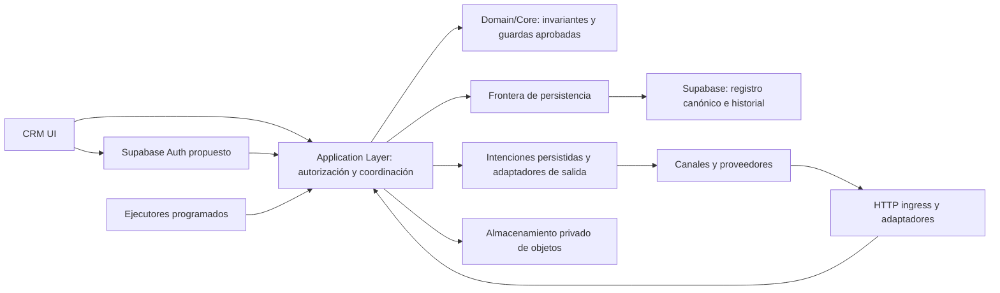
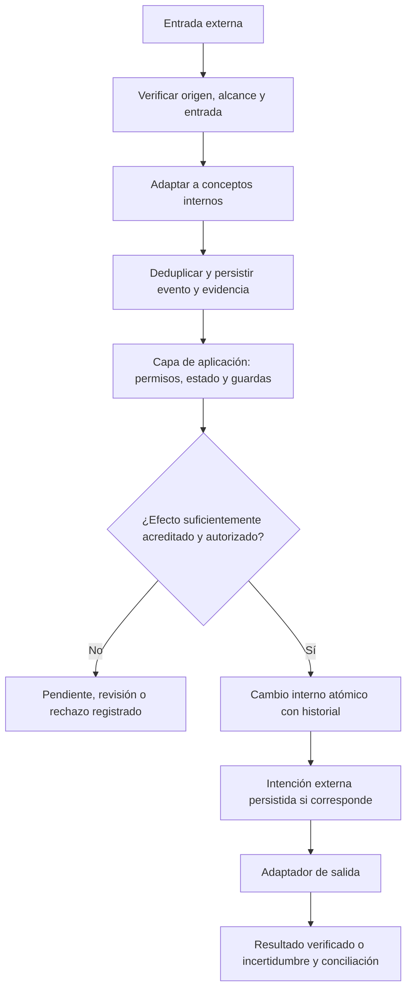

# CRM HUESCAVENTURA OS — Architecture

Status: DRAFT
Version: 0.1
Last updated: 2026-09-10

Primera iteración pendiente de revisión humana. Las decisiones ARCH-DEC son propuestas de este borrador, no decisiones humanas APPROVED. Publicar este documento no aprueba Architecture ni autoriza iniciar SPEC 001, plan, tasks o implementación.

## 1. Propósito, autoridad y alcance

Definir una arquitectura V1 sencilla, trazable y compatible con el dominio y las transiciones aprobados, con fronteras suficientes para redactar futuras Specs después de la aprobación explícita de Architecture. No define comportamientos de negocio nuevos.

Fuentes leídas íntegramente antes de redactar:

- [Constitution v1.0 APPROVED](constitution.md), principios P01–P20.
- [Product v0.1 APPROVED](product.md).
- [Business Rules v0.2 APPROVED](business-rules.md).
- [Domain Model v0.1 APPROVED](domain-model.md), incluidos sus 52 DM-INV.
- [State Machines v0.1 APPROVED](state-machines.md), aprobada el 2026-09-09, guardas G1–G6, dependencias y prohibiciones.
- [D001–D020 APPROVED](DECISIONS.md), todas vigentes.
- [README](../README.md), [Project Status](PROJECT-STATUS.md), [Next Steps](NEXT-STEPS.md) y el placeholder anterior de Architecture como orientación/coordinación, sin autoridad para introducir reglas.

La base documental verificada de main y origin/main antes de editar es 523809291bfa143f95c6926c3a12dbbccddc991f. El último commit de aprobación sigue siendo 393a105bafd1f541098706048ac571a130c50e5e, correspondiente a State Machines; no se sustituye por un commit de borrador.

Rige la Constitución y la autoridad documental definida en BR-GOV-001. Orden de trabajo: Constitution → Product → Business Rules → Domain Model → State Machines → Architecture → SPEC 001 → plan → tasks → implementación. Este documento desarrolla exclusivamente el paso 5 — Architecture de la coordinación posterior a Constitution.

Las notas finales de fases anteriores y los apartados Impact de D018–D020 conservan el contexto histórico de su redacción. El estado actual de State Machines es APPROVED, y no queda ningún SM-PENDING activo. Los textos anteriores de BR-PENDING-027 / DM-PENDING-001, BR-PENDING-023 / DM-PENDING-003 y BR-PENDING-036 / DM-PENDING-004 se interpretan junto con D018–D020 y State Machines §19.2, sin reabrir sus alcances resueltos.

El alcance es conceptual: responsabilidades, límites de acceso y consistencia, flujos internos/externos, persistencia, fallos, trazabilidad y evolución. Quedan fuera SQL, tablas/columnas/índices físicos, migraciones, funciones SQL, RLS concreta, clases, endpoints y schemas API definitivos, componentes UI, pantallas, código, configuración Supabase/Vercel/proveedores y despliegues. Tampoco se redactan SPEC 001, plan o tasks. Las tablas de este documento son cuadros explicativos, no un modelo físico de datos.

## 2. Estilo V1 y aplicación principal

Fuentes: D002–D007; C P03/P04/P06/P17; DM §§3/7/13.

Se propone un **monolito modular**, desplegable como una única aplicación web principal en Vercel. Frontend y servidor pertenecen a esa aplicación con límites lógicos claros. Los módulos son divisiones de responsabilidad internas, no servicios desplegados por separado.

La lógica de negocio, las autorizaciones y las mutaciones materiales se ejecutan en servidor. El cliente presenta información permitida y solicita operaciones; no acredita permisos, transiciones, cálculos definitivos ni ejecución por haberlos mostrado. Las lecturas, búsquedas, proyecciones y exportaciones también se filtran en servidor según finalidad y autorización.

**Propuesta ARCH-DEC-018 — Framework de aplicación V1:** Next.js App Router será el framework de la aplicación CRM V1, desplegada en Vercel. Es una decisión arquitectónica que permanece **PROPUESTA EN DRAFT, pendiente de revisión humana**. Architecture no congela la versión concreta de Next.js; los componentes UI, contratos/API físicos y endpoints definitivos siguen fuera de alcance. Se mantiene el monolito modular con Vercel y Supabase: elegir Next.js no elimina los límites internos ni convierte componentes UI en dominio. La lógica de negocio sensible continúa en servidor y en la capa de aplicación; Server Actions y handlers HTTP actúan como interfaces según §6.

No se incorporan microservicios, Kafka, RabbitMQ, event sourcing, CQRS complejo, Kubernetes, service mesh, locks distribuidos ni motores genéricos de workflow/BPM. Separar consultas de mutaciones por responsabilidad no crea un sistema CQRS independiente. V1 debe funcionar sin infraestructura distribuida adicional.

Las flechas representan responsabilidades y circulación conceptual de información. El núcleo valida significado y reglas; no conoce SDK, formatos propietarios ni detalles de almacenamiento. Los ejecutores reutilizan la capa de aplicación y pueden ser invocaciones de la misma aplicación, sin constituir un nuevo servicio permanente. Autenticar identifica al solicitante; la autorización de cada acción sigue perteneciendo al servidor.

## 3. Módulos internos y propiedad de los cambios

Fuentes: DM §§3–13; BR-GEN/CON/LEAD/PROP/CONV/BOOK/SVC/PAX/NIGHT/PAY/SUPL; SM §§2–18.

Los límites lógicos de DM §7 gobiernan el significado y las identidades. La agrupación arquitectónica siguiente organiza responsabilidades sin convertir todos los conceptos de una fila en una entidad o una transacción gigante.

| Módulo conceptual | Responsabilidad y conceptos del dominio | Frontera de cambio |
|---|---|---|
| Identidad y relaciones | Contact, Organization, Group / Party, Primary Contact y participantes cuando sean necesarios. | No confundir persona de negocio con CRM Actor. Fusión solo humana y con ambos historiales. |
| Comercial | Lead, Opportunity, Proposal, Proposal Version, modalidades, Acceptance y términos exactos. | Versiones fijadas y aceptaciones inmutables; conversión con procedencia y alcance verificados. |
| Catálogo y abastecimiento | Servicios/variantes, categorías/atributos, públicos, unidades/formas de precio, packs, tarifas, promociones, requisitos, Provider y Offering. | Configuración versionada; cambios actuales no reinterpretan lo usado históricamente. La oferta no confirma disponibilidad. |
| Operación | Booking, Booking Service, cantidades/asignaciones, noches, opciones, confirmaciones y Booking Modification. | Estado comercial, operativo y económico separados; cambio y revalidación solo sobre alcance y dependencias materiales. |
| Economía reservada | Previsiones, movimientos, Payment Allocation, Reconciliation, fondos del cliente/suplidos, facturas externas, honorarios, costes propios, fianzas, Refund y cálculos. | Acceso exclusivo del Administrador autorizado; no confundir obligación, detección, recepción, conciliación y ejecución, ni fondos ajenos con ingreso/coste propio. |
| Coordinación y evidencia | Communication, documentos, transcripciones, Task, Alert/Notification, Incident, Human Approval, historial y ejecuciones. | Originales y resultados conservan identidad y permisos. Cerrar Task o Incident no ejecuta otros hechos. |
| Integraciones | Integration Source, External Reference, External Event y adaptadores. | Traducción, procedencia y conciliación; el proveedor no dicta el modelo del núcleo. |

Las mutaciones entre módulos pasan por servicios de aplicación; ninguno escribe directamente el estado de otro eludiendo sus invariantes. Las consultas pueden reunir contexto de varios módulos con controles de acceso, sin trasladarles la autoridad sobre los hechos.

Closure Assessment permanece dentro de Booking, con evaluaciones comercial, operativa y económica independientes. Timeline y calendario operacional son proyecciones. No se crea un estado único de expediente que sustituya las máquinas aprobadas, ni entidades nuevas por cada estado, noche confirmada o pago conciliado.

### 3.1. D018–D020 como límites del núcleo

- **D018:** aceptación parcial solo de partes/modalidades/alcances expresamente seleccionables. En caso contrario se fija nueva Proposal Version antes de Acceptance. La reserva directa del Administrador genera o registra Opportunity → Proposal / Proposal Version y condiciones → Acceptance real → Booking, reutilizando lo existente y sin Lead ficticio. V1 mantiene una Booking por Opportunity aceptada, con N servicios/modalidades/noches/cantidades. No divide ni agrupa automáticamente; las operaciones extraordinarias requieren especificación posterior.
- **D019:** el cálculo conserva la modalidad concreta del/de la novi@ y su precio final por persona; la cancelación total individual usa el precio real de su modalidad. No promedia ni prorratea precios fijos/grupales. Un componente sin valor atribuible verificable exige determinación económica explícita del Administrador antes del efecto económico. Primero se determina el derecho contractual y después se ajustan fondos, conciliaciones, asignaciones, Refund u obligaciones. Pueden avanzar efectos operativos independientes.
- **D020:** los cálculos de este ámbito usan fechas locales y días naturales, concediendo completo el día límite, sin convertir 7/3 días en 168/72 horas ni usar la hora del servicio como corte. Saldo general y cifra final global usan por defecto el primer servicio contratado de Booking; las referencias específicas y de cancelación se aplican según SM §§2.4/12.2/13.2. Se conserva referencia, alcance, política y resultado. Cambiar fecha reevalúa los plazos afectados; cambiar solo hora dentro de esa fecha no cambia intervalos. Una referencia contractual expresa y válida diferente conserva su precedencia.

Las fórmulas, porcentajes, intervalos y excepciones siguen en las fuentes aprobadas. La arquitectura concentra su aplicación, no crea nuevas políticas ni atribuye a un scheduler autoridad contractual.

## 4. Supabase y clases de información

Fuentes: C P01/P05–P07/P09/P20; D004; BR-GEN-008, BR-AVAIL-005, BR-INT-002; DM §§2/8/11/13.

Supabase es el registro canónico del expediente CRM. Se propone que PostgreSQL conserve datos estructurados, versiones/snapshots, auditoría, Human Approvals, External Events normalizados, idempotencia, ejecuciones y trabajo pendiente. Supabase Auth aporta autenticación propuesta (§5); Supabase Storage es la opción prevista para objetos privados (§9).

La recepción y normalización de mensajes/webhooks corresponden a adaptadores y capa servidor; Supabase conserva sus eventos, evidencias y resultados. Persistirlos allí no implica activar Edge Functions, un motor de automatización o productos adicionales. Los efectos solo se aplican mediante la capa de aplicación y sus guardas.

| Clase de información | Autoridad y tratamiento | Límite |
|---|---|---|
| Datos canónicos CRM | Hechos internos, relaciones, versiones, revisiones y decisiones del expediente gobernados en Supabase. | Sus modificaciones cumplen las fuentes aprobadas y conservan auditoría. |
| Datos externos | Disponibilidad, referencias de reserva, movimientos o documentos cuya autoridad es del proveedor/sistema emisor. | Mantener fuente, referencia externa cuando exista, momento del hecho/consulta/recepción, alcance, vigencia pertinente y estado de verificación. Copiar no transfiere autoridad. |
| Evidencias/originales | Mensajes, documentos, confirmaciones, movimientos acreditados, transcripciones o registros manuales autorizados que sustentan un hecho. | Conservar original o registro viable/autorizado y vínculo al hecho exacto; adjuntar o recibir no confirma por sí solo. |
| Datos derivados | Resúmenes, timeline, calendario operacional, recomendaciones, cálculos, clasificaciones y resultados de IA. | Vincular fuentes/versiones y procedencia; poder reproducir o reconstruir lo relevante. No reemplazan hechos, originales ni decisiones. |

Estas clases describen autoridad y uso; una evidencia externa puede conservarse canónicamente en el expediente sin convertir al CRM en su emisor. Un cálculo aplicado conserva snapshot reproducible y componentes, aunque sea derivado. Una transcripción original importada sigue separada del resumen generado.

Interfaces, cachés y exportaciones derivan del registro canónico con sus permisos. Una proyección retrasada no autoriza una mutación usando estado obsoleto: antes del efecto se reconsulta el estado material. Si hay discrepancia externa, se conserva dato anterior/nuevo y se abre revisión; la información más reciente verificada del proveedor no reescribe términos aceptados.

## 5. Autenticación y autorización V1

Fuentes: C P10/P11/P15; D015; BR-SEC-001–004; DM §5.2 y DM-INV-050; SM G1/G3.

**Propuesta ARCH-DEC-004:** utilizar Supabase Auth para identificar al único usuario operativo V1, Administrador / Propietario, y relacionar esa identidad autenticada con Internal User / CRM Actor. Esta selección forma parte del DRAFT; D004 por sí sola no la había aprobado.

Como requisito arquitectónico propuesto de ARCH-DEC-004, **en Production el usuario Administrador/Propietario deberá utilizar MFA cuando la capacidad de autenticación seleccionada lo soporte**. Supabase Auth continúa siendo la propuesta V1; MFA no introduce roles ni usuarios operativos adicionales. Development y Staging podrán tener una política proporcional, pero Production deberá contemplar MFA para el Administrador. La configuración concreta, factores admitidos, recuperación y políticas de sesión se definirán posteriormente. No se configura MFA ni se diseñan pantallas o flujos UI de MFA en esta fase.

El servidor verifica la autenticación y la habilitación vigente del actor antes de permitir lecturas o mutaciones internas. Estar autenticado, conocer un identificador o aparecer como Contact/Provider no otorga acceso. La identidad de autenticación, el actor del dominio y sus facultades se distinguen; no se deducen permisos de datos editables por el cliente ni de un rol solicitado por este.

V1 aplica acceso del Administrador a todo el CRM, con mínimo privilegio técnico y denegación por defecto. No se habilitan altas públicas de usuarios operativos ni facultades a terceros por relaciones comerciales. Autenticación no significa ejecutar todas las operaciones con una credencial privilegiada de plataforma.

Los controles en servidor se complementarán obligatoriamente con controles de base de datos, incluida RLS en todas las tablas expuestas mediante Supabase, antes de exponer datos. “Futura RLS” significa implementación en la fase autorizada, no opcionalidad en producción. No se definen ahora políticas concretas.

La frontera económica protege costes, márgenes, beneficios, comisiones, honorarios y desgloses internos en consultas, API, informes, documentos, búsquedas, exportaciones, timeline, automatizaciones y contexto IA. Los contenidos comerciales de packs respetan BR-PACK-003. El contexto completo accesible al propietario no se entrega automáticamente a un destinatario externo.

Comercial, Operaciones, Administración y Colaborador interno limitado quedan preparados como evolución conceptual, sin matriz granular ni usuarios adicionales activos. Administración no equivale a Administrador. BR-PENDING-012/013 y DM-PENDING-006 conservarán la decisión de permisos finos antes de activar esos roles. Sesiones, métodos de acceso y mecanismos concretos de protección se especificarán después, sin añadir facultades de negocio.

## 6. Capa de aplicación e interfaces de entrada

Fuentes: SM G1–G6, §§14/16–18; BR-GEN-007, BR-AUTO-001–002; C P06/P10/P14/P15.

La capa de aplicación coordina cada operación material solicitada. El núcleo/domain services evalúa invariantes, cálculos y guardas; la capa de aplicación aporta identidad, evidencia, persistencia y coordinación de efectos. No se diseñan clases, nombres físicos ni contratos.

Para una mutación, esta capa:

1. Identifica actor/origen, permiso, intención, entidad y alcance.
2. Obtiene estado y versiones actuales, fuentes/evidencias y datos materiales; identifica qué falta sin bloquear trabajo independiente.
3. Verifica idempotencia y guardas aprobadas, transiciones permitidas y prohibiciones; comprueba Human Approval cuando corresponde.
4. Coordina los cambios internos que formen una unidad material, su auditoría, resultado idempotente e intención externa persistida si existe.
5. Registra resultado conocido, rechazo, conflicto o pendiente. Los efectos externos y su entrega/conciliación se acreditan por separado.

Desde el CRM interno, **Server Actions de Next.js App Router** podrán ser la interfaz principal de mutación cuando corresponda, delegando la lógica sensible en la capa de aplicación en servidor. Compartir aplicación no exime de validar autenticación, autorización, entrada y estado en cada invocación. No se confía en validaciones UI ni se distribuye lógica sensible entre componentes.

Para webhooks, formularios web e integraciones se usa **HTTP ingress específico por propósito**, sin endpoints definitivos. Esos handlers son fronteras de recepción y adaptación, no atajos para editar hechos sensibles.

Flujo de toda entrada externa:

**recepción → autenticación/verificación → normalización → deduplicación/idempotencia → persistencia del evento/evidencia → evaluación/aplicación del efecto.**

La autenticación/verificación depende del canal: credenciales/firma de proveedor cuando proceda; un formulario público admite acceso anónimo limitado con validación y controles de abuso, sin inventar identidad autenticada del cliente. Las entradas no verificadas se rechazan o quedan aisladas para revisión de seguridad, sin incorporarse como evidencia válida ni ejecutar efectos.

La deduplicación y la persistencia del registro de recepción deben coordinarse atómicamente para no perder ni duplicar eventos concurrentes. Un evento recibido puede quedar pendiente de evaluación. Haberlo aceptado técnicamente no equivale a haber aplicado el efecto de negocio.

## 7. Integraciones y fronteras de proveedores

Fuentes: C P01/P17; D014; BR-INT-001–008; DM §13; SM G6 y SM-FORB-27/28.

Cada proveedor/canal tiene un adaptador independiente que traduce su formato a Communication, External Event, External Reference y evidencias pertinentes. Esta capa de traducción o anti-corruption layer protege al dominio de formatos propietarios. El núcleo expresa intenciones y resultados de negocio, no vocabulario de un SDK.

Cada adaptador deberá poder sustituirse, desactivarse o fallar preservando identidades, originales autorizados, procedencia e historial. Su contrato futuro definirá autoridad por dato, intercambio permitido, autenticación, alcance, caducidad conocida, idempotencia, errores, consulta del resultado y conciliación. No se presupone que un proveedor permita consultar, cancelar, sincronizar o deduplicar: BR-PENDING-035 exige comprobarlo.

Las acciones salientes parten de la capa de aplicación con permisos y aprobaciones aplicables; el adaptador ejecuta solo el alcance preparado. Registra intención, intento, referencia y resultado. No amplía facultades porque el proveedor ofrezca más operaciones.

Los fallos de un canal no destruyen el núcleo. Se mantienen disponibles las operaciones independientes; una acción que necesita evidencia externa actual permanece pendiente. La sustitución no renombra ni duplica hechos históricos ni convierte referencias del proveedor nuevo en identidades CRM.

El orden aprobado de D014 permanece: **Telefonía IA + WhatsApp → Email → Calendario → Pagos → Web pública → Avaibook**. Ese orden no es un plan de implementación ni acredita capacidades probadas.

## 8. Aplicación de las fronteras a cada integración

### 8.1. Telefonía IA y WhatsApp

Fuentes: D009/D014/D016; BR-INT-005, BR-COMM-001–005, BR-AI-001–006; SM §14.

Son prioridad nº1 y comparten contexto CRM y timeline mediante identidades/vínculos comunes, manteniendo adaptador de telefonía y adaptador de WhatsApp separados y desacoplados. No necesitan compartir proveedor: la solución final puede utilizar un único proveedor para ambos canales o proveedores diferentes. Ambos adaptadores normalizan comunicaciones, eventos y evidencias; ningún proveedor se convierte en el dueño del expediente. No se debe forzar una solución unificada si resulta técnicamente o económicamente peor.

Transcripción original, resumen y extracción se distinguen, con fuente, momento, contexto y revisión. La IA puede preparar acciones o registrar datos objetivos claros con procedencia; no sobrescribe confirmaciones manuales. Sus propuestas sensibles pasan por Human Approval y capa de aplicación antes del efecto, aunque la información de origen parezca inequívoca.

No se almacena audio por defecto V1. Esto no resuelve consentimiento ni conservación de transcripciones. PLAUD Pro se admite como fuente de transcripción original, resumen y metadatos de llamadas atendidas personalmente; importación automatizada solo si se comprueba viable, con alternativa manual sencilla cuando corresponda. No requiere un conector prioritario separado.

No se elige ningún proveedor. ARCH-PENDING-001 conserva la comparación previa de ElevenLabs y al menos una alternativa real para Telefonía IA. WhatsApp debe analizarse también por sus capacidades reales y proveedor adecuado. La decisión comparará capacidad, coste, facilidad de automatización, fiabilidad e integración de cada canal, incluyendo transcripción y contexto cuando correspondan; no se presenta la comparativa como realizada.

### 8.2. Email

Fuentes: BR-COMM-001/002/006, BR-TASK-006; D016.

Email es un canal de Communication. La incorporación debe poder conservar mensaje original, remitente/destinatarios, fecha, adjuntos autorizados y vínculos al contexto CRM, además de threading/referencias cuando la capacidad técnica lo permita. El adaptador no duplica el mensaje por cada contexto ni deduce identidad únicamente de una dirección.

info@huescaventura.com es la dirección comercial futura prevista; las históricas/secundarias pueden conservar su procedencia. No se migra ni configura correo en esta fase. Envío, recepción y lectura se registran solo con evidencia disponible.

Email no recibe notificaciones internas V1. Todos los avisos internos van al CRM; los Críticos e Importantes también a WhatsApp, dirigidos al Administrador/Propietario. El canal comercial sigue sometido a supervisión y permisos.

### 8.3. Calendario

Fuentes: D014; BR-TASK-007; DM-INV-049; SM §§2.4/13.2/16.

El calendario operacional del CRM deriva de Booking Services, fechas, opciones, vencimientos, tareas y demás hechos canónicos en Supabase. No se crea una segunda agenda que gobierne esos hechos. La proyección conserva fuente, alcance y condición de confirmado/pendiente.

Google Calendar es auxiliar. La sincronización desacoplada conserva External Reference, procedencia, versiones/resultados e idempotencia, permitiendo reconocer ecos de cambios propios sin reaplicarlos. Puede contemplarse intercambio bidireccional donde las capacidades se verifiquen; no se presume igualdad de autoridad.

Un cambio externo se recibe como evento y se evalúa. Si puede modificar un hecho crítico de Booking, requiere revisión/validación o regla explícita aprobada; nunca se copia silenciosamente. Los efectos usan el proceso de modificación/revalidación pertinente. Los vencimientos derivados siguen D020, no los horarios visuales o de ejecución de la sincronización.

### 8.4. Pagos

Fuentes: BR-PAY-001–007, BR-SUPL-001–004; D013/D014/D019; SM §§9–11.

La arquitectura conserva medios genéricos. Actualmente se usa transferencia bancaria: detección, recepción verificada, conciliación y asignaciones permanecen hechos separados. Tarjeta, Bizum u otros medios futuros se conectarán mediante adaptadores; BR-PENDING-034 conserva la selección de tarjeta.

Los eventos/webhooks de pagos deben tolerar duplicados, entrega repetida, eventos fuera de orden y resultado incierto. La secuencia de llegada no sustituye el momento del hecho ni permite retroceder una situación acreditada usando una noticia antigua. Se consulta/contrasta con fuente autorizada cuando corresponda.

“Evento recibido” no implica “pago conciliado”. La capa de aplicación aplica SM-CP-01–08 y SM-RC-01–04: correspondencia, recepción, porciones y ausencia de doble cómputo deben verificarse; las dudas se resuelven humanamente. Se conservan dos transferencias reales distintas aunque coincidan importe y fecha.

Devoluciones y pagos salientes conservan autorización, intento, ejecución y conciliación separados. El adaptador no determina derechos contractuales, reparte fondos dudosos ni atribuye todo cobro a ingreso propio. No se permite repetir una acción sensible incierta sin comprobar el efecto previo.

### 8.5. Avaibook

Fuentes: D014; BR-INT-006/007; SM-FORB-28.

En V1 el adaptador será **solo lectura/consulta**, sujeto a capacidad real verificada. Puede aportar disponibilidad, reservas/referencias externas e información verificable con fuente, alcance y momento.

No crea, modifica ni cancela reservas en Avaibook. Una discrepancia produce revisión/alerta y conserva ambas evidencias; no se resuelve mediante escritura silenciosa en Avaibook ni en el expediente CRM. La información externa no acredita una confirmación comercial u operacional distinta de su alcance.

### 8.6. Web pública

Fuentes: D007/D013; BR-INT-004/008, BR-PROP-008, BR-DOC-005; C P10/P11/P16.

huescaventura.com y CRM permanecen en aplicaciones/repositorios separados. Podrán compartir un backend/API expresamente diseñado, con una frontera pública limitada e independiente del acceso interno del Administrador.

Los futuros formularios introducen directamente leads en CRM con procedencia/campaña/página y datos conocidos, sin hojas o reenvío manual como flujo normal. La conversión a Opportunity aplica BR-LEAD-002. El acceso anónimo limitado no permite leer expedientes ni escribir estados arbitrarios.

La web no accede directamente a economía interna ni usa credenciales privilegiadas CRM en cliente. Las futuras aceptaciones conservan identidad/evidencia, Proposal Version, términos/versiones y alcance; el mandato solo se registra si realmente existe y fue aceptado. No se modifica la web ni se diseñan sus pantallas, API o textos jurídicos aquí.

## 9. Archivos, documentos y originales

Fuentes: C P07/P10/P11; D017; BR-DOC-001–005, BR-SEC-005; DM §§5.2/8/12.

Se propone conservar binarios en almacenamiento privado de objetos, previsiblemente Supabase Storage; metadatos, permisos, procedencia, versiones y vínculos pertenecen al registro canónico. No se fijan buckets, rutas físicas ni políticas.

El acceso a objetos se autoriza por finalidad y alcance. Cuando corresponda se usarán URLs firmadas/temporales; conocer la referencia de un documento no concede acceso ni permite generar una URL. Los objetos no se asumen públicos y las URLs temporales no se convierten en identificadores permanentes ni se vuelcan en logs.

Una sustitución material crea versión/historial y conserva el vínculo al original autorizado. Adjuntar no acredita revisión, pago o validez fiscal. Resumen, OCR, extracción u otro derivado no reemplazan el documento/transcripción original. Un registro manual autorizado puede ser evidencia sin binario ni audio.

La coordinación entre objeto y metadatos contempla cargas incompletas, errores y referencias no disponibles: se registra el estado conocido y se permite su reparación/conciliación sin presentar una evidencia ausente como conservada. La persistencia del objeto y la transacción PostgreSQL no se fingen una operación ACID única. La limpieza futura respeta las políticas de conservación y nunca borra historia por un reintento.

## 10. Tareas, automatizaciones y jobs

Fuentes: C P14/P15; D016; BR-TASK-001–007, BR-AUTO-001–002; DM §12; SM §13.2.

Las Task del negocio conservan causa, contexto, responsable V1, deadline conocido o pendiente y resultado. No se confunden con jobs técnicos ni con tasks de implementación SDD. Las notificaciones conservan causa, destinatario/canal y evidencia de entrega; leer o entregar un aviso no resuelve su causa.

Se proponen automatizaciones específicas derivadas de futuras Specs, sin motor BPM/workflow genérico. Automation Definition/version y Execution Record conservarán responsable, trigger, entradas autorizadas, permisos, efecto previsto, registros afectados, resultado, fechas, intentos, error e idempotencia. No se inventan nuevos disparadores de negocio ni se activan automatizaciones al documentarlas.

El trabajo pendiente se persiste en Supabase, mediante un mecanismo conceptual de jobs/outbox sin broker externo. Cuando una operación interna genera un efecto externo, su intención se registra junto con el cambio interno en la misma unidad atómica. El ejecutor procesa después esa intención; la confirmación interna no acredita entrega externa.

Los ejecutores/cron programados reclaman trabajo de forma atómica, registran su ejecución y procesan unidades acotadas y reanudables. No dependen de memoria de proceso ni de que una solicitud web permanezca viva. La ejecución deberá ajustarse a los límites comprobados del entorno de despliegue; no se fija proveedor de scheduler, frecuencia ni tablas físicas.

Se contemplan reintentos limitados y seguros, backoff configurable, registro de intentos, situación final verificable y alertas por fallo persistente. Los parámetros concretos se determinarán en la Spec correspondiente, sin número universal inventado. Debe poder detenerse una automatización y revisarse/recuperarse o compensarse su efecto de forma autorizada.

Si un ejecutor cae tras contactar con un proveedor, recuperar el trabajo no significa reenviar. Primero se comprueba el resultado anterior. Fallos persistentes generan avisos Importantes o Críticos al Administrador, siguiendo la política CRM/WhatsApp y sin email. Si WhatsApp falla, el fallo permanece visible en CRM y se controla su propia deduplicación para evitar ciclos de avisos.

## 11. Human Approval ligada a una propuesta concreta

Fuentes: C P15; D009/D016; BR-AI-002/003; DM-INV-046; SM §14.3.

La aprobación humana se vincula a una propuesta identificada e inmutable de contenido/efecto mediante identidad de versión y alcance, o fingerprint/hash conceptual que permita comprobar correspondencia. No se prescribe algoritmo ni formato físico, ni se presenta el hash como firma legal.

Se conserva quién revisó, cuándo, qué acción, contenido, destinatario, precio, alcance, condiciones y efecto autorizó, y a qué intento/ejecución corresponde. Antes de ejecutar, la capa de aplicación comprueba esa correspondencia junto con permisos, estado y guardas actuales.

Si cambia materialmente contenido, precio, destinatario, alcance, condiciones o efecto, la aprobación anterior deja de ser aplicable y se requiere nueva aprobación. El registro previo se conserva. Una aprobación todavía vinculada al mismo contenido tampoco dispensa revalidar un estado o evidencia que haya perdido cobertura.

Aprobación, intención, intento y ejecución son hechos distintos. El mecanismo evita que dos ejecuciones consuman el mismo efecto autorizado por concurrencia o reintento; no convierte una aprobación en permiso genérico para efectos repetidos. La IA no se autoaprueba y el ejecutor automático mantiene su identidad distinta del aprobador humano.

Human Approval no sustituye Acceptance del cliente ni Provider Confirmation, no acredita pago y no levanta P16. Las informativas con plantillas solo se automatizan en los límites de una Spec aprobada; el seguimiento comercial V1 permanece supervisado. No se diseña la UI de revisión.

## 12. Idempotencia, concurrencia y consistencia

Fuentes: C P06/P14/P20; BR-AUTO-002, BR-PAY-003; DM-INV-008/012/030/048; SM G4–G6 y §§6.1/9/14.

### 12.1. Idempotencia transversal

Webhooks, mensajes, pagos, External Events, creación de Booking, notificaciones, jobs, automatizaciones y acciones con proveedor necesitan identificar la operación y su efecto. Se usa identificador externo cuando existe, acotado a fuente/contexto, y clave interna cuando sea necesario; se conserva registro de procesamiento y resultado conocido.

Repetir la misma operación válida con el mismo contenido y alcance reutiliza su resultado previo, sin duplicar el efecto ni inventar otro éxito. Una clave repetida con contenido material diferente es conflicto y requiere evaluación; no devuelve ciegamente el resultado anterior. La lectura del resultado previo sigue sometida a permisos.

La ausencia de identificador fiable no autoriza deducir duplicidad solo por importe, teléfono o similitud. Se conserva incertidumbre para revisión. La deduplicación técnica tampoco autoriza fusionar automáticamente Contact/Organization ni dos transferencias reales.

Recepción y aplicación pueden estar separadas en el tiempo; el registro permite distinguir evento persistido, efecto pendiente, efecto acreditado y resultado incierto. No se promete “exactly once” entre sistemas externos. Ante entrega repetida se reutiliza o concilia el efecto existente con evidencia.

### 12.2. Concurrencia

El único usuario humano V1 no elimina concurrencia: solicitudes, webhooks y jobs pueden coincidir. Se proponen transacciones de base de datos para cambios atómicos, comprobación de estado/versión previa, actualizaciones condicionales u optimistic concurrency, e identidades/restricciones para evitar duplicados.

Se protege especialmente:

- Fijación de Proposal Versions, registro/verificación de Acceptance y términos, sin sobrescritura histórica.
- Creación de una Booking por Opportunity aceptada, también mediante reserva directa o reintento.
- Conciliaciones, asignaciones, pagos y Refund, para que dos operaciones no consuman la misma porción de fondos.
- Human Approval y ejecución de su efecto exacto, evitando doble ejecución y aprobación de contenido obsoleto.
- Reclamación de jobs y registro de idempotencia, sin ejecutores concurrentes que apliquen el mismo efecto.

Si el estado/versión ha cambiado, la operación detecta conflicto y reevalúa con datos actuales; no sobrescribe el cambio concurrente. Una actualización técnica condicional no autoriza una transición no aprobada. No se diseñan índices, columnas ni locks distribuidos.

### 12.3. Consistencia interna y externa

Dentro del núcleo, los cambios que constituyen una única unidad material se confirman juntos o ninguno: hecho vigente, historia necesaria, resultado idempotente e intención pendiente asociada cuando corresponda. Por ejemplo, la conversión no deja una Booking visible con vínculos comerciales obligatorios ausentes, ni la conciliación asignaciones incoherentes con la porción acreditada.

Esta atomicidad no obliga a ejecutar en bloque todas las partes de una modificación. D019 y SM-MO-05/06 permiten delimitar efectos operativos independientes de una determinación económica pendiente.

Con proveedores y almacenamiento de objetos se asume consistencia eventual. Se conserva intención, intento, resultado conocido, referencias y conciliación posterior; no hay two-phase commit ni transacción distribuida simulada. No se mantiene una transacción de negocio abierta esperando una respuesta externa. Las compensaciones son nuevas actuaciones autorizadas y auditadas, no borrados de hechos ni reversiones bancarias por cambiar un estado.

## 13. Errores, auditoría y observabilidad

Fuentes: C P06/P07/P14; BR-GEN-002/003, BR-HIST-001–005, BR-AUTO-001–002; SM G6 y §18.

### 13.1. Errores e incertidumbre

| Situación | Tratamiento conceptual |
|---|---|
| Error definitivo | Registrar rechazo/causa; no repetir sin corregir la causa o revisar la operación. |
| Error transitorio | Reintento limitado solo si es seguro e idempotente, conservando intentos y resultado. |
| Resultado incierto | No declarar éxito ni fracaso definitivo del efecto; comprobar/conciliar antes de repetir. |
| Dato ambiguo | Registrar original y alcance dudoso; revisión de la parte material, sin confirmación inferida. |
| Conflicto | Conservar discrepancia/estado concurrente y reevaluar, sin sobrescritura silenciosa. |
| Fallo de autenticación/verificación | Impedir efectos, registrar información mínima de seguridad y revisar según corresponda. |
| Dependencia externa caída | Mantener pendiente lo dependiente y permitir trabajo independiente con la limitación visible. |

Ante resultado incierto de una operación sensible: registrar intento → impedir repetición automática peligrosa → consultar/conciliar estado previo → reintentar solo cuando sea seguro → alertar si requiere intervención. Un timeout no demuestra que el proveedor no haya ejecutado. Un reintento manual autorizado cumple las mismas guardas.

Registrar una realidad sobrevenida con evidencia no significa autorizarla retroactivamente. Los hechos económicos u operativos conocidos se conservan con incidencia/revisión si hubo incumplimientos, conforme a SM §§6/7/10/11; no se fabrica una aprobación anterior para cuadrar el historial.

### 13.2. Auditoría e historial

Se conserva estado vigente donde corresponda junto con versiones/snapshots, Domain Events / Change Records, Execution Records, Human Approvals y evidencias. No se usa event sourcing ni se exige reconstruir todo el CRM desde un log de eventos.

Todo cambio material permite reconstruir entidad/alcance, antes/después, actor, origen humano/automático, motivo, momento del hecho y momento del registro, evidencia, guardas/revisiones pertinentes y relaciones. Una creación distingue ausencia de valor previo. Registrador, solicitante externo, aprobador y ejecutor automático no se confunden.

Timeline es una proyección con referencias a esos registros y sus permisos, no la única fuente de historia. Corregir, reabrir, fusionar o archivar no destruye hechos ni reutiliza identificadores humanos. La conservación queda sujeta a privacidad autorizada y auditada.

### 13.3. Observabilidad V1

Se proponen logs estructurados, correlation/request IDs, execution IDs de automatizaciones, external event IDs y vínculos a los registros afectados, con captura de excepciones, métricas básicas de fallos y visibilidad de jobs fallidos/pendientes de intervención.

La observabilidad técnica sirve para localizar un fallo; no sustituye el historial de negocio ni convierte una respuesta técnica en confirmación comercial o económica. Se muestran alertas internas relevantes según D016. No se elige plataforma compleja ni se fija infraestructura adicional.

Los logs excluyen siempre secretos y URLs de acceso temporal. Minimizan datos personales y utilizan referencias en lugar de copiar cuerpos completos de comunicaciones o documentos. Esas referencias permiten investigar dentro de un contexto autorizado sin trasladar contenidos sensibles al sistema de logs.

## 14. Seguridad, privacidad y minimización

Fuentes: C P10–P12/P15/P16; D008/D015–D017; BR-SEC-001–005, BR-BILL-001–005.

La frontera servidor aplica validación de entradas, permisos por acción/alcance y verificación de autenticación en mutaciones y lecturas. En Production se exigirá al Administrador/Propietario el cumplimiento de MFA cuando la capacidad seleccionada lo soporte, conforme al requisito propuesto en §5; su verificación no se delega únicamente en la UI. Las interfaces internas invocables también requieren protección frente a solicitudes no autorizadas y abuso; un identificador difícil de adivinar no sustituye permiso.

Secretos fuera de Git, documentación, ejemplos, expedientes y logs; separados por entorno y gestionados por mecanismos protegidos. Credenciales públicas y credenciales de servidor tienen usos distintos. Nunca se expone service-role/secret key al cliente; su eventual uso servidor no elimina la comprobación de permisos ni la limitación del efecto.

Webhooks verifican autenticidad e integridad según capacidades reales, con protección contra replay cuando la integración lo permita. Entradas públicas incorporarán límites de frecuencia y controles contra abuso de formularios/webhooks, con validación del contenido recibido. Los valores concretos se especificarán según uso y riesgo, sin inventarlos aquí.

Archivos privados requieren autorización y, cuando corresponda, URLs firmadas temporales. Se limitarán entradas y adjuntos a los tipos/usos necesarios. El transporte de sesiones, datos y secretos deberá estar protegido. Las dependencias deberán mantenerse actualizadas y revisadas en la futura implementación; no se instala ninguna ahora.

La futura RLS y demás controles de datos son requisitos previos a la exposición pertinente (§5); no se redactan políticas ni se permite una fase de producción sin esos controles. Una identidad técnica de automatización usa privilegios limitados a sus efectos y conserva responsable humano.

La arquitectura permite políticas de retención por tipo, archivado recuperable, anonimización/eliminación autorizada y auditoría de esos procesos. Se conserva separación entre originales, derivados y referencias para aplicar una política aprobada a cada categoría, incluidos datos enviados a IA, copias, logs y backups. No se inventan plazos RGPD ni retención indefinida.

Los datos personales compartidos con IA/integraciones se limitan a finalidad, destinatarios y alcance autorizados. Se preservan BR-PENDING-014/015/019/020 y DM-PENDING-005; no almacenar audio por defecto no resuelve el tratamiento de transcripciones. El acceso del propietario al CRM no autoriza cualquier divulgación externa.

El registro operativo de suplidos, honorarios, Tararí o documentos externos no activa facturación legal ni numeración fiscal. Fiscalidad, tipos y mandato efectivo conservan BR-PENDING-021/022/033 y DM-PENDING-002. No se crea motor fiscal, texto jurídico ni una factura interna por defecto.

## 15. Backup y recuperación

Fuentes: C P06/P07/P10/P13/P14; D003/D004/D017; propuesta de continuidad de esta iteración.

La arquitectura exige una estrategia verificable de backup y restauración aprovechando las capacidades disponibles de Supabase/plataforma, sin asumir que un plan contratado, una copia existente o PITR estén ya configurados.

El alcance de recuperación incluye datos canónicos, versiones/evidencias, objetos privados, identidades/configuración necesarias, definiciones de automatización, referencias externas y registros de idempotencia/ejecución. Debe comprobarse la coherencia entre objetos restaurados y metadatos.

La documentación oficial indica que los backups de base de datos no incluyen los objetos guardados mediante Storage; la estrategia debe cubrirlos por separado. Esta es una comprobación de capacidad técnica, no una nueva regla de negocio ni evidencia de backups activos: [Supabase Database Backups](https://supabase.com/docs/guides/platform/backups).

Se requerirán procedimiento documentado, responsable, comprobación de copias, restauración probada periódicamente en entorno aislado y evidencia de resultados. Configuración crítica no secreta debe ser exportable/recuperable y versionada; los secretos necesarios se recuperan mediante gestión protegida, nunca desde Git.

Antes de reanudar automatismos tras restaurar, se mantendrán suspendidos los efectos externos sensibles hasta conciliar lo ya ejecutado por proveedores con el punto restaurado. Restaurar datos no deshace cobros ni mensajes enviados y no debe duplicarlos.

**ARCH-PENDING-002** mantiene abierta la decisión humana sobre RPO — pérdida máxima aceptable de datos — y RTO — tiempo máximo aceptable de indisponibilidad — frente al coste/complejidad de recuperación. No se fijan valores, frecuencias ni garantías operativas sin esa decisión. El pendiente no elimina la obligación de preparar backups y recuperación verificable antes del uso productivo.

## 16. Versionado, entornos y evolución

Fuentes: C P02/P06/P13/P17–P19; D002/D003/D005/D010/D017.

### 16.1. Versionado separado

Se distinguen versión de aplicación/release, migraciones de datos, versiones de automatizaciones, configuraciones/reglas de negocio, snapshots de propuestas/términos, contratos de integración cuando existan y documentación Git. Un release nuevo no actualiza retrospectivamente los términos aceptados ni las tarifas aplicadas.

Cada futuro despliegue será trazable a commit, versión publicada y migraciones aplicadas. Todos los cambios estructurales o administrativos de base de datos, incluidos permisos/RLS y transformaciones, seguirán migraciones versionadas/revisables conforme a P13. Su excepción break-glass constitucional permanece íntegra; este documento no crea una excepción ni ejecuta cambios.

Las futuras Specs definirán criterios comprobables y validación proporcional de reglas, permisos, transiciones, fallos, concurrencia y recuperación antes de declarar una funcionalidad terminada. No se presentan comprobaciones documentales como pruebas de una aplicación existente.

### 16.2. Entornos

| Entorno conceptual | Finalidad | Separación requerida |
|---|---|---|
| Development | Work Local en Mac sigue como entorno principal de desarrollo (D002). | Supabase y secretos propios; datos sintéticos o minimizados, sin copiar producción indiscriminadamente. |
| Staging | Validar futuras migraciones, integraciones y automatizaciones antes de producción. | Supabase y secretos separados de Development/Production; sandbox/test de proveedores cuando exista. |
| Production | Servicio operativo real tras las fases y aprobaciones correspondientes. | Supabase, secretos, acceso, integraciones y datos productivos separados, con recuperación verificada. |

Vercel sigue como plataforma principal prevista de despliegue. Los tres entornos son conceptuales; no se crean proyectos, configuraciones o despliegues. Staging no utiliza credenciales productivas por conveniencia. Donde no haya sandbox externo, la futura Spec deberá delimitar la validación sin producir efectos reales no autorizados.

### 16.3. Evolución sin construcción anticipada

Las fronteras de módulos, persistencia e integración permiten evolución posterior. Microservicios, brokers, workers independientes, analítica u otros componentes solo se extraerán si cargas, riesgos o límites demostrados lo justifican mediante la fase SDD correspondiente.

V1 funciona con la aplicación modular, Supabase, objetos privados y ejecución programada sencilla; no exige esos componentes futuros. La ampliación de usuarios, autonomía IA, fiscalidad o capacidades de integración conserva sus decisiones/validaciones previas y no queda aprobada por un punto de extensión.

## 17. ARCH-DEC — Decisiones arquitectónicas propuestas

**Estado de todas las filas: PROPUESTA EN DRAFT, pendiente de revisión humana.** Los identificadores son estables y no equivalen a D001–D020 ni se incorporan como APPROVED a DECISIONS.md. Cuando desarrollan un límite ya aprobado, solo la solución técnica propuesta sigue pendiente; el límite de negocio no se reabre.

| Identificador y título | Propuesta y motivo | Desarrollo / fundamento |
|---|---|---|
| ARCH-DEC-001 — Monolito modular V1 | Una aplicación principal desplegable en Vercel con módulos internos; simplicidad y evolución sin microservicios. | §§2–3; D005/D006, C P17. |
| ARCH-DEC-002 — Responsabilidades de Supabase | Registro canónico estructurado, autenticación propuesta, soporte de autorización, objetos privados y persistencia de auditoría/eventos/idempotencia/jobs. | §§4–5/9–10; D004, C P01/P10/P14. |
| ARCH-DEC-003 — Separación canónico / externo / evidencia / derivado | Autoridad y procedencia explícitas; las copias/proyecciones no sustituyen hechos. | §4; C P01/P05, DM §§2/13. |
| ARCH-DEC-004 — Supabase Auth y autorización V1 simplificada | Supabase Auth para el único CRM Actor Administrador/Propietario, controles servidor/base de datos y MFA obligatorio en Production cuando la capacidad seleccionada lo soporte; roles futuros inactivos. Configuración, factores, recuperación y sesiones se definirán después. | §§5/14; D015, C P10/P11. |
| ARCH-DEC-005 — Server Actions para CRM + HTTP ingress para externos | Server Actions de Next.js App Router como interfaz principal de mutación interna cuando corresponda y handlers HTTP específicos para webhooks/integraciones, ambos subordinados a la capa de aplicación. | §§2/6; ARCH-DEC-018, SM G1–G6. Sin contratos/API físicos ni endpoints definitivos. |
| ARCH-DEC-006 — Adaptadores / anti-corruption layer para integraciones | Contratos internos independientes de formatos propietarios, sustitución y conciliación. | §§7–8; D014, C P17. |
| ARCH-DEC-007 — Calendario CRM canónico + Google Calendar auxiliar | Proyección operacional de Supabase; cambios externos materiales revisados, sin segunda autoridad de agenda. | §8.3; D014, BR-TASK-007. |
| ARCH-DEC-008 — Web pública separada | Aplicaciones/repositorios separados y futura frontera pública limitada, sin acceso económico interno. | §8.6; D007, C P10/P11. |
| ARCH-DEC-009 — Avaibook read-only V1 | Consulta solo si la capacidad se verifica; discrepancias a revisión sin escrituras silenciosas. | §8.5; D014, BR-INT-006. |
| ARCH-DEC-010 — Archivos privados en object storage + metadata canónica | Objetos privados, metadatos/versiones/vínculos en CRM y acceso temporal autorizado. | §9; BR-DOC-001–005, C P07/P10. |
| ARCH-DEC-011 — Automatizaciones específicas, no motor workflow genérico | Reglas derivadas de Specs, Definition/version y Execution Record auditables. | §10; C P14, BR-AUTO-001–002. |
| ARCH-DEC-012 — Human Approval ligada al contenido concreto | Identidad/fingerprint de propuesta y alcance; cambio material requiere nueva aprobación. | §11; C P15, SM §14.3. |
| ARCH-DEC-013 — Idempotencia transversal | Identificación, procesamiento y resultado previo reutilizable sin duplicar efectos. | §12.1; BR-AUTO-002, SM G6. |
| ARCH-DEC-014 — ACID interno + consistencia eventual externa | Unidad material interna atómica; intención/resultado/conciliación externos sin transacción distribuida. | §12; C P06/P14/P20, SM §§9/16/18. |
| ARCH-DEC-015 — Jobs/outbox persistidos sin broker externo V1 | Trabajo duradero en Supabase y ejecutores sencillos, reintentos seguros y fallos visibles. | §10; BR-AUTO-001–002. |
| ARCH-DEC-016 — Auditoría con historial/versiones, no event sourcing | Estado vigente más snapshots, eventos/cambios, ejecuciones, aprobaciones y evidencias; timeline derivada. | §13; C P06/P07, DM §8, SM §18. |
| ARCH-DEC-017 — Development / Staging / Production separados | Supabase, secretos y pruebas de integración aislados, manteniendo Work Local y Vercel. | §16.2; D002/D005, C P10/P12/P13. |
| ARCH-DEC-018 — Framework de aplicación V1 | Next.js App Router será el framework del CRM V1 desplegado en Vercel. PROPUESTA EN DRAFT, pendiente de revisión humana; sin congelar versión concreta ni definir UI o contratos/API físicos. Mantiene el monolito modular y la lógica sensible en la capa de aplicación en servidor. | §§2/6; D005, C P10/P17. |

## 18. ARCH-PENDING y pendientes heredados

### 18.1. Pendientes arquitectónicos activos

| Identificador | Origen y decisión pendiente | Condición antes del trabajo dependiente |
|---|---|---|
| **ARCH-PENDING-001 — Proveedor(es) definitivos de Telefonía IA y WhatsApp** | BR-PENDING-001, BR-PENDING-035 y D014. Falta comparación verificable y elección humana por canal; la prioridad nº1 ya está aprobada. Los adaptadores separados comparten contexto CRM/timeline, sin exigir proveedor común: puede haber uno para ambos canales o proveedores diferentes. | Antes de implementar, comparar/probar ElevenLabs y al menos una alternativa real para Telefonía IA y analizar capacidades reales/proveedor adecuado de WhatsApp. Evaluar capacidad, coste, facilidad de automatización, fiabilidad e integración de cada canal, transcripción y contexto cuando correspondan. No forzar una solución unificada técnicamente o económicamente peor; no se elige ningún proveedor ni se declara probada la comparativa. |
| **ARCH-PENDING-002 — RPO / RTO de producción** | Falta decisión humana sobre pérdida máxima de datos, tiempo máximo de indisponibilidad y coste/complejidad aceptables de recuperación. | Definir objetivos y contrastar capacidad/coste de backup-restauración antes de aceptar producción. Mientras tanto siguen exigidos backups, restauración y prueba periódica verificables; no se asignan cifras. |

ARCH-PENDING-001 es la referencia arquitectónica solicitada del mismo asunto existente, no otra selección paralela: su futura resolución deberá coordinar BR-PENDING-001/035 sin declarar resueltas capacidades ajenas a la evidencia aportada.

### 18.2. Heredados conservados sin nuevos identificadores

| Referencias existentes | Frontera que conserva este borrador |
|---|---|
| BR-PENDING-021/022/033; DM-PENDING-002 | Fiscalidad/suplidos/Tararí, tipos fiscales y mandato efectivo pendientes de validación profesional y decisión correspondiente. Sin emisión/numeración fiscal, tipos inventados ni aceptación de mandato inexistente. |
| BR-PENDING-014/015; DM-PENDING-005 | Retención y anonimización/eliminación: diseño compatible con políticas futuras autorizadas, sin plazos RGPD inventados. |
| BR-PENDING-019/020; DM-PENDING-005 | Consentimiento y tratamiento/conservación de telefonía, transcripciones y eventual audio excepcional; sin audio por defecto V1. |
| BR-PENDING-012/013; DM-PENDING-006 | Permisos finos de roles futuros; V1 solo Administrador/Propietario, economía reservada vigente. |
| BR-PENDING-034 | Proveedor de tarjeta; arquitectura de pagos genérica sin selección ni activación. |
| BR-PENDING-035 | Capacidades reales de APIs/conectores; cada integración debe comprobar su alcance antes de implementarlo. ARCH-PENDING-001 no absorbe todos los conectores. |

D018, D019 y D020 ya resuelven sus alcances V1 respecto a BR-PENDING-027/023/036 y DM-PENDING-001/003/004; SM-PENDING-001/002/003 permanecen históricos resueltos. No se crean pendientes nuevos para esas mismas decisiones. Operaciones extraordinarias no descritas, datos económicos ausentes o configuraciones no verificadas tampoco quedan habilitados por Architecture.

## 19. Revisión documental y trazabilidad

### 19.1. Contraste con Constitution P01–P20

| Principio | Cobertura revisada |
|---|---|
| P01 | §§4/7–8: Supabase canónico y autoridad externa conservada. |
| P02 | §§1/16: documentación en GitHub y publicación trazable a commit. |
| P03 | §§1/16: fase Architecture aislada; funcionalidades futuras siguen SDD. |
| P04 | §§1/16: sin implementación ni avance a Spec antes de aprobación explícita. |
| P05 | §§3–8/13: datos verificables, ambigüedad visible y bloqueo material. |
| P06 | §§6/11–13/16: actor, antes/después, causa, evidencias, versiones y ejecución. |
| P07 | §§3–4/9/13–15: historial/originales preservados con privacidad autorizada. |
| P08 | §§3/6/12: dimensiones y cierres independientes; guardas de cada transición. |
| P09 | §3: cantidades/asignaciones por servicio/noche; proyecciones no propagan globales. |
| P10 | §§5–6/9/14/16: controles servidor/base de datos, RLS futura obligatoria, mínimo privilegio y entornos aislados. |
| P11 | §§3–5/8–9/13–14: economía reservada en todo soporte y contexto IA. |
| P12 | §§13–16: secretos protegidos por entorno, fuera de Git y logs. |
| P13 | §16.1: futuras migraciones revisables y excepción constitucional intacta; ninguna ejecutada. |
| P14 | §§6/10/12–13/15: ejecución identificable, errores, detención y recuperación segura. |
| P15 | §§5/8/11: Human Approval concreta, IA supervisada y plantilla sin dispensa sensible. |
| P16 | §§8.6/14/18: no facturas legales/numeración fiscal ni validación jurídica implícita. |
| P17 | §§2/7–8/16: módulos y adaptadores sustituibles, contratos futuros explícitos. |
| P18 | §§16/19.4: validación proporcional exigida; revisión documental distinta de pruebas de aplicación. |
| P19 | §§1/17–19 y coordinación: DRAFT y limitaciones explícitos, sin aprobación simulada. |
| P20 | §§3–4/12–13/16: componentes/versiones/cálculos reproducibles; D019 conservada. |

### 19.2. Contraste con D001–D020

| Decisión vigente | Correspondencia |
|---|---|
| D001 | Nombre oficial en título y §1. |
| D002 | Work Local en Mac, §16.2. |
| D003 | GitHub fuente documental/código, §§1/16. |
| D004 | Supabase fuente canónica del CRM, §4. |
| D005 | Aplicación principal compatible con Vercel, §§2/16. |
| D006 | Orden SDD y ausencia de implementación, §§1/16. |
| D007 | Web y CRM separados, §8.6. |
| D008 | Facturación legal condicionada; ninguna emisión, §§14/18. |
| D009 | Revisión humana de acciones sensibles IA, §11. |
| D010 | Catálogo completo y reglas versionados; snapshots históricos y precisión sin nuevos redondeos, §§3/4/16 y referencias económicas aprobadas. |
| D011 | Aceptación/cobros/cancelaciones según guardas aprobadas, §§3.1/6/8.4/12; sin cambiar porcentajes ni excepciones. |
| D012 | Operación por servicio, revalidaciones y tres cierres, §§3/6/12. |
| D013 | Fondos ajenos, honorarios y Tararí separados; validación fiscal pendiente, §§3/8.4/14/18. |
| D014 | Prioridad/capacidades y comparativa pendientes, §§7–8/18. |
| D015 | Un Administrador/Propietario V1 y roles futuros inactivos, §5. |
| D016 | Originales, IA, automatismos y avisos CRM/WhatsApp sin email interno, §§8/10–14. |
| D017 | Identidades, versiones e historial recuperable, §§3/9/13–16. |
| D018 | Selección expresa, reserva directa trazable y una Booking por Opportunity V1, §§3.1/12. |
| D019 | Bases económicas verificables antes de asignar/conciliar efectos, §§3.1/8.4/12. |
| D020 | Fechas locales, días naturales completos y referencias por alcance, §§3.1/8.3/10. |

### 19.3. Contraste con Product, Business Rules, Domain Model y State Machines

| Alcance de las fuentes | Frontera arquitectónica revisada |
|---|---|
| Product §§1–7/16–20; BR-GOV/GEN/CON/LEAD; DM-INV-001–007 | §§1–6: propósito interno, identidad, datos parciales, autoridad y fase; roles de producto interpretados según D015. |
| Product §7; BR-PROP/CONV/PACK/PROMO; DM-INV-008–012/024–029; SM §§4–6/14 | §§3.1/6/11–12/16: versiones, Acceptance, conversión y cálculo; D018/D019 sin reabrir antecedentes. |
| Product §§8–10; BR-BOOK/SVC/PAX/NIGHT/SUP/AVAIL/DIM; DM-INV-013–023; SM §§2/6–8 | §§3–4/6–8: prestación/noches, confirmación/revalidación y procedencia; sin propagaciones globales. |
| Product §11; BR-PAY/ECON/SUPL/TAR/CHANGE; DM-INV-030–040; SM §§9–12 | §§3–4/8.4/12–14: previsión, fondos, conciliación, fianza y devolución separados; D019/D020 conservadas. |
| Product §§12/15; BR-CLOSE/INC/DOC/TASK; DM-INV-041–044; SM §§13/15 | §§3/8.3/9–10/13: tres cierres, tareas, documentos e incidencias con ciclos propios. |
| Product §§13–15; BR-COMM/AI/AUTO/HIST; DM-INV-045–048; SM §§14/18 | §§8–13: original/derivado, aprobación/ejecución, idempotencia y auditoría. |
| Product §§16/18–19; BR-INT/SEC/ID/BILL; DM-INV-049–052; SM §§16–19 | §§5/7–9/13–18: calendario, Avaibook, identidad, privacidad, permisos y prohibición fiscal. |
| SM G1–G6 y SM-FORB-01–33 | §§3/6/11–14: ninguna entrada técnica autoriza saltar guardas, inventar hechos, duplicar efectos o usar cortes horarios prohibidos. |

### 19.4. Resultado y casos de contraste

La revisión documental no detecta contradicciones abiertas con las fuentes APPROVED. Las diferencias históricas de estado/pendientes se interpretan según §1 y SM §19.2; no se modifican fuentes aprobadas ni DECISIONS.md. No se añaden reglas de negocio, permisos, condiciones fiscales o decisiones humanas aprobadas.

| Caso revisado conceptualmente | Resultado exigido por la arquitectura |
|---|---|
| Dos intentos concurrentes de reserva directa | Guardas comerciales íntegras, control de concurrencia e idempotencia; una Booking por Opportunity aceptada. |
| Nueva versión o cambio de destinatario tras Human Approval | Aprobación histórica conservada, no aplicable al efecto materialmente nuevo. |
| Webhook de pago repetido o antiguo | Evento/evidencia trazables, verificación y conciliación; sin duplicar fondos ni sobrescribir alcance actual por orden de llegada. |
| Timeout al enviar una acción sensible | Resultado incierto; comprobar efecto previo antes de repetir o reclamar el job. |
| Cambio externo de calendario o Avaibook discrepante | Revisión del alcance; sin escritura silenciosa ni operación de escritura Avaibook V1. |
| Cancelación parcial sin distribución económica verificable | Determinación explícita del Administrador para el importe; pueden avanzar partes operativas independientes. |
| Saldo en el día situado 7 días antes del primer servicio | Día completo disponible; el job no lo declara vencido por la hora del servicio. |
| Archivo cargado pero metadatos incompletos, o restauración sin objeto | Evidencia incompleta visible y recuperación/conciliación; no declarar original recuperado sin comprobarlo. |
| Restauración anterior a un envío/pago ya ejecutado externamente | Conciliar antes de reanudar trabajo sensible; restaurar no autoriza repetir efectos. |

Estas son comprobaciones de coherencia documental, no pruebas ejecutadas de software, integraciones, seguridad o recuperación. No existe implementación acreditada por este documento.

**Architecture v0.1 permanece DRAFT, pendiente de revisión humana; ARCH-PENDING-001/002 siguen activos. SPEC 001 no se ha iniciado. La siguiente acción es revisar este borrador, sin avanzar automáticamente.**
