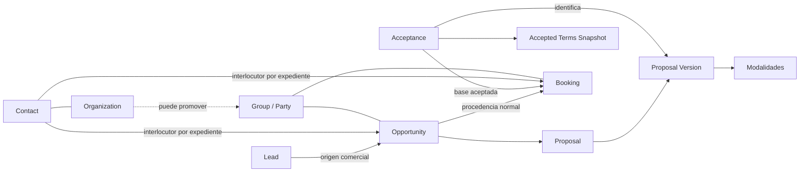
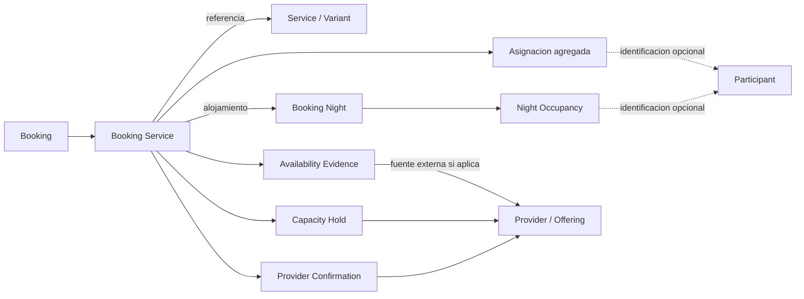
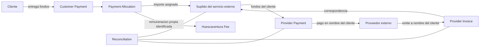

# CRM HUESCAVENTURA OS — Domain Model

Status: APPROVED
Version: 0.1
Approved: 2026-09-06
Last updated: 2026-09-06

Aprobado por revisión humana. Este documento formaliza el modelo de dominio conceptual y no constituye una implementación ni inicia la siguiente fase.

## 1. Purpose / Scope — Propósito y alcance

Traducir las reglas aprobadas a un modelo conceptual del negocio: identidades, entidades, conceptos, relaciones, agregados lógicos, responsabilidades sobre los datos, invariantes e historial. La fuente principal es [Business Rules v0.2 APPROVED](business-rules.md), bajo [Constitution v1.0](constitution.md), [Product Definition v0.1](product.md) y [D001–D017](DECISIONS.md).

Se han leído íntegramente esas fuentes, [README](../README.md), [Project Status](PROJECT-STATUS.md), [Next Steps](NEXT-STEPS.md) y el placeholder anterior de este documento. README y los documentos de coordinación orientan la fase; no añaden reglas de negocio. No se utilizan fuentes externas, supuestos fiscales ni valores de catálogo ajenos a la documentación aprobada.

Las referencias BR-xxx remiten a identificadores de business-rules.md; C Pxx, a principios constitucionales; Dxxx, a decisiones aprobadas. Las elecciones de representación forman parte del modelo conceptual aprobado y no crean nuevas políticas de negocio. Los puntos de producto ya concretados por D010–D017 se interpretan con esas decisiones, sin reabrirlos. Las notas de cierre de business-rules.md describen el final de su propia fase; el paso vigente se consulta en los documentos de coordinación.

Quedan fuera SQL, tablas físicas, migraciones, contratos API, componentes UI, máquinas de estados detalladas, arquitectura técnica, Specs, planes, tareas de implementación y código. Tampoco se crea contabilidad general ni un motor fiscal. Los nombres ingleses sirven como vocabulario estable, sin prescribir nombres físicos futuros.

## 2. Modelling Principles — Principios de modelado

### 2.1. Tipos de concepto

| Tipo | Criterio utilizado | Ejemplo |
|---|---|---|
| Entidad | Tiene identidad y continuidad aunque cambien sus datos; puede ser raíz o estar subordinada a otra entidad. | Contact, Opportunity, Booking Service. |
| Value object / concepto de valor | Describe un significado por sus valores y alcance; no necesita vida independiente. Una corrección material conserva historia. | Cantidad con unidad, franja horaria, importe con moneda. |
| Relación | Vincula identidades y expresa función, alcance o vigencia; puede necesitar identidad propia si sus cambios deben seguirse. | Primary Contact, Payment Allocation. |
| Snapshot / versión | Conserva contenido exacto e inmutable utilizado en una decisión. Su identidad se liga al concepto y versión de origen. | Proposal Version, Accepted Terms Snapshot. |
| Evidencia | Sustenta un hecho concreto, con origen, momento y alcance verificable; puede ser documental o un registro autorizado. | Availability Evidence, registro manual de una llamada inequívoca. |
| Evento / histórico | Registra que algo ocurrió o cambió, con actor, fecha, motivo y referencias al hecho original. | Cambio de participantes, conciliación rectificada. |
| Configuración | Expresa reglas o datos maestros aprobados, con fuente, vigencia y versión cuando afectan al negocio. | Tarifa, promoción, requisitos documentales. |
| Vista derivada | Reúne hechos sin apropiarse de sus identidades ni sustituirlos. | Timeline, calendario operacional, resumen de cierres. |

Los tipos pueden combinarse: Acceptance es una entidad que conserva un hecho inmutable y sus evidencias; Promotion es configuración con identidad y versiones. Clasificarlos así no decide cuántas tablas habrá.

### 2.2. Criterios transversales

- Representar por separado la relación comercial, la preparación/ejecución y la economía. Un estado de una dimensión no sustituye las otras (C P08; BR-GEN-004, BR-DIM-001–005).
- No crear entidades para estados: una reserva confirmada y una cancelada siguen siendo Booking; un pago detectado y uno conciliado conservan la identidad del movimiento. Sí separar una previsión de un movimiento, porque pueden existir independientemente y relacionarse varios a varios.
- Distinguir identidad de persona, función comercial, pertenencia a un grupo y permisos. Cliente, pagador, interlocutor y participante no son sinónimos (BR-CON-003–004).
- Asociar todo dato material a fuente, alcance, momento y condición de conocido/estimado/confirmado. Desconocido no significa cero, disponible o aceptado. Solo se bloquea la acción materialmente dependiente (C P05; BR-GEN-001–003).
- Conservar detalle por servicio/noche y reglas económicas reproducibles; un resumen nunca reemplaza sus componentes (C P09/P20).
- Mantener versiones y ajustes para reconstruir la historia con el mecanismo conceptual más sencillo. No se propone event sourcing ni reconstruir todo el CRM mediante eventos (C P06/P07).
- Aplicar minimización, economía interna reservada y supervisión humana V1 a registros, vínculos, documentos, comunicaciones, vistas y datos derivados (C P10/P11/P15).
- Mantener una identidad interna independiente de referencias y formatos de proveedores. Registrar una copia no transfiere al CRM la autoridad externa (C P01/P17).

## 3. Domain Map — Mapa del dominio

| Área | Pregunta de negocio | Conceptos principales |
|---|---|---|
| Identidad y relación | ¿Quién consulta, representa, contrata o participa? | Contact, Organization, Group / Party, roles contextuales. |
| Comercial | ¿Qué se necesita, propone y acepta? | Lead, Opportunity, Proposal, Proposal Version, Modality, Acceptance, términos. |
| Catálogo y abastecimiento | ¿Qué se puede ofrecer y con qué reglas/fuentes? | Service, Variant, Provider, Offering, Pack, Tariff, Promotion. |
| Operación | ¿Qué servicio concreto se prepara y ejecuta, para quién y cuándo? | Booking, Booking Service, Allocation, Booking Night, Hold, Confirmation, Modification. |
| Economía | ¿Qué se debe, recibe, asigna, paga y concilia? | Previsiones, pagos, suplidos, facturas externas, honorarios, costes propios, fianzas, devoluciones. |
| Coordinación y evidencia | ¿Qué ocurrió, qué falta y quién debe actuar? | Task, Alert, Incident, Document, Communication, Approval, historial. |
| Fronteras externas | ¿De dónde viene la información y quién la confirma? | Integration Source, External Reference, External Event. |

Los diagramas siguientes muestran relaciones conceptuales. Las flechas expresan vínculo o procedencia, no automatismos, transiciones, almacenamiento ni cardinalidades extraordinarias.

## 4. Core Entities — Entidades nucleares

Cada ficha declara identidad, responsabilidad y límite. Los datos indicados son información conceptual, no un listado de campos obligatorios en todas las etapas.

### 4.1. Identidad y relación comercial

| Concepto y clasificación | Identidad y responsabilidad | Relaciones y límite |
|---|---|---|
| **Contact — entidad** | Persona física identificable, incluso inicialmente con información incompleta y procedencia conocida. Conserva medios de contacto y cambios verificados. | Puede relacionarse con organizaciones y actuar en distintos expedientes. No exige ser comprador, pagador, usuario del CRM ni asistente. Teléfono/email son señales, no identidad infalible. |
| **Organization — entidad** | Empresa, colegio, agencia, asociación, club u otra organización con continuidad e historial propios. | Puede tener varios contactos y promover experiencias con grupos diferentes en distintos años. No representa automáticamente a los asistentes de una reserva. |
| **Group / Party — entidad contextual** | Grupo concreto previsto o participante en una experiencia, con contexto, tipo de grupo y tamaños estimado/confirmado diferenciados. Puede conocerse parcialmente durante la venta. | Se vincula al contexto de Opportunity/Booking; Organization es opcional. No es una agenda nominal obligatoria ni una cuenta cliente universal. No se fija aquí una política de reutilización, división o agrupación extraordinaria entre expedientes. |
| **Group Responsible / Primary Contact — relación contextual con historial** | Designación de un Contact como interlocutor principal de una oportunidad/reserva, con alcance, procedencia y evidencia de actuación. | Se conserva la designación pertinente en cada momento; puede cambiar por expediente y en el tiempo. No se crea una segunda persona ni un responsable global obligatorio de Organization. Su designación no acredita pago, confirmación de proveedor ni acceso interno. |
| **Lead — entidad de captación** | Señal/consulta de interés con origen y contexto propios, que puede permanecer incompleta. | Se enlaza con Contact y demás contexto cuando se verifica; su conversión conserva el origen. No es una variante de Contact ni exige previamente Organization o lista de asistentes. |
| **Opportunity — entidad comercial** | Proceso de venta identificable: origen, necesidad/evento, responsable, fechas, participantes previstos, intereses, estado comercial y motivos conocidos. | Puede existir sin Booking; contiene referencias a propuestas y al grupo cuando se conoce. Ganada acredita aceptación comercial. Pérdida y reactivación son situaciones de la misma Opportunity. |

Lead y Opportunity se proponen separados porque el primero conserva una entrada/señal y su procedencia, mientras la segunda gestiona la venta y sus compromisos. La conversión los relaciona; no mantiene dos ventas competidoras ni exige duplicar personas. Esta distinción no fija cardinalidades de consolidación o división que BR-PENDING-027 ha diferido.

Cliente, pagador y participante son funciones identificables en un contexto. No se añade una entidad genérica Customer que absorba Contact, Organization y Group. La identidad de cliente/destinatario de documentos se explicita según sea persona u organización; el pagador se identifica por la evidencia del movimiento y puede ser distinto. No se inventa quién contrata jurídicamente cuando aún falta verificarlo.

Ejemplos conceptuales: una empresa conserva su Organization y sus contactos aunque cada viaje tenga un Group distinto; una despedida puede tener Group y Primary Contact sin Organization. Cambiar de interlocutor para una reserva no reatribuye las aceptaciones antiguas al nuevo responsable.

Fuentes: BR-CON-001–006, BR-LEAD-001–005, BR-BOOK-001/003, BR-PAX-001; Producto §§6–9.

### 4.2. Propuesta y contratación

| Concepto y clasificación | Identidad y responsabilidad | Relaciones y límite |
|---|---|---|
| **Proposal — entidad** | Identidad comercial estable de una propuesta/alternativa de una Opportunity. | Posee su secuencia de versiones. Varias alternativas pueden coexistir; aceptar una no destruye las otras. |
| **Proposal Version — versión inmutable identificada** | Contenido exacto de una edición: composición, modalidades, fechas, cantidades, importes, condiciones, emisión, vigencia y pendientes expresados. | Pertenece a una Proposal. Lo presentado y aceptado referencia una versión concreta; los cambios materiales producen otra. La preparación editable no se confunde con una versión fijada. |
| **Proposal Modality / Personalized Pack / Pack Variant — componente identificado de versión** | Modalidad concreta para una parte del grupo: nombre, personas, noches, servicios incluidos/excluidos, condiciones y precio final por persona. | Pertenece a la Proposal Version y comparte su inmutabilidad. Puede referenciar Pack Version o componerse ad hoc. No necesita identidad de pack maestro. Su continuidad entre revisiones se conserva por referencia de origen, no editando la modalidad histórica. |
| **Acceptance — entidad de hecho aceptado, inmutable** | Quién aceptó, propuesta/versión exacta, términos/versión, fecha/hora, canal, alcance y evidencia. Si se registra manualmente, también actor y momento de registro. | Enlaza aceptante verificable, designación pertinente, Proposal Version y Accepted Terms Snapshot. No es un booleano ni el estado Ganada. Una corrección preserva el registro original y su rectificación. |
| **Accepted Terms Snapshot — snapshot inmutable** | Contenido exacto y versión efectiva de las condiciones aceptadas, con servicios, precios, pagos, cancelación, condiciones específicas/no reembolsables y mandato cuando correspondan; conserva también el proveedor cuando forme parte de las condiciones efectivamente aceptadas, sin declararlo cuando no aplique (BR-DOC-005). | Queda fijado por Acceptance junto con la Proposal Version. La referencia a una página o a «términos actuales» no basta para reconstruirlo. Puede referenciar Terms Version conservada sin imponer duplicación física. |
| **Commercial Pack — entidad de configuración** | Plantilla comercial reusable con identidad propia. | Posee Pack Versions. Una personalización solo pasa manualmente a maestro cuando se decide, conservando la procedencia sin alterar propuestas previas. |
| **Pack Version — configuración versionada inmutable** | Composición reusable de una edición del pack, servicios, condiciones y reglas aplicables. | Se referencia desde modalidades concretas; no impone sus cantidades actuales a propuestas/reservas históricas. |
| **Promotion — entidad de configuración con versiones** | Identidad de una regla promocional y sus sucesivas condiciones aprobadas. | Promotion Version fija elegibilidad comercial, composición requerida y efecto autorizado. Su aplicación histórica se conserva junto al cálculo, sin codificar «novio/a» como entidad estructural. |

Terms Version es configuración documental versionada; Accepted Terms Snapshot identifica exactamente el contenido que llegó a aceptarse y su alcance. Una futura versión de términos no modifica esa aceptación. Un mandato todavía inexistente o no aceptado se declara pendiente; ni la etiqueta Suplido ni el pago del cliente lo crean.

Las líneas de composición de una modalidad son relaciones identificables con Service/Variant, noches/fechas, cantidades, inclusiones/exclusiones y reglas económicas. Permiten explicar cómo se originan los Booking Services y sus cantidades; no son servicios ejecutados ni confirmaciones operativas.

Fuentes: BR-PROP-001–008, BR-CONV-001–004, BR-PACK-001–004, BR-PROMO-001–002, BR-DOC-005, BR-BILL-004.

### 4.3. Reserva y participantes

| Concepto y clasificación | Identidad y responsabilidad | Relaciones y límite |
|---|---|---|
| **Booking — entidad/expediente** | Referencia estable de servicios aceptados, en preparación o ejecución; conserva procedencia comercial, grupo, responsables y contexto. | Reúne Booking Services y vínculos a modificaciones, economía, documentos y comunicaciones. No absorbe Opportunity ni usa su estado como operativo. |
| **Booking Service — entidad central subordinada al expediente** | Prestación concreta con identidad propia dentro de una Booking, aunque repita un servicio del catálogo. Conserva variante, proveedor si es externo, fechas, horarios, localización, cantidades, participantes, disponibilidad, bloqueos, confirmación, dependencias, precio, economía, documentación, ejecución e incidencias. | Referencia Service/Variant y origen aceptado; dirige el detalle operacional y nocturno aplicable. Un servicio interno no exige Provider externo. Ni los valores globales ni otra prestación sustituyen su alcance. |
| **Booking Modification — entidad subordinada con historial** | Petición/revisión identificable, incluida cancelación total o parcial: solicitante, causa, alcance, antes/después, impactos, política aceptada, aprobador, fecha, evidencia y resultado de aplicación. | Se vincula a Booking y a sus servicios, cantidades, noches, acuerdos y ajustes afectados. No se crea otra Booking por el mero cambio. Petición, autorización y efecto aplicado son hechos distintos del mismo expediente de modificación. |
| **Booking Participant Allocation — relación con identidad de alcance y cantidades** | Detalle de asistentes por Booking Service y, si corresponde, Booking Night; conserva cantidad estimada/confirmada, categorías necesarias, procedencia y origen en modalidades. | Existe sin personas nominales. Separa recuento de personas de otras unidades del servicio. Las asignaciones nominales, cuando existen, explican todo o parte del recuento; no se suman de nuevo como asistentes adicionales. |
| **Booking Night — entidad subordinada a un Booking Service de alojamiento** | Noche concreta identificable en ese alojamiento, que conserva cambios de alcance, ocupación y componentes aplicados. | Tiene Night Occupancy propia y evidencia aplicable. No representa un hotel ni una habitación maestra. Modificar una noche no altera las demás. |
| **Night Occupancy — concepto de valor/asignación nocturna** | Cantidad de asistentes por noche, estimada/confirmada, con selección nominal opcional y distribución opcional cuando sea necesaria. | Es el detalle nocturno de Booking Participant Allocation, no un segundo total independiente que compita con él. Precio y capacidad respetan la unidad real de la tarifa. |
| **Participant — entidad nominal opcional** | Persona identificada para una necesidad concreta del grupo/servicio, con únicamente los datos autorizados necesarios. | Puede vincularse a un Contact existente si la identidad está verificada; no se exige crear Contact para cada asistente ni copiar sus datos indiscriminadamente. No se crean participantes ficticios para representar cantidades anónimas. |
| **Participant Service Assignment — relación identificada** | Vincula un Participant a una asignación de servicio y/o noche concreta. | Conserva alcance, origen y cambios. No implica que asista a todos los servicios o noches ni duplica su identidad por prestación. |

La identidad de Booking Service permite distinguir dos prestaciones del mismo catálogo con horarios, proveedores o condiciones distintos. La clasificación interna/externa y el alcance aplicado se conservan históricamente: actualizar el catálogo no reclasifica una prestación ya acordada.

Fuentes: BR-BOOK-001–004, BR-SVC-002–009, BR-PAX-001–008, BR-NIGHT-001–005, BR-CHANGE-001–007.

## 5. Supporting Entities / Concepts — Conceptos de soporte

### 5.1. Catálogo, reglas y proveedores

| Concepto | Clasificación y responsabilidad | Alcance / ownership lógico |
|---|---|---|
| Service | Entidad maestra con configuración versionada: servicio que puede ofrecerse, de naturaleza propia/interna o externa según el caso verificado. | Catálogo; varias prestaciones Booking Service pueden referenciarlo sin compartir su estado. |
| Service Category | Entidad de configuración versionada: clasificación editable con identidad estable y versiones de su definición/asignación al servicio. | Catálogo. Actividad, Alojamiento, Restauración, Ocio nocturno/copas, Transporte, Extra/complemento y Otro son categorías iniciales configurables. Agua/tierra/aire/nieve/indoor son atributos, no categorías rígidas. |
| Service Attribute / Attribute Assignment | Definición de atributo configurable/versionada y relación versionada de su asignación a Service/Variant. | Catálogo: agua, tierra, aire, nieve e indoor son atributos de actividad. Definición y asignación conservan lo utilizado históricamente, sin exigir entidades autónomas para cada atributo. |
| Service Variant | Componente de catálogo con identidad subordinada a Service y configuración versionada cuando sea material. | Diferencia opciones reales del servicio; no es un Booking Service ni una modalidad de propuesta por sí misma. |
| Target Audience Recommendation | Relación configurable/versionada Service/Variant ↔ público recomendado, con prioridad Alta/Media/Baja; también conserva la versión de la definición del público utilizada. | Catálogo: despedidas, amigos, empresas, familias, niños, colegios/juveniles y parejas conforme a BR-SVC-005. No acredita elegibilidad. |
| Unit Definition | Concepto de configuración versionada que define la unidad y el significado de una cantidad: personas, plazas, vehículos, habitaciones, alojamientos completos, unidades, horas, noches, días/jornadas u otras configurables. | Se referencia desde cantidades y reglas de capacidad/precio con la versión aplicada; cambiar la definición actual no reinterpreta cantidades históricas. No exige una entidad autónoma por unidad. |
| Pricing Basis / Pricing Form | Concepto de configuración versionada de la forma de precio: por persona/categoría, vehículo, habitación, alojamiento completo, grupo/servicio fijo, unidad, hora, noche, día o combinaciones aprobadas. | Tariff/Pricing Rule conserva la forma y unidades aplicadas. La forma de precio es distinta de la unidad de cantidad y del importe concreto de tarifa; no exige una entidad autónoma por forma. |
| Eligibility Rule | Regla de configuración versionada para restricciones objetivas de edad, peso u otras condiciones verificadas. | Alcance de servicio/variante/proveedor aplicable. No se inventan umbrales ni se compensa una restricción con una recomendación alta. |
| Capacity Rule | Regla versionada de unidades, mínimos, máximos, tramos y condiciones de capacidad. | Servicio/variante/oferta pertinente; capacidad estructural y disponibilidad temporal son conceptos diferentes. |
| Pricing Rule / Tariff | Tariff es entidad de configuración con identidad; Pricing Rule es la regla de cálculo aplicada por una versión de tarifa. | Servicio/variante y proveedor cuando corresponda. Soporta persona, categorías adulto/niño, vehículo, habitación, casa completa, grupo/servicio fijo, unidades, tiempo o combinaciones aprobadas. |
| Tariff Version | Snapshot de tarifa/reglas, unidad, variantes/tramos, fuente, inicio/fin de vigencia e indicación fiscal conocida. | Tariff. Versionar no verifica un valor incierto ni rellena importes ausentes. |
| Service Location | Concepto de lugar con dirección, encuentro, mapa/enlace, acceso y llegada recomendada; referencia reusable de catálogo cuando existe. | Se fija el lugar pertinente en Booking Service y se conserva el aplicado. No requiere una entidad autónoma de sedes en V1 ni usa siempre la dirección del proveedor. |
| Provider | Entidad de contraparte proveedora: continuidad de servicios ofrecidos, condiciones, contactos y relación operacional. | Puede vincular una Organization o un Contact proveedor individual cuando se identifica. La función proveedora es distinta de ser cliente; no exige duplicar la persona/organización. No es un usuario del CRM por defecto. |
| Provider Contact | Relación contextual Provider ↔ Contact, con función, medios pertinentes y antecedentes. | Provider gobierna la relación; Contact conserva identidad personal. No es una segunda ficha de persona obligatoria. |
| Provider Service Offering | Relación con identidad entre Provider y Service/Variant, con condiciones, ubicaciones y tarifas conocidas. | Contexto de abastecimiento. Ofrecer un servicio no confirma disponibilidad, bloqueo ni prestación concreta. |
| Availability Evidence | Evidencia identificable de consulta/respuesta: fuente, momento, servicio, fechas, cantidad/unidad, condiciones, certeza y vigencia explícita. | Se vincula a alcance propuesto o Booking Service. No tiene autoridad superior a la fuente externa ni vale fuera del alcance acreditado. |
| Capacity Hold / Option | Entidad de compromiso temporal: proveedor, servicio, fechas, capacidad/unidades, creación, vencimiento explícito, condiciones, evidencia y situación de liberación. | Puede existir mientras se prepara una propuesta, antes de Booking; al convertir conserva vínculo con el servicio pertinente. No es confirmación final ni vence en una fecha inventada. |
| Provider Confirmation | Hecho confirmado identificado e inmutable en su alcance, con proveedor/persona, prestación, fecha, hora, cantidad, condiciones, evidencia y registro autorizado. | Se relaciona con Booking Service y las noches/unidades que cubre. Cambios posteriores dejan nuevo hecho o rectificación; nunca amplían tácitamente su alcance. |

Las definiciones y asignaciones del catálogo completo son configurables y versionadas conforme a D010. Propuestas, Booking Services y cálculos históricos conservan las versiones o snapshots aplicados de categorías, atributos, públicos/recomendaciones, unidades y formas de precio, además de servicios/variantes, tarifas y packs; cambiar la configuración actual no los modifica ni reinterpreta retrospectivamente.

En servicios propios, Booking Service conserva por separado hechos y evidencias de capacidad, confirmación, preparación y ejecución, con el responsable interno que los verificó. No exige una Provider Confirmation externa y su naturaleza interna no confirma automáticamente ninguno de esos hechos.

Fuentes: BR-SVC-001–009, BR-PAX-005/007, BR-SUP-001–004, BR-AVAIL-001–006, BR-ECON-001/006–007, BR-TAR-001; D010; C P06/P07.

### 5.2. Requisitos, coordinación y documentos

| Concepto | Clasificación y responsabilidad | Límite |
|---|---|---|
| Internal User / CRM Actor | Entidad de identidad humana interna estable: persona autorizada para actuar dentro del CRM, distinta de Contact, Organization, Participant y Provider. | En V1 existe un único actor operativo: Administrador/Propietario. Su identidad no es un rol ni la identidad de una automatización; no se diseña autenticación ni permisos técnicos. |
| Participant Requirement | Configuración versionada del dato/requisito necesario por servicio/proveedor; su aplicación al servicio/noche/persona conserva cumplimiento y evidencia. | Edad, talla, alergias, permisos u otros datos solo cuando se justifican. No crea una ficha médica universal ni convierte recomendación comercial en autorización de tratamiento. |
| Document Requirement / Required Document | Regla configurable de documentación; Required Document es su exigencia concreta, identificable, con alcance, necesidad, situación y revisión. | Pendiente/Recibido/Revisado/No aplica/Incidencia son situaciones de la misma exigencia. No se crea una entidad diferente por estado ni se confunde recibido con revisado. |
| Document / Evidence | Document es entidad de recurso documental con procedencia, finalidad, fecha, permisos y versiones. Evidence es el vínculo de ese recurso o de un registro autorizado con el hecho que acredita. | Un archivo puede sustentar varios hechos delimitados; no los confirma por su sola incorporación. Una llamada registrada puede ser evidencia sin archivo ni audio. |
| Task | Entidad de trabajo operativo/comercial con responsable, causa, contexto, vencimiento conocido o pendiente, prioridad y resultado. | V1 asignada al Administrador/Propietario. No son las tareas de implementación SDD, que quedan fuera de esta fase. Cerrarla no ejecuta el hecho que motivó la tarea. |
| Alert / Notification | Alert es señal identificable de causa/riesgo; Notification es el aviso y evidencia de entrega a un destinatario/canal. | Una alerta puede originar avisos conforme a la política V1. Reenviar no crea un nuevo riesgo ni resuelve el original. |
| Incident | Entidad con ID propio: alcance, detector, fecha/hora, descripción, gravedad, acciones, evidencias, causa provisional/final y resolución. | Puede enlazar cliente, proveedor, Booking y Booking Service. Compensación/devolución se vincula al hecho económico independiente. |
| Communication | Entidad de interacción con canal, participantes, destinatarios, contenido, contexto y evidencias de preparación/entrega/respuesta. | Puede estar relacionada con varios contextos simultáneamente; no se duplica la conversación por cada vínculo. |
| Call Transcript | Recurso documental/contenido versionado de una Communication de llamada, con original, procedencia, fecha e identificación de importación cuando existe. | No es una entidad telefónica dependiente de PLAUD. Resumen y original coexisten y se vinculan; no se guarda audio por defecto V1. |
| Human Approval | Evidencia/registro identificado de autorización por actor, momento, acción concreta y alcance/contenido revisado. | Acceptance es aceptación del cliente; Human Approval es autorización interna. Ninguna sustituye a la otra ni acredita la ejecución autorizada. |
| Provenance / Review | Concepto de procedencia por dato o resultado material: fuente, fecha, actor, origen humano/automático, confianza opcional y necesidad/resultado de revisión. | Una extracción automática clara sigue diferenciada de confirmación; los datos manuales confirmados se preservan ante discrepancias. |
| Domain Event / Change Record | Registro histórico de hecho o cambio material, actor, momentos de hecho/registro, motivo, antes/después, vínculos y evidencia. | Da trazabilidad; no reemplaza entidades originales ni impone event sourcing. |
| Timeline Entry | Proyección trazable de comunicaciones, hechos y cambios registrados. | Conserva referencias a los originales y sus permisos; no gobierna pagos, reservas o confirmaciones. |
| Automation Definition / Execution Record | Configuración versionada del automatismo y registro identificable de cada ejecución, responsable, causa, alcance, intentos, resultado y fallos. | Solo conceptos de responsabilidad/auditoría; no se diseña un motor, contrato ni política técnica de reintentos. |

Domain Events / Change Records, Human Approvals, Booking Modifications, Reconciliations y demás actos auditables referencian al CRM Actor que realiza o registra la actuación interna, distinguiendo registrador, aprobador y responsable según corresponda. Un solicitante o aceptante externo conserva su identidad de negocio y no se convierte en CRM Actor por quedar registrado. Las automatizaciones conservan su propia identidad, versión y origen automático en Automation Definition / Execution Record; el vínculo con su responsable o aprobador humano no atribuye la ejecución automática a ese humano ni sustituye su identidad automática.

Fuentes: BR-DOC-001–005, BR-TASK-001–007, BR-INC-001–002, BR-COMM-001–006, BR-AI-001–006, BR-AUTO-001–002, BR-HIST-001–005, BR-SEC-001; D015; C P06/P07.

Los conceptos económicos se formalizan juntos en §11 para que la separación entre fondos de clientes, obligaciones externas y economía propia sea revisable en un único lugar.

## 6. Relationships — Relaciones y multiplicidades conocidas

| Relación | Alcance conocido del modelo | Restricción / cuestión no supuesta |
|---|---|---|
| Organization ↔ Contact | Una organización puede tener varios contactos; se conserva la función y su evolución verificadas. | La asociación no hace al contacto aceptante, pagador o miembro de todos sus grupos. No se presume una única afiliación vitalicia. |
| Group ↔ Organization / Contact | Organization es opcional; contactos desempeñan funciones contextuales. | Group tiene identidad distinta de Organization y no exige composición nominal completa. |
| Primary Contact ↔ Opportunity / Booking | Designación principal normalmente presente, referida al Contact y expediente concreto. | Se conserva su historia; cambios no se propagan retrospectivamente ni conceden permisos internos. |
| Lead → Opportunity | Se conserva la señal/origen de la conversión normal. | No se fija una regla general de división/consolidación de señales o expedientes extraordinarios. |
| Opportunity → Proposal → Proposal Version | Toda Proposal tiene Opportunity de origen; una Opportunity admite varias propuestas y una Proposal varias versiones. Cada versión pertenece a una Proposal. | Rechazar/aceptar una alternativa no elimina otras. |
| Proposal Version → Modality → Composición | Una versión admite varias modalidades, cada una con personas, noches y servicios propios. | Varias modalidades en un acuerdo no equivalen por sí mismas a aceptación parcial extraordinaria. |
| Acceptance → Proposal Version + Terms Snapshot | Cada aceptación identifica exactamente su versión, contenido de términos, aceptante y alcance. | No se amplía a versiones futuras ni se deduce del silencio. Aceptación parcial no descrita: DM-PENDING-001. |
| Opportunity / Acceptance → Booking | La conversión normal conserva origen y base aceptada verificable. Opportunity puede no tener Booking. | No se establece una restricción global uno-a-uno ni un mecanismo de alta directa/división/agrupación: DM-PENDING-001. |
| Booking → Booking Service | Cada prestación concreta pertenece a su expediente y tiene identidad propia; una reserva reúne sus servicios. | Un servicio de catálogo repetido puede originar prestaciones distintas. Las vías extraordinarias no se diseñan aquí. |
| Modality / Composición → Booking Service / Allocation | Se conserva procedencia del alcance aceptado y cantidades trasladadas. | Compartir Service de catálogo no basta para unir prestaciones de distinto horario/proveedor/condiciones. Se mantiene trazable la contribución de cada modalidad. |
| Booking Service → Night / Allocation | Cada noche pertenece al servicio de alojamiento; cada asignación identifica servicio y noche si aplica. | Las cifras generales o de otras noches no las sobrescriben. |
| Participant ↔ Service / Night | Un participante identificado puede tener varias asignaciones; una asignación agregada puede tener ninguna, algunas o todas sus personas identificadas. | No exige Contact ni personas ficticias para el resto; no se deducen personas distintas sumando asistencias. |
| Provider → Offering / Contact / Evidencias | Un proveedor puede ofrecer varios servicios y tener varios contactos. Evidencias, opciones y confirmaciones conservan su alcance. | Una evidencia puede cubrir varios alcances explícitos; cada Booking Service debe acreditar su cobertura sin extensión tácita. |
| Communication / Document ↔ Contextos | Un original puede vincularse a Contact, Organization, Opportunity, Booking, Booking Service y Provider según corresponda. | No se duplica por contexto ni se amplían derechos de acceso. |
| Pago ↔ Previsiones / destinos económicos | Varios pagos pueden cubrir una obligación; un pago puede descomponerse en varias asignaciones justificadas dentro del expediente. | No se aprueba compensación entre reservas ni traslado libre de fondos entre clientes; esos flujos no están descritos. |
| Suplido ↔ Factura / Pago / Conciliación | Se identifica qué importe documental, pago y fondos corresponden al servicio/cliente/proveedor. | No se fuerza igualdad «un archivo = un pago»; si una evidencia abarca varios servicios debe delimitar importes y vínculos. No se inventan repartos dudosos. |

## 7. Aggregate / Ownership Boundaries — Agregados y responsabilidad

Ownership significa aquí quién gobierna el significado y los cambios de un concepto. No equivale a propiedad legal del dinero, permisos de usuario, transacción técnica ni borrado en cascada. Se proponen límites lógicos revisables, no una arquitectura distribuida. Las filas agrupadas describen responsabilidades relacionadas: Contact y Organization son raíces distintas, como también Lead y Opportunity; la agrupación económica no convierte todos sus registros en una única entidad.

| Raíz / límite lógico | Elementos que gobierna | Referencias que conserva sin absorber |
|---|---|---|
| Contact / Organization | Identidad, medios/datos propios e historial; relaciones verificadas entre personas y organizaciones. | Grupos, expedientes, participantes y papeles contextuales. No se borran sus historias al cambiar de interlocutor. |
| Group / Party | Identidad del grupo concreto y tamaños de referencia con su procedencia. | Responsable según expediente y detalle de asistencia, que gobiernan servicio/noche. No domina los totales operacionales. |
| Lead / Opportunity | Lead gobierna señal/origen; Opportunity gobierna necesidad, seguimiento, estado comercial y motivo de pérdida. | Contact/Organization/Group, propuestas, aceptación y Booking conservan sus identidades. |
| Proposal | Identidad, versiones y alternativas propias; cada versión gobierna modalidades, composición, precio y condiciones ofrecidos fijados. | Catálogo, Pack/Tariff/Promotion Versions y evidencias. Acceptance fija el hecho y alcance aceptados sin editar la versión. |
| Acceptance | Hecho de aceptación, aceptante, evidencia y snapshot exacto de términos aceptados. | Propuesta, registros de pago usados como evidencia y futura Booking. No confirma por sí misma la operación. |
| Booking | Pertenencia de prestaciones al expediente, procedencia, responsabilidades, modificaciones y evaluaciones de cierre. | Opportunity, documentos, movimientos e incidentes conservan sus ciclos propios. |
| Booking Service — subagregado lógico | Alcance de la prestación, asignaciones, noches, lugar/horario aplicado, preparación y hechos de ejecución; identifica qué evidencia cubre cada confirmación. | Service/Variant, proveedor/oferta, opciones, evidencias y economía. Una revisión se limita al alcance afectado; no exige modificar todos los servicios. |
| Catálogo y reglas maestras | Service y variantes, categorías, atributos/asignaciones, públicos/recomendaciones, unidades y formas de precio; Pack, Tariff, Promotion y requisitos aplicables, con sus versiones. | Sus referencias históricas permanecen fijadas en propuestas y servicios. La nueva configuración solo gobierna usos posteriores aplicables. |
| Provider / Offering / compromisos | Provider gobierna contexto/relación; Offering, condiciones ofrecidas. Cada opción/confirmación conserva compromiso y evidencia acotados. | El CRM registra lo verificado; el proveedor mantiene autoridad sobre capacidad y condiciones externas. |
| Economía del expediente | Cada pago, suplido, honorario, coste, fianza, devolución y conciliación mantiene identidad o detalle propio y ajustes. Las asignaciones explican sus relaciones. | Booking/Booking Service dan contexto, no transforman fondos del cliente en patrimonio propio ni validan documentos externos. |
| Communication / Document / Incident / Task | Cada entidad gobierna su original, revisiones y resultado; vínculos comunes permiten consultar varios contextos. | Timeline y calendario solo proyectan hechos; no tienen autoridad para modificarlos. |

Participant conserva su identidad nominal dentro del contexto necesario; cada Booking Service/Night gobierna la relación de asistencia pertinente. Corregir una identidad no modifica silenciosamente una lista ya utilizada: el cambio material queda trazado con las limitaciones de conservación de §15.

La conversión conserva referencias y fija alcance aceptado; no enlaza valores vivos de tarifa, pack o grupo que cambien los servicios retrospectivamente. Una modificación relaciona sus impactos comerciales, operativos y económicos; documentar el vínculo no autoriza ejecutar automáticamente todos sus efectos.

En V1 el único CRM Actor operativo es Administrador/Propietario. Comercial, Operaciones, Administración y Colaborador interno limitado son roles/asignaciones futuras del actor, no identidades distintas; no se activan por figurar en el modelo. Administración no equivale automáticamente a Administrador. Contact, responsable de grupo, cliente y Provider no ganan acceso por sus relaciones. Costes, márgenes, beneficios, comisiones y desgloses internos permanecen reservados en cualquier soporte (BR-SEC-001–005; D015; C P10/P11).

## 8. Identity and Versioning — Identidad y conservación histórica

### 8.1. Dos niveles de identidad

Toda entidad requiere una identidad técnica interna estable e independiente de nombres, teléfonos, emails y proveedores. Las entidades subordinadas y relaciones identificadas requieren continuidad en su alcance, sin imponer códigos humanos a cada concepto.

Opportunity, Proposal, Booking e Incident necesitan además identificador humano automático, único, correlativo anual, buscable y no reutilizable. Formatos aprobados de referencia: OP-2026-0001, PR-2026-0001, RES-2026-0001 e INC-2026-0001. Una versión se distingue de su propuesta: PR-2026-0042 · v3. Estos son ejemplos de formato, no registros reales ni secuencias físicas.

Archivar, fusionar o anular no libera identidades para reutilizarlas. Una fusión humana preserva las identidades de origen, relaciones y procedencia para reconstruir ambos historiales. External Reference agrega identidad en un sistema externo sin sustituir la interna (BR-ID-001–002, BR-CON-005).

### 8.2. Qué se conserva y cómo

| Objeto / hecho | Tratamiento conceptual | Contenido histórico necesario |
|---|---|---|
| Contact, Organization, Group, CRM Actor, asignaciones de roles, Lead, Opportunity | Identidad estable + historial de cambios materiales. | Antes/después, fuente, motivo, actor, fechas; pérdidas y designaciones previas. |
| Proposal / Proposal Version / Modality | Versiones inmutables dentro de identidad comercial estable. | Composición, cantidades, noches, precio, condiciones, fuentes, vigencia y pendientes exactos de cada edición. |
| Acceptance / Accepted Terms Snapshot | Hecho y contenido inmutables; rectificación enlazada si corresponde. | Aceptante, registro, versión de propuesta/términos, canal, alcance, evidencia y mandato efectivamente aceptado si existe. |
| Catálogo completo (§5.1), Pack, Tariff, Promotion, reglas/requisitos y términos | Configuración versionada; snapshots de las versiones utilizadas, incluidas definiciones y asignaciones de catálogo. | Fuente, vigencia aplicable, unidades, condiciones y reglas conocidas, sin inventar valores. |
| Booking Service, cantidades, noches, horario y lugar | Vista vigente + historial; baseline del alcance aceptado y modificaciones identificadas. | Último alcance confirmado, solicitud de cambio, antes/después, efectos y necesidad de revalidación. |
| Cálculo económico aplicado | Snapshot reproducible del cálculo y ajustes posteriores. | Cantidades/unidades, versiones, precios, descuentos, honorarios/costes previstos, confirmados y reales; precio calculado y final manual. |
| Disponibilidad / opción / confirmación | Evidencias y compromisos identificados, vinculados a su evolución. | Consulta/respuesta, alcance, fuente/momento, vencimiento explícito, cambios, revalidación y liberación acreditada. |
| Pagos / asignaciones / suplidos / fianzas / devoluciones / conciliaciones | Identidad de movimientos y relaciones + hechos/ajustes históricos. | Previsión separada, importe, método, fuente, referencias, correspondencias, discrepancias, autorizaciones y ejecución. |
| Documentos / originales / transcripciones / resúmenes | Versiones de documentos importantes y relación explícita original-derivado. | Procedencia, contexto, finalidad, correcciones, evidencia de revisión y permisos. |
| Tareas / alertas / incidencias / automatismos | Historial de origen, acciones y resultados. | Motivo, actor, fechas, responsables, vínculos, intentos, fallos, efectos comprobados y compensaciones. |

No todo dato maestro necesita una edición de documento completa: basta una versión o historial que permita reconstruir lo utilizado. Las versiones fijadas, aceptaciones y evidencias históricas no se corrigen silenciosamente. Se distinguen momento del hecho y momento del registro. La inmutabilidad de negocio queda sujeta a eliminación/anonimización legal autorizada y auditada, no a retención personal ilimitada (C P06/P07; BR-HIST-001–005, BR-DOC-002, BR-SEC-005).

## 9. Commercial Dimension — Dimensión comercial

### 9.1. Captación, propuesta y aceptación

Opportunity representa la venta; su estado comercial sigue el vocabulario aprobado de BR-DIM-001. No se duplican sus estados como entidades. Convertir Lead exige método válido de contacto, necesidad/evento identificable y posibilidad comercial real; no scoring, fecha definitiva ni una ficha completa global. Pérdida exige motivo conocido o «desconocido» explícito; la reactivación no revalida automáticamente precio/disponibilidad.

Proposal Version conserva emisión y vencimiento efectivo. La validez por defecto es 7 días configurable; prevalece el límite más restrictivo si antes vence un precio, disponibilidad u opción relevante. Una versión caducada requiere revalidar los datos materiales antes de aceptar; esa revisión conserva su evidencia y genera nueva versión cuando cambia materialmente el contenido. No se inventa vigencia para fuentes que no la indican.

Acceptance admite WhatsApp del responsable, email, web/formulario, anticipo inequívocamente relacionado o llamada registrada por usuario autorizado, según BR-PROP-005. La misma evidencia de anticipo puede vincular Acceptance y un Customer Payment, pero sus verificaciones y significados son distintos. Leído, silencio, ambigüedad o mero envío no son aceptación. Se conserva también rechazo de la alternativa y motivo conocido como hecho histórico, sin crear una nueva entidad Proposal Rejected.

La conversión normal a Booking conserva Opportunity, versión, aceptación, términos y alcance. Puede abrir trabajo de preparación con servicios pendientes. Las aceptaciones parciales y vías extraordinarias quedan delimitadas en DM-PENDING-001. No se crea ni se edita una reserva real en esta fase.

### 9.2. Modalidades, packs y promociones

Cada modalidad expresa personas, noches, componentes incluidos/excluidos, condiciones específicas y precio final por persona. La composición permite obtener cantidades exactas de cada servicio/noche al trasladar lo acordado. Es un cálculo de origen trazable: cambios posteriores del total del grupo o del pack maestro no sobrescriben ese detalle.

En la propuesta comercial de packs al cliente se presenta por modalidad precio final por persona, número de participantes y elementos incluidos. El desglose de proveedor, suplidos, honorarios, comisiones, margen y beneficio permanece interno. La unidad real de componentes fijos se conserva aunque el pack se presente por persona; no se los transforma en tarifas por persona. Se conservan precio calculado y precio comercial final manual, actor, fecha y motivo, sin redondeo comercial automático ni ajuste de suplidos para cuadrar (BR-PACK-002–004).

Promotion Version representa las condiciones aprobadas de «Novio/a gratis»: despedida, mínimo 15 asistentes totales y pack completo con al menos un alojamiento, una actividad, un restaurante y dos copas en Tararí. En el supuesto homogéneo aprobado, 15 asistentes pagan 14, 16 pagan 15 y 17 pagan 16. La aplicación conserva versión, alcance, base, beneficio e impacto económico. No reduce asistentes reales ni cantidades/deudas de proveedores. No se activa para otros públicos o servicios independientes; futuras promociones necesitan aprobación. El reparto entre modalidades/precios diferentes permanece en DM-PENDING-003 (BR-PROMO-001–002).

### 9.3. Cambios del compromiso y políticas aceptadas

Un cambio material de composición, precio o condiciones de propuesta produce nueva versión. Tras aceptación no se edita la versión aceptada: Booking Modification conserva petición, alcance, impacto y aplicación; cuando corresponde una nueva propuesta/versión, la enlaza con la nueva aceptación necesaria. No se define aquí una máquina detallada para elegir vías extraordinarias.

Cancellation es el tipo/alcance de una modificación, no una Booking distinta. La política aplicable se conserva como configuración/versionado de condiciones aceptadas y cálculo por parte afectada:

- Causa de Huescaventura/proveedor: devolución del 100 % de la parte cancelada, también si se comunicó no reembolsable.
- Cancelación voluntaria: ≥7 días, devolución del importe correspondiente; ≥3 y <7, retención del 50 % de la parte cancelada; <3, retención/cobro del 100 %. Exactamente 7 y 3 pertenecen a sus intervalos respectivos.
- No reembolsable solo prevalece en cancelación voluntaria si fue comunicado y aceptado expresamente. No-show, retraso del cliente que impida prestar el servicio, imposibilidad por alcohol/drogas o exclusión por incumplir normas de seguridad no generan devolución de la parte afectada.

Se conservan causante, motivo, participantes/servicios/noches, importes pagados/devueltos/retenidos y pendientes, política, evidencia y autorización. Una petición no acredita cancelación de proveedor; un derecho a devolución no acredita reembolso realizado. Los repartos no definidos y la convención temporal ambigua conservan DM-PENDING-003/004. No se inventa un recargo por modificación (BR-CHANGE-001–007).

## 10. Operational Dimension — Dimensión operativa

### 10.1. Alcance de cada prestación

Booking conserva su situación operativa; cada Booking Service conserva la propia conforme a BR-DIM-002/004. La señal «Pendiente de revalidación» explica que cambió un dato material y preserva el último hecho confirmado. Disponible, bloqueado, confirmado, preparado y ejecutado describen hechos diferentes; sus transiciones detalladas pertenecen a una fase posterior.

Booking Service distingue fecha, hora solicitada, franja, preferencias, alternativas del proveedor, hora final, duración y llegada recomendada. El lugar aplicado incluye encuentro, acceso y referencia de mapa cuando se conocen. Se registran dependencias entre servicios y conflictos de agenda explicables; una incompatibilidad obvia produce aviso V1 y revisión del administrador, no bloqueo automático. Justificarla no elimina una restricción objetiva de capacidad/seguridad (BR-SVC-007–009).

Availability Evidence acredita únicamente lo comunicado/verificado. Capacity Hold conserva temporalidad y condiciones; sin vencimiento explícito requiere tarea de revalidación. El aviso de caducidad no acredita liberación ejecutada. Provider Confirmation requiere aceptación inequívoca de su alcance; una llamada registrada autorizadamente es válida sin confirmación escrita posterior obligatoria. Cambiar fecha, cantidad u otra condición material obliga a revisar la cobertura, sin borrar el hecho anterior (BR-SUP-002–004; BR-AVAIL-001–006).

La confirmación operativa de Booking requiere los servicios críticos necesarios confirmados y las condiciones económicas aplicables satisfechas o su excepción autorizada. El cumplimiento económico no se presume por ganar la Opportunity ni por presentar justificantes sin verificar (BR-CONV-004, BR-DIM-002/005).

### 10.2. Cantidades agregadas y personas opcionales

Se proponen tres niveles complementarios:

1. Group conserva tamaño total estimado y confirmado con fuente. Su total de personas distintas no se obtiene sumando asistencias a actividades o noches.
2. Booking Participant Allocation conserva cantidades propias por servicio; Booking Night/Night Occupancy aporta el detalle por noche de alojamiento. El servicio conserva además otras cantidades de cobro/capacidad, como un vehículo o una casa completa, sin confundirlas con asistentes.
3. Participant y Participant Service Assignment identifican únicamente a quienes deban figurar nominalmente. Una lista parcial explica una parte de la cantidad agregada; no equivale a una lista completa ni reduce a cero el resto desconocido.

En un mismo alcance nominal no se cuenta dos veces a la misma persona. Si el recuento y una lista nominal discrepan, se conserva la discrepancia y se revisa la decisión afectada; no se reescribe automáticamente el total. No se exige igualdad entre grupo y servicio ni entre servicios, pero la diferencia debe explicarse desde el alcance conocido. Una cantidad nueva no hereda capacidad ni confirmación acreditadas para la anterior.

Ejemplo ilustrativo de estructura, sin precios, capacidades o datos de clientes reales: una modalidad de 10 personas incluye rafting y dos noches; otra de 2 personas excluye rafting y solo incluye la primera noche. Si ambas incluyen la misma cena, la composición da rafting 10, cena 12, noche 1: 12 y noche 2: 10. La reserva puede prepararse con esos agregados sin 12 fichas nominales; si el alojamiento requiere nombres, sus asignaciones se completan por noche. Esas cifras no permiten inferir personas por otros servicios ni una tarifa de alojamiento por persona-noche.

Habitaciones, camas, distribución, cuna, régimen y restricciones son detalle opcional según necesidad. Una casa completa puede representarse por alojamiento y ocupaciones nocturnas sin distribución nominal de habitaciones. El plazo estándar de cifra final es 7 días antes, configurable por servicio/proveedor/reserva; vencer genera revisión, alertas y recálculo pertinente, sin confirmar estimaciones. El ancla temporal multifecha queda en DM-PENDING-004 (BR-PAX-001–008, BR-NIGHT-001–005).

### 10.3. Preparación, documentación e incidencias

Cada exigencia concreta de Participant Requirement o Document Requirement se vincula al servicio/noche/persona pertinente. Solo lo realmente imprescindible bloquea el compromiso o preparación dependiente. Recibir un documento no acredita haberlo revisado. Documentos generales de cliente/facturación se solicitan cuando son necesarios, sin convertirlos en requisito universal de captación ni habilitar emisión fiscal.

Task y Alert relacionan causa, responsabilidad y acción pendiente: bloqueos, cobros, confirmaciones, factura de proveedor, pago de suplido, documentos, listas necesarias, disponibilidad, modificaciones, cancelaciones y seguimiento, conforme a BR-TASK-005. En V1 todos los avisos internos aparecen en CRM; Críticos/Importantes también en WhatsApp, ninguno por email, y todos al Administrador/Propietario. El calendario operacional deriva de esos hechos; no se añade una entidad Calendar Event que compita con el servicio o vencimiento original.

Incident conserva gravedad Leve/Importante/Crítica y las situaciones base aprobadas, sin diseñar transiciones. La causa final verificada se distingue de lo detectado/supuesto. Una crítica abierta impide cierre completo salvo justificación explícita del administrador con alcance, motivo y auditoría; esta excepción no acredita obligaciones económicas pendientes (BR-INC-001–002).

## 11. Economic Dimension — Dimensión económica

### 11.1. Entidades, relaciones y conceptos separados

| Concepto | Clasificación y responsabilidad | Relaciones y hechos que no sustituye |
|---|---|---|
| Payment Policy Version | Configuración versionada de la política de cobro y condiciones del esquema. | Su aplicación en Booking/servicio conserva también las excepciones autorizadas. No implica que se haya recibido dinero. |
| Payment Schedule | Composición identificada de los vencimientos concretos aplicados al expediente, con base, política/versionado, referencia temporal y ajustes. | Agrupa Expected Payments y conserva su historia; no es la política maestra ni un conjunto de movimientos recibidos. |
| Expected Payment / Payment Due | Concepto identificado de previsión u obligación de cobro, con importe, vencimiento, alcance y fuente. | Se relaciona con pagos reales mediante asignaciones/conciliación. Dos vencimientos no requieren dos pagos exactos ni un movimiento esperado es dinero disponible. |
| Customer Payment | Entidad del movimiento entrante identificado o detectado, con pagador, reserva, importe, fecha, método, referencia, procedencia y evidencia según se conozcan. | Detección, recepción verificada, conciliación, incidencia y devolución son hechos/situaciones ligados al mismo movimiento, no entidades de pago duplicadas por estado. |
| Payment Allocation | Relación identificada de un importe de un pago/fondos a una obligación, servicio o destino económico dentro del expediente, con fuente y ajustes. | Distingue qué se destina a honorarios, fondos para suplidos o fianza cuando aplica. Una asignación prevista no acredita fondos recibidos ni un pago al proveedor. |
| Suplido / Managed Client Funds | Entidad de gestión por cuenta del cliente para un servicio externo: cliente, proveedor, Booking Service, importe debido estimado/confirmado, fondos asignados, mandato/evidencia cuando exista y situación documental/económica. | Coordina relaciones con factura dirigida al cliente, pago y conciliación. No es coste ordinario propio ni ingreso propio por recibir fondos. «Suplido» identifica el modelo operativo declarado, sujeto a validación profesional. |
| Provider Invoice addressed to client | Entidad de documento externo recibido/gestionado: proveedor emisor, cliente destinatario, importe identificado, original, revisión y vínculos. | Documenta la obligación externa y su correspondencia. Recibirla no acredita pago ni autoriza al CRM a emitir otra; pendiente/recibida/revisada/vinculada son distinciones del mismo documento/exigencia. |
| Provider Payment | Entidad del pago al proveedor, con previsión/programación y ejecución diferenciadas, importe, fecha, medio, referencia, evidencia y asignaciones pertinentes. | El pago de suplido usa fondos del cliente en su nombre y se vincula al servicio/reserva. No sustituye la factura ni se reclasifica automáticamente como coste propio. |
| Huescaventura Fee / Honorarium | Concepto económico identificado de remuneración propia por organizar los servicios, con regla, base, importe previsto/confirmado/aplicado y ajustes. | Se vincula al expediente/servicio y al cálculo interno; soporta los mecanismos aprobados de fijo, por persona, por reserva o variable sin inventar importes. No representa todo lo cobrado. |
| Internal Cost | Concepto económico identificado de coste propio atribuible, distinguiendo estimado, confirmado y real, fuente, regla y evidencia. | Se asigna a servicio/expediente para reproducir rentabilidad. No absorbe facturas externas dirigidas al cliente ni presupone costes desconocidos de Tararí. |
| Deposit / Fianza | Entidad de garantía exigible del servicio/alojamiento, con condición aplicada, importe, entrega, devolución o retención parcial/total y motivo. | Relaciona movimientos reales y justificaciones. No equivale al anticipo comercial ni desaparece por terminar el servicio. Sin fianza es configuración explícita, no importe desconocido tratado como cero. |
| Refund | Entidad de devolución con origen en cobro(s) y parte afectada, derecho/importe, petición, autorización, ejecución, método y evidencia. | Mantiene separadas esas situaciones del mismo reembolso. Cancelación, autorización o incidencia resuelta no acreditan ejecución. |
| Reconciliation | Registro identificado de comprobación y correspondencia entre obligaciones, movimientos, asignaciones y evidencias autorizadas, con alcance, resultado, actor, fecha y diferencias. | Puede proponer coincidencias antes de validarlas; dudas y rectificaciones preservan historia. No es un booleano global del expediente. |
| Economic Calculation Snapshot | Snapshot de componentes y reglas aplicados, con comparación previsto/confirmado/real y recálculos enlazados. | Une cantidades/unidades, tarifas/versiones, promociones, precio calculado/manual, honorarios y costes propios sin ocultar fondos de terceros. |

No se crea una entidad nueva para cada estado de pago o factura. Expected Payment se separa de Customer Payment porque la obligación y el movimiento existen de forma independiente: puede faltar el movimiento, llegar parcialmente o cubrir más de un vencimiento. Reconciliation registra el acto verificable de correspondencia y su alcance.

### 11.2. Flujo de suplidos y fondos ajenos

**PENDIENTE DE VALIDACIÓN PROFESIONAL**: se representa el funcionamiento operativo aprobado en D013 y BR-SUPL-001–004; no se concluye su fiscalidad definitiva, no se crean facturas legales ni numeración fiscal y no se valida aquí el tratamiento exacto de Tararí.

El proveedor externo factura directamente al cliente; Huescaventura recibe/gestiona esa factura y paga en nombre del cliente con sus fondos. Por servicio se separan importe debido al proveedor, fondos del cliente asignados, factura externa dirigida a ese cliente, pago ejecutado, conciliación y remuneración/costes propios. El mandato/autorización solo se vincula cuando su contenido efectivo exista y esté aceptado; DM-PENDING-002 conserva la dependencia legal.

Los fondos recibidos no se contabilizan dos veces por asignarlos a varios destinos. Una asignación utiliza una porción identificada: previsiones, fondos verificados, consumos y devoluciones deben permitir reconstruir qué importe queda pendiente o disponible para su finalidad, sin contar dos veces el mismo movimiento ni la misma porción. Si faltan fondos o el reparto es dudoso se hace visible; no se inventa financiación propia, compensación entre clientes o ajuste de importes.

La factura, el importe debido y el pago correspondiente deben poder contrastarse. Una diferencia crea discrepancia y revisión. Un suplido solo cierra documentalmente cuando hay factura del proveedor dirigida al cliente, importe identificado, pago realizado, conciliación y vínculo servicio/reserva. Pagado sin factura sigue abierto y genera alerta. Haber ejecutado el servicio no resuelve esa ausencia.

### 11.3. Cobros, devoluciones y fianzas

La política general aplicada es 50 % al confirmar y 50 % restante 7 días antes. A menos de 7 días se exige 100 % antes de confirmar, salvo excepción autorizada. Payment Policy Version y Expected Payments conservan el esquema, base, fechas aplicables y excepción con actor/momento/motivo; admiten otras configuraciones futuras aprobadas sin cambiar el concepto de pago. La referencia multifecha ambigua permanece pendiente de DM-PENDING-004.

El método actual es transferencia bancaria. Referencia, importe, cliente y fecha pueden fundamentar una propuesta de conciliación; una coincidencia dudosa requiere validación humana. Avisos/justificantes se contrastan con fuente autorizada. Los parciales conservan saldo por cubrir; varios pagos pueden cubrir un vencimiento y un pago puede cubrir varios mediante asignaciones comprobables. Un duplicado detectado no incrementa el total recibido. No existe un campo conceptual único paid que sustituya estas relaciones (BR-PAY-001–007).

Refund conserva el importe debido conforme a causa, parte afectada y política aceptada de §9.3, separado de su autorización y ejecución. Normalmente se devuelve por el mismo medio; no se inventan excepciones. La devolución se vincula al cobro y ajustes/asignaciones afectados y no borra el movimiento original. Las acciones sensibles de cobro, pago y reembolso preparadas por IA requieren aprobación humana concreta.

Fianza conserva exigencia y condiciones configurables propias, entrega si procede y resolución. Su devolución/retención necesita hecho, importe y motivo, manteniendo diferencias visibles. No se suma al anticipo como si compartieran significado ni se declara resuelta por un cierre comercial (BR-NIGHT-005).

### 11.4. Tarifas, importes e historia aplicada

Tariff conserva identidad; Tariff Version conserva fuente, vigencia, unidad, condiciones y reglas. La tabla actual de Huescaventura es la fuente maestra inicial aprobada, pero no está completa en el repositorio: no se inventa su contenido. Se distinguen estimación autorizada, importe confirmado y valor históricamente aplicado. Si un coste material incierto afecta a una propuesta definitiva, se confirma antes de enviarla (BR-ECON-001/006).

El cálculo aplicado conserva componentes por servicio/noche, unidades reales, precios unitarios, tramos, descuentos/promoción, comisiones/honorarios, coste propio previsto/confirmado/real y precio final utilizado. El ajuste manual conserva calculado/final y motivo; no modifica silenciosamente obligaciones externas. La nueva tarifa verificada puede exigir revalidar o proponer modificación, pero nunca reescribe lo aceptado. Un total de pack no sustituye su descomposición.

Moneda base EUR; los importes visibles/cobrados tienen 2 decimales y puede conservarse mayor precisión interna. Cada tarifa/coste indica expresamente IVA incluido/excluido; cuando sea necesario se distinguen base, impuestos y total. Los precios comerciales son normalmente IVA incluido, sin inferir el tratamiento del proveedor. Tipos/tratamientos fiscales no verificados quedan pendientes y bloquean solo el cálculo dependiente; no se escogen tipos ni algoritmos de reparto/redondeo adicionales aquí (BR-ECON-007; DM-PENDING-002/003).

La rentabilidad operativa principal se reconstruye como honorarios propios menos costes propios atribuibles. Se comparan previsto, confirmado y real; no se presenta como definitiva con costes desconocidos o repartos no aprobados. El total gestionado con fondos de clientes no se toma automáticamente como ingreso propio (BR-ECON-002–005).

### 11.5. Tararí

Tararí se representa como Service propio/interno bajo el mismo titular/NIF indicado en BR-TAR-001. Puede tener variantes, unidades, tarifas, reglas de coste interno y Booking Services propios. No requiere Provider externo, Suplido ni factura Tararí → Huescaventura por defecto. Su tratamiento fiscal exacto permanece **PENDIENTE DE VALIDACIÓN PROFESIONAL**.

Las únicas cifras aquí reproducidas son las aprobadas como configuración versionable: dos copas incluidas en todo pack completo de despedida, valor comercial del conjunto 15 € y coste interno estándar del conjunto 3,80 €; Extra Pack 25 copas, 25 × 7 € = 175 €; Extra Pack 50 copas, 50 × 6,50 € = 325 €. Los extras se separan de las dos copas incluidas. Los importes del conjunto de dos no son valores unitarios de cada bebida. Los costes internos de los extras no han sido aportados y no se extrapolan (BR-TAR-002–003).

### 11.6. Tres dimensiones de cierre

Se propone un concepto compuesto **Closure Assessment** dentro de Booking: tres evaluaciones distinguibles, con criterios aplicables, evidencias, pendientes, actor/momento y justificaciones. No son tres nuevas entidades autónomas ni un único estado que reemplace los estados comerciales y operativos. Se conservan sus cambios para reconstruir por qué se consideró resuelta cada dimensión.

| Dimensión | Qué acredita su resolución | Qué no basta |
|---|---|---|
| Commercial closure | Relación comercial y condiciones finales resueltas, con acuerdo/modificaciones y motivos pertinentes. | Marcar la Opportunity como Ganada sin resolver condiciones finales. |
| Operational closure | Servicios ejecutados/cancelados correctamente y sin pendientes críticos; justificaciones de incidencias según la regla aprobada. | Venta aceptada, pago, disponibilidad o mera solicitud de cancelación. |
| Economic closure | Cliente ha pagado lo debido; suplidos conciliados y facturas de proveedores recibidas cuando aplican; honorarios registrados; devoluciones y fianzas resueltas; sin incidencias económicas abiertas. | Servicio Finalizado, pago al proveedor sin factura o reembolso solo autorizado. |

**Closed / Historical** es la condición conjunta alcanzable únicamente cuando las tres dimensiones están resueltas conforme a BR-CLOSE-001–002. Los requisitos se evalúan cuando aplican: no se fabrica una factura de proveedor externo para Tararí. Una incidencia crítica abierta exige la justificación explícita permitida por BR-INC-002; esa justificación no sustituye pagos, documentos ni devoluciones ausentes. Cierre no elimina historial, y archivado recuperable es un concepto de conservación distinto de acreditar cierre completo.

## 12. Communications / Audit — Comunicaciones y auditoría

Communication mantiene una única identidad y vínculos de contexto con Contact, Organization, Opportunity, Booking, Booking Service y Provider. Canal y fuente son dimensiones diferentes: WhatsApp, email y teléfono son canales; PLAUD puede ser fuente de la transcripción de una llamada atendida personalmente. Un canal nuevo no requiere otro tipo de cliente o reserva.

Original, adjuntos, transcripción, resumen y notas pueden coexistir con relaciones explícitas de procedencia. Un resumen tiene autor/origen, fecha y referencia al original; su edición no reemplaza la transcripción. Se conserva el original cuando sea técnicamente viable y esté autorizado por finalidad/privacidad. No se almacena audio por defecto en V1 ni se presupone consentimiento por disponer de transcripción (BR-COMM-001/004–005).

Se distinguen elaboración, preparación, aprobación, envío, recepción y respuesta mediante hechos/evidencias del mismo contexto; no se diseña una máquina de estados. Una aprobación interna se refiere al contenido concreto, no acredita envío ni aceptación. La naturaleza informativa o sensible depende del contenido, no del canal. El seguimiento de propuestas genera recordatorio interno a los 2–3 días y antes de caducidad con parámetros configurados; se prepara el mensaje, pero V1 no lo envía al cliente sin supervisión. Las informativas con plantilla solo se automatizan si una Spec lo autoriza (BR-PROP-007; BR-COMM-002–003).

Provenance / Review acompaña los datos extraídos: fuente, fecha, actor/origen automático, confianza opcional y revisión cuando corresponda. Claridad de extracción no equivale a confirmación de negocio. Ante «18 confirmados» y un mensaje tentativo de 16, se conserva 18, se registra posible cambio/discrepancia y tarea, y la validación humana deja historial. Una acción sensible de IA exige Human Approval de propuesta concreta y vínculo a ejecución; cambiar materialmente su alcance exige nueva aprobación (BR-AI-001–006).

Domain Event / Change Record conserva quién hizo qué, cuándo ocurrió y cuándo se registró, por qué, alcance, valores anteriores/nuevos y evidencia. En una creación se expresa que no existía valor previo. Un motivo material debe ser reconstruible aunque otro comentario libre sea opcional. Timeline Entry reúne referencias a esos hechos y originales; no es el lugar único donde existen aceptación, confirmación o pago. Timeline y calendario respetan permisos de cada fuente, incluida economía interna (BR-HIST-001–005).

Automation Definition y Execution Record permiten identificar responsable, versión, disparador, entradas, permisos, efectos, registros afectados, intentos, fechas, resultado e incertidumbres. Un fallo persistente genera aviso Importante/Crítico al administrador. Un efecto sensible incierto se verifica antes de repetirlo; recibir otra vez el mismo hecho no lo duplica. No se inventan número de reintentos, pausas, contratos ni mecanismos técnicos (BR-AUTO-001–002; C P14).

## 13. External Integration Boundaries — Límites de integración

| Concepto genérico | Significado conceptual | Límite |
|---|---|---|
| Integration Source | Identifica procedencia y responsabilidad de una fuente externa y capacidades verificadas cuando existan. | No confunde prioridad aprobada con integración disponible ni conserva secretos en el dominio compartido. |
| External Reference | Relación entre identidad interna y referencia en una fuente/sistema, con tipo, alcance y procedencia. | Puede haber varias referencias para un expediente/documento; ninguna sustituye su identidad canónica ni implica sincronización autorizada. |
| External Event | Registro identificable de un hecho recibido: origen, referencia externa, momento del hecho/recepción, alcance, evidencia y resultado de revisión/conciliación. | Recibir/detectar no confirma. Repetir el mismo hecho conserva trazabilidad sin duplicar su efecto. |

Supabase sigue siendo registro canónico del CRM (D004, C P01), sin diseñar su almacenamiento. Proveedores conservan autoridad sobre su disponibilidad, precios y condiciones externos verificados; el medio autorizado aporta evidencia de movimientos; el emisor externo conserva responsabilidad sobre su documento. Una nueva información verificada prevalece como información externa actual, conserva la anterior y abre revisión si afecta al expediente; no modifica el acuerdo aceptado silenciosamente.

| Frontera aprobada | Representación del dominio | Pendiente que se conserva |
|---|---|---|
| Telefonía IA + WhatsApp, prioridad 1 | Communication, transcript, contexto compartido, Source/Reference/Event separados del canal y proveedor. | BR-PENDING-001/035: comparativa de ElevenLabs y al menos una alternativa real y capacidades. No se escoge proveedor aquí. |
| Email, prioridad 2 | Communication con originales y entrega evidenciada; info@huescaventura.com es dirección comercial futura aprobada, otras pueden conservarse históricas. | Capacidad técnica BR-PENDING-035; no se ejecuta migración. Ausencia de avisos internos por email V1 no impide email comercial. |
| Calendario, prioridad 3 | Vista operacional de hechos del CRM; referencias auxiliares de Google Calendar. | Sincronización prevista, capacidades por validar. Un cambio crítico externo necesita validación/regla explícita; nunca cambia silenciosamente Booking. |
| Pagos, prioridad 4 | Movimientos, asignaciones, evidencia y conciliación con medio/fuente genéricos. | Transferencia actual. BR-PENDING-034/035: tarjeta/Bizum/otros y capacidades antes de activarlos. |
| Web pública, prioridad 5 | Entrada futura con procedencia/campaña/página/datos conocidos → Lead; aceptación enlaza versión y términos. | Web y CRM siguen separados (D007); no se modifica la web ni se declara existente el mandato de BR-PENDING-033. |
| Avaibook, prioridad 6 | Referencias/consultas externas de disponibilidad y reservas. | Solo lectura V1 si es viable; sin crear/modificar/cancelar allí. Discrepancia genera alerta y revisión; BR-PENDING-035. |
| PLAUD | Fuente de original, resumen y metadatos de llamada; vinculación manual/importación cuando proceda. | No exige conector prioritario propio. Automatización por verificar en BR-PENDING-035; tratamiento/conservación en DM-PENDING-005. |
| Facturación | Documentos externos y borradores autorizados inequívocamente no fiscales. | D008, C P16 y DM-PENDING-002 mantienen condicionada toda emisión legal. |

Sustituir/desactivar una integración no destruye originales, vínculos ni historia. Los datos compartidos respetan finalidad y autorización; ni la web ni una referencia externa reciben economía interna por formar parte del contexto. D002 y D005 siguen vigentes para su fase futura; no se deriva arquitectura de ellos aquí (BR-INT-001–008).

## 14. Invariants — Invariantes del dominio

Los identificadores DM-INV son referencias estables del modelo para trazabilidad, no reglas de negocio nuevas. Las fuentes siguen siendo normativas. Se agrupan obligaciones estrechamente relacionadas para evitar repetir cada BR literalmente.

| ID | Invariante | Fuente |
|---|---|---|
| DM-INV-001 | Desconocido no equivale a cero, gratuito, disponible, aceptado o confirmado. Estimación requiere regla aprobada y etiqueta; el bloqueo se limita a la acción dependiente. | BR-GEN-001–003; C P05. |
| DM-INV-002 | Contact es persona; Organization es organización; Group es grupo concreto. Cliente, pagador, interlocutor y participante no se presuponen iguales. | BR-CON-003–004; BR-BOOK-001; Producto §9. |
| DM-INV-003 | Identidad/autoridad requieren evidencia; coincidencia de canal no basta. Duplicados solo se fusionan humanamente en V1 y preservan ambos historiales. | BR-CON-002/005. |
| DM-INV-004 | El responsable principal se designa por contexto y conserva su historia; su cambio no reatribuye aceptaciones ni concede acceso económico. | BR-CON-004; BR-SEC-002–003. |
| DM-INV-005 | Lead se convierte con contacto válido, necesidad identificable y posibilidad real, sin scoring obligatorio ni exigencia global de datos finales. | BR-LEAD-001–004. |
| DM-INV-006 | Opportunity puede existir sin Booking; Ganada no implica confirmación operativa ni pago. Las dimensiones no se sustituyen. | BR-CONV-001–004; BR-DIM-001–005; C P08. |
| DM-INV-007 | Pérdida exige motivo o desconocido explícito; reactivación conserva antecedentes y no renueva tarifas/disponibilidad. | BR-LEAD-005. |
| DM-INV-008 | Proposal mantiene identidad; versiones fijadas son inmutables y los cambios materiales generan otra versión. Lo aceptado nunca se edita ni se destruyen alternativas. | BR-PROP-002/006; BR-ID-002. |
| DM-INV-009 | Acceptance identifica aceptante, propuesta/versión, términos exactos, momento, canal, alcance y evidencia. Silencio, leído o ambigüedad no bastan. | BR-PROP-005/008; BR-DOC-005. |
| DM-INV-010 | Términos aceptados son snapshot/version inmutable; no se declara aceptado un mandato inexistente o aún no aceptado. | BR-DOC-005; BR-BILL-004. |
| DM-INV-011 | Vigencia por defecto 7 días configurable, limitada por la fecha material más restrictiva; caducidad requiere revalidación antes de aceptación. | BR-PROP-004. |
| DM-INV-012 | Conversión conserva procedencia y alcance/versiones aceptados, traslada hechos sin cambiar su certeza e identifica pendientes. | BR-CONV-001–004. |
| DM-INV-013 | Cada Booking Service tiene identidad y alcance propio; no hereda automáticamente participantes, disponibilidad, confirmación o ejecución de Booking u otros servicios. | BR-SVC-002–004; BR-PAX-002. |
| DM-INV-014 | Tamaño estimado y confirmado son distinguibles; no se exige igualdad entre servicios ni se obtiene personas distintas sumando asistencias. | BR-PAX-001–003/006. |
| DM-INV-015 | Identificación nominal solo cuando es necesaria; asignaciones por servicio/noche pueden ser agregadas, parcialmente nominales o nominales sin doble cómputo. | BR-PAX-004/006–007; C P09/P10. |
| DM-INV-016 | Cada noche mantiene ocupación/certeza propia y su cálculo/capacidad; cambios de una noche no alteran otras. Habitaciones nominales no son requisito global. | BR-NIGHT-001–004. |
| DM-INV-017 | Un cambio material de cantidad/fecha/condición conserva antes/después y revisa precio, capacidad y confirmación afectados; no amplía evidencia previa. | BR-PAX-005; BR-DIM-004; BR-CHANGE-002. |
| DM-INV-018 | Cumplir recomendación comercial no acredita elegibilidad; capacidad, unidades y restricciones deben verificarse para el compromiso concreto. | BR-SVC-005–006; BR-PAX-005/007. |
| DM-INV-019 | Hora alternativa no es hora final; ubicación/duración son propias del servicio. Conflicto obvio de agenda avisa en V1 sin dispensar seguridad/capacidad. | BR-SVC-007–009. |
| DM-INV-020 | Availability Evidence identifica fuente, momento y alcance; dato externo más reciente verificado conserva el anterior y no reescribe acuerdos aceptados. | BR-AVAIL-001–005; BR-INT-002. |
| DM-INV-021 | Capacity Hold es temporal y distinto de confirmación; no se inventa vencimiento ni liberación, y sin vencimiento explícito se exige revalidación. | BR-AVAIL-003/006. |
| DM-INV-022 | Provider Confirmation solo cubre su alcance inequívoco; una llamada registrada autorizadamente no exige escrito posterior. Petición no es confirmación/cancelación ejecutada. | BR-SUP-002–004; BR-SVC-003. |
| DM-INV-023 | Confirmar operativamente Booking exige servicios críticos necesarios confirmados y condiciones económicas aplicables o excepción autorizada. | BR-CONV-004; BR-DIM-002/005. |
| DM-INV-024 | Modalidades mantienen personas, noches e inclusiones/exclusiones propias; personalizarlas no obliga a crear pack maestro. | BR-PACK-001–002. |
| DM-INV-025 | El pack comercial muestra precio final por persona, participantes e incluidos por modalidad, preservando internamente unidades y desglose reservado. | BR-PACK-003; C P11. |
| DM-INV-026 | Precio calculado y final manual se conservan con actor/fecha/motivo; no hay redondeo comercial ni ajustes silenciosos de suplidos/costes. | BR-PACK-004; BR-ECON-003/007. |
| DM-INV-027 | Novio/a gratis solo se aplica bajo condiciones aprobadas; no reduce asistentes, capacidad utilizada ni deudas de proveedor. Repartos no definidos quedan pendientes. | BR-PROMO-001–002; BR-PENDING-023. |
| DM-INV-028 | Catálogo, categorías/atributos y asignaciones, públicos/recomendaciones, unidades, formas de precio, tarifas y packs son configurables/versionados. Cambiarlos, o cambiar promoción/términos actuales, no altera propuestas, Booking Services ni cálculos históricos; cada importe aplicado debe reconstruirse desde componentes/versiones. | D010; BR-SVC-001/005–006; BR-ECON-002–003/006; BR-PROP-006; C P06/P07/P20. |
| DM-INV-029 | EUR y 2 decimales visibles/cobrados no autorizan inventar tipo fiscal, unidad de cobro o reparto; tratamiento IVA debe ser explícito. | BR-ECON-007; BR-SVC-006. |
| DM-INV-030 | Pago esperado/solicitado, detectado, recibido y conciliado son distinguibles; parcial no es pago total y un duplicado no se cuenta dos veces. | BR-PAY-001–003/006. |
| DM-INV-031 | Política 50/50 y 100 % antes de confirmar a menos de 7 días conserva configuración, referencia temporal y excepciones autorizadas con motivo. | BR-PAY-002; BR-PENDING-036. |
| DM-INV-032 | Asignación de fondos no acredita pago; obligaciones, factura, fondos asignados y pago real del proveedor son hechos distintos y contrastables. | BR-PAY-005; BR-SUPL-002–003. |
| DM-INV-033 | Suplido externo usa fondos del cliente y factura dirigida a este; no equivale a ingreso ni coste propio ordinario de Huescaventura. | BR-SUPL-001–002; BR-ECON-004; D013. |
| DM-INV-034 | Suplido pagado sin factura sigue abierto. Cierre documental exige factura al cliente, importe, pago, conciliación y vínculos; discrepancia se revisa sin ajuste silencioso. | BR-SUPL-003–004. |
| DM-INV-035 | Honorarios y costes propios se separan de fondos ajenos; rentabilidad no se presenta definitiva con costes desconocidos o repartos no aprobados. | BR-ECON-001–005. |
| DM-INV-036 | Tararí es servicio interno; no proveedor externo/suplido ni factura interna por defecto. Costes de upsells desconocidos no se extrapolan. | BR-TAR-001–003. |
| DM-INV-037 | Fianza y anticipo comercial son distintos; devolución/retención de fianza requiere trazabilidad y motivo y su pendiente afecta al cierre económico. | BR-NIGHT-005; BR-CLOSE-001. |
| DM-INV-038 | Modificación/cancelación identifica parte afectada, causa, política, impactos y autorización; solicitud no confirma efectos en proveedores, cobros o devolución. | BR-CHANGE-001–004/007. |
| DM-INV-039 | Reembolso se determina por causa y parte cancelada: 100 % si atribuible a Huescaventura/proveedor; en voluntaria rigen intervalos aprobados y no reembolsable aceptado; no-show/supuestos de BR-CHANGE-007 no generan devolución. | BR-CHANGE-005–007. |
| DM-INV-040 | Refund solicitado, autorizado y ejecutado son hechos distintos; ni cancelación ni incidencia resuelta prueban devolución real. | BR-PAY-004; BR-INC-002. |
| DM-INV-041 | Closed / Historical exige cierres comercial, operativo y económico resueltos cuando aplican; Finalizada operativamente no basta. | BR-CLOSE-001–002. |
| DM-INV-042 | Crítica abierta impide cierre completo salvo justificación explícita auditada del administrador; esa excepción no acredita pagos/documentos/devoluciones pendientes. | BR-INC-002; BR-CLOSE-002. |
| DM-INV-043 | Requisito documental no equivale a documento recibido/revisado; adjunto no confirma un hecho. Solo requisitos imprescindibles bloquean su parte dependiente. | BR-DOC-001–004; BR-GEN-002. |
| DM-INV-044 | Cerrar Task no prueba aceptación, pago o ejecución; alertas/avisos tienen causa, alcance, responsable y política V1, sin efectos sensibles duplicados. | BR-TASK-001–006. |
| DM-INV-045 | Original y resumen coexisten; no audio por defecto V1. Aprobación, envío, recepción y aceptación no son equivalentes. | BR-COMM-001–005. |
| DM-INV-046 | Dato derivado por IA conserva origen y revisión pertinente; no sobrescribe confirmación manual. Acción sensible requiere aprobación concreta y nueva aprobación tras cambio material. | BR-AI-001–005; C P15. |
| DM-INV-047 | Todo cambio material conserva quién/cuándo/motivo, antes/después y vínculos: CRM Actor identifica al usuario interno actuante; la automatización conserva identidad/origen propios, sin confundir ejecutor y responsable/aprobador humano. Timeline no sustituye entidades ni amplía permisos. | BR-HIST-001–005; BR-AUTO-001; BR-SEC-001; D015; C P06/P07. |
| DM-INV-048 | Integración/reference/evento externo no sustituye identidad ni autoridad; repetición no duplica efecto y fallo incierto no es éxito. | BR-INT-002–003/007; BR-AUTO-001–002. |
| DM-INV-049 | Calendario externo no cambia silenciosamente reservas; Avaibook V1 solo consulta/lectura si es viable. | BR-TASK-007; BR-INT-006. |
| DM-INV-050 | V1 solo opera Administrador/Propietario; roles/contactos/proveedores no reciben permisos implícitos. Economía interna se restringe en todos los soportes y contexto IA. | BR-SEC-001–004; C P10/P11. |
| DM-INV-051 | Archivado es recuperable; fusión/anulación no reutiliza IDs ni destruye historia. Privacidad exige política autorizada/auditada y no permite retención personal indefinida. | BR-ID-001–002; BR-SEC-003/005; C P07. |
| DM-INV-052 | Registro económico, borrador o integración fiscal no autoriza emisión legal/numeración fiscal; suplidos, mandato y Tararí mantienen validación profesional pendiente. | BR-BILL-001–005; D008/D013; C P16. |

## 15. Open Questions / DM-PENDING — Límites pendientes

Se trasladan únicamente cuestiones activas que condicionan el modelo. No reabren políticas aprobadas, no impiden modelar las partes independientes y no se resuelven por supuestos técnicos o jurídicos.

| Identificador | Origen aprobado | Límite del modelo que queda pendiente | Qué sí queda definido |
|---|---|---|---|
| **DM-PENDING-001 — Conversiones extraordinarias** | BR-PENDING-027. | Cardinalidades/reglas de alta directa, división/agrupación de oportunidades/reservas y aceptación parcial no descrita. No se fija relación global uno-a-uno ni se habilitan esos caminos. | Conversión normal con Opportunity, versión y alcance aceptados trazables; varias modalidades y varias propuestas/versiones no dependen de resolver estas excepciones. |
| **DM-PENDING-002 — Validación fiscal y mandato efectivo** | BR-PENDING-021/022/033; D008/D013; C P16. | Calificación fiscal definitiva de suplidos/Tararí, tratamientos fiscales concretos y contenido/actualización legal del mandato que permitirá acreditar autorización efectiva. La relación con términos/mandato solo puede cumplimentarse con evidencia real. | Separación operativa entre fondos ajenos, factura de proveedor al cliente, pago, honorarios, coste propio y servicio interno Tararí; versiones/snapshots para conservar lo efectivamente aceptado. PENDIENTE DE VALIDACIÓN PROFESIONAL; sin emisión legal ni texto jurídico inventado. |
| **DM-PENDING-003 — Repartos económicos no aprobados** | BR-PENDING-023. | Asignación de gratuidad entre modalidades/precios distintos y reparto de cancelación parcial sobre precios fijos, promociones o fondos asignados. No se calcula ni concilia artificialmente el importe dependiente. | Promoción homogénea, cantidades reales, importes de proveedor, políticas de cancelación e identidades de asignaciones/ajustes. |
| **DM-PENDING-004 — Referencia temporal exacta** | BR-PENDING-036. | Convención de cómputo de días y ancla fecha/hora cuando una reserva multifecha sea ambigua, para cobros, cifras finales y cancelaciones. | Umbrales 7 días, ≥7, ≥3 y <3; política y fecha de referencia aplicada se conservan cuando están determinadas. No se automatiza el caso ambiguo. |
| **DM-PENDING-005 — Privacidad, conservación y comunicaciones** | BR-PENDING-014/015/019/020. | Plazos por tipo de dato, procedimiento de eliminación/anonimización y condiciones legales concretas para transcripciones, metadatos, voces o audio excepcional. Condiciona qué originales/datos nominales pueden conservarse/compartirse y cómo se preserva la evidencia autorizada. | Minimización, originales y derivados separados, no audio por defecto V1, archivado recuperable, finalidad/permiso y auditoría. No se inventa consentimiento ni retención ilimitada. |
| **DM-PENDING-006 — Permisos futuros** | BR-PENDING-012/013. | Alcance fino por rol, acción, campo, documento y exportación al incorporar otros usuarios. No se asignan facultades nuevas a roles previstos. | Único Administrador/Propietario V1, denegación por defecto, mínimo privilegio y economía interna reservada; relaciones de negocio no confieren acceso. |

BR-PENDING-001/034/035 se conservan como límites de integración en §13. La elección de proveedor, plataforma de tarjeta o capacidad de API no impide definir las relaciones genéricas; no se duplican como DM-PENDING nuevos. La revisión no prueba conectores ni habilita cobros.

Tarifas completas, capacidades, importes/condiciones de fianza, costes de upsells, parámetros de avisos y reintentos ausentes son datos/configuración por verificar en su alcance. No son decisiones de estructura pendientes nuevas ni se completan con valores inventados. Tampoco se crean pendientes para transiciones o arquitectura: son fases posteriores expresamente excluidas.

## 16. Traceability to Business Rules / Constitution — Trazabilidad

### 16.1. Cobertura por familias de reglas

| Fuente aprobada | Representación en este documento | Referencia de revisión |
|---|---|---|
| BR-GOV-001–002; BR-GEN-001–008 | Autoridad, tipos de concepto, certeza, fuentes y límites de fase. | §§1–3, 13–15; DM-INV-001/006/047/050/052. |
| BR-CON-001–006; BR-LEAD-001–005 | Personas, organizaciones, grupo, roles contextuales, señal y proceso de venta. | §§4.1, 6–9; DM-INV-002–007. |
| BR-PROP-001–008; BR-CONV-001–004 | Propuesta estable/versiones, modalidades, aceptación/evidencia, vigencia y conversión trazable. | §§4.2, 6–9; DM-INV-006/008–012/023. |
| BR-BOOK-001–004; BR-DIM-001–005 | Booking/Booking Service y dimensiones separadas; señal de revalidación y cierre. | §§4.3, 7, 9–11; DM-INV-006/013/017/023/041. |
| BR-SVC-001–009; D010 | Catálogo/variantes, categorías, atributos/asignaciones, públicos/recomendaciones, unidades y formas de precio configurables/versionados; restricciones, ubicación y horario propios. | §§4.3, 5.1, 8, 10; DM-INV-013/018–019/025/028–029. |
| BR-PAX-001–008; BR-NIGHT-001–005 | Asignación agregada/nominal opcional y nocturna, cifra final, distribución opcional y fianza. | §§4.3, 5.2, 10–11; DM-INV-014–018/031/037. |
| BR-SUP-001–004; BR-AVAIL-001–006 | Provider/Offering, evidencia temporal, opciones y confirmaciones acotadas. | §§5.1, 6–8, 10, 13; DM-INV-017/020–023. |
| BR-PAY-001–007; BR-SUPL-001–004 | Previsiones, movimientos, asignaciones, facturas al cliente, pagos externos y conciliación separados. | §11; DM-INV-030–035/040. |
| BR-ECON-001–007; BR-TAR-001–003 | Tarifas/versiones/cálculos aplicados, honorarios y costes propios, servicio interno Tararí. | §§5.1, 8, 11; DM-INV-026/028–029/033/035–036. |
| BR-PACK-001–004; BR-PROMO-001–002 | Maestro/versiones, personalización/modalidades, precio comercial manual y promoción configurable. | §§4.2, 9.2, 11.4–11.5; DM-INV-024–028. |
| BR-CHANGE-001–007 | Booking Modification, causa/parte afectada, políticas/intervalos y efectos independientes. | §§4.3, 9.3, 11.3; DM-INV-017/038–040. |
| BR-TASK-001–007; BR-INC-001–002; BR-CLOSE-001–002 | Tareas/alertas, calendario derivado, expediente de incidencia y tres evaluaciones de cierre. | §§5.2, 10.3, 11.6; DM-INV-041–044/049. |
| BR-COMM-001–006; BR-AI-001–006; BR-AUTO-001–002 | Original/derivado, contexto múltiple, procedencia, aprobación concreta y ejecución auditable. | §§5.2, 12–13; DM-INV-045–048. |
| BR-DOC-001–005; BR-HIST-001–005; BR-ID-001–002 | Requisitos/documentos/evidencias, términos, versiones, historial, IDs y vistas trazables. | §§5.2, 8, 12; DM-INV-008–010/043/047/051. |
| BR-SEC-001–005; BR-BILL-001–005 | Ownership distinto de permisos, economía reservada, privacidad y prohibición fiscal. | §§7–8, 11–15; DM-INV-050–052. |
| BR-INT-001–008 | Source/Reference/Event, autoridad, orden aprobado y límites de cada integración. | §13; DM-INV-020/048–049/052. |
| BR-PENDING activos | Seis límites DM-PENDING y pendientes tecnológicos conservados sin resolverlos. | §15 y tabla de §13. |

### 16.2. Constitución y decisiones

| Principios / decisiones | Cumplimiento conceptual / frontera |
|---|---|
| C P01/P02; D001/D003/D004 | Nombre oficial, expediente canónico y autoridad externa diferenciados; documentación versionada en el repositorio. No se diseña almacenamiento. |
| C P03/P04/P18/P19; D006 | Documento APPROVED tras revisión humana, trazable a reglas aprobadas. Ninguna implementación ni aprobación de fases posteriores. |
| C P05 | Fuentes, alcance, certeza, vigencia y bloqueo material sin inventar valores ni políticas. |
| C P06/P07; D017 | Identidades estables, versiones/snapshots, cambios y evidencias reconstruibles; archivado y privacidad sin event sourcing obligatorio. |
| C P08/P09; D011/D012 | Opportunity separada de Booking; prestación, cantidades y noches independientes; cierres comercial/operativo/económico distinguibles. |
| C P10/P11; D015 | CRM Actor humano y asignaciones de roles futuros diferenciados; único Administrador/Propietario V1. Minimización y economía interna reservada en todos los soportes, incluidos vínculos, vistas e IA. |
| C P12 | Secretos fuera de expedientes compartidos, documentos, referencias e historial visible; no se incorporan credenciales. |
| C P13 | No se realizan cambios de base de datos; obligación de migraciones y excepción constitucional vigentes para su fase futura. |
| C P14/P15; D009/D016 | Procedencia automática, ejecución/errores trazables y aprobación humana concreta de acciones sensibles; dato manual confirmado protegido. |
| C P16; D008/D013 | Registro operativo de suplidos, honorarios y Tararí no habilita facturación legal. Validación profesional y mandato efectivo siguen pendientes. |
| C P17; D007/D014 | Dominio independiente de proveedores, referencias externas genéricas; web separada y prioridades/límites respetados sin implementar contratos. |
| C P20; D010/D013 | Unidades, versiones y snapshots de cantidades/precios/promociones/ajustes; fondos ajenos separados de remuneración y costes propios. |
| D002/D005 | Entorno local y plataforma de despliegue aprobados se mantienen como contexto; esta fase no diseña arquitectura ni despliega. |

D001–D017 permanecen sin cambios. Los DM-PENDING no son decisiones resueltas ni requieren introducir una decisión inventada en DECISIONS.md. La siguiente fase habilitada es state-machines.md, que permanece no iniciado y requiere una nueva instrucción humana específica.
