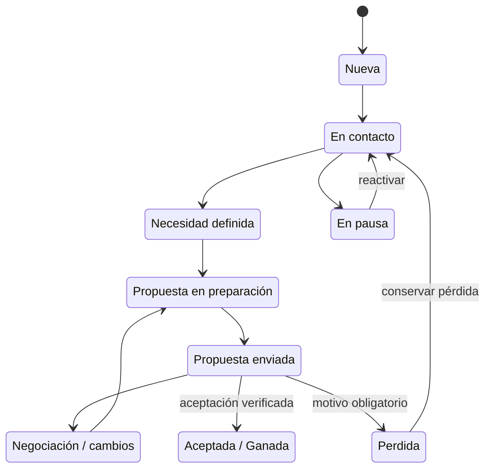
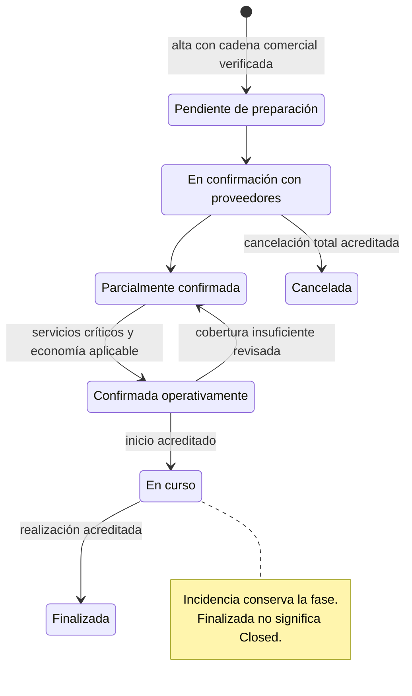
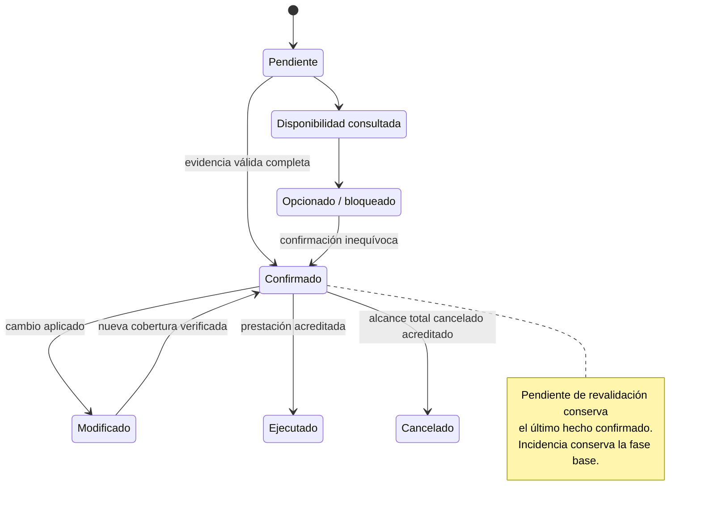
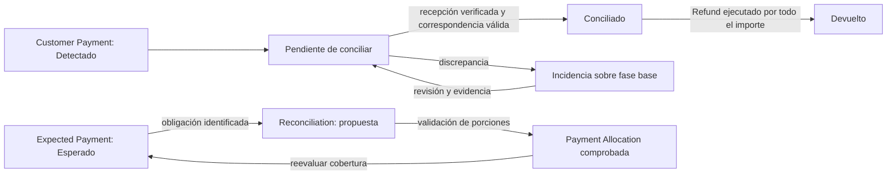
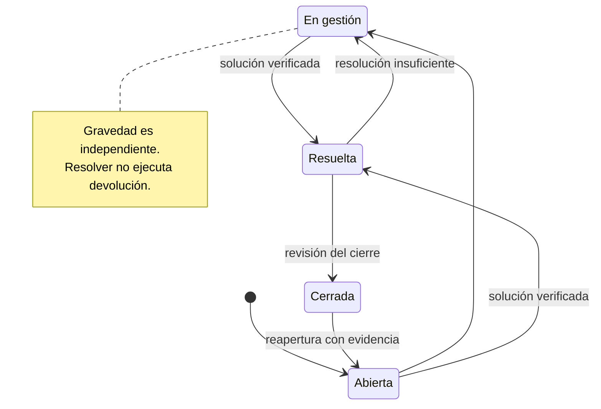
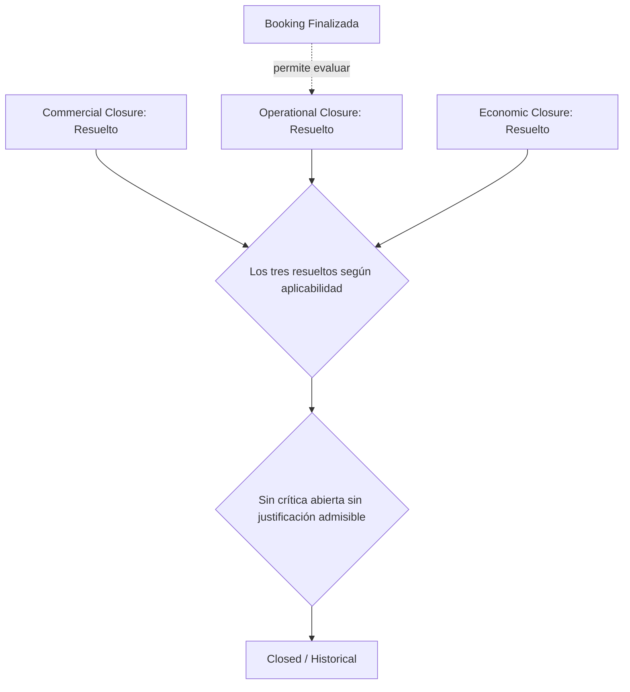

# CRM HUESCAVENTURA OS — State Machines

Status: DRAFT
Version: 0.1
Last updated: 2026-09-09

Primera versión formal, pendiente de revisión y aprobación humana. Describe comportamiento conceptual propuesto a partir de fuentes aprobadas; no declara funcionalidad implementada ni autoriza avanzar a arquitectura.

## 1. Purpose / Scope — Propósito y alcance

Formalizar estados, transiciones, eventos/intenciones, guardas, evidencias, efectos, prohibiciones, revalidaciones y dependencias de las entidades aprobadas en [Domain Model v0.1 APPROVED](domain-model.md), usando como fuente principal [Business Rules v0.2 APPROVED](business-rules.md). Rigen [Constitution v1.0](constitution.md), [Product Definition v0.1](product.md) y [D001–D020](DECISIONS.md), sin reabrir decisiones. D018 incorpora la decisión humana sobre aceptación parcial, reserva directa y ausencia de división/agrupación automática V1; D019 fija las bases económicas reproducibles para promociones y cancelaciones; D020 establece el cómputo por días naturales y sus fechas de referencia. Resuelven respectivamente SM-PENDING-001, SM-PENDING-002 y SM-PENDING-003 en su alcance sin aprobar globalmente este documento.

Se han leído íntegramente esas fuentes, [README](../README.md), [Project Status](PROJECT-STATUS.md), [Next Steps](NEXT-STEPS.md) y el placeholder anterior de este documento antes de editar. Las notas finales de documentos anteriores describen su propia fase; la coordinación actual identifica el paso vigente. Las elecciones de representación de este documento continúan DRAFT y requieren revisión humana global; las decisiones concretas D018–D020 ya están aprobadas. BR-PENDING-023/027/036 y DM-PENDING-001/003/004 conservan su formulación anterior en sus documentos de origen y se interpretan, para los alcances resueltos aquí, conforme a D018–D020 y §19; no bloquean las reglas V1 expresamente aprobadas.

Quedan fuera arquitectura, Specs, planes/tareas de implementación, SQL, tablas físicas, migraciones, APIs, UI, código, jobs, webhooks, motores técnicos de aprobación, automatizaciones concretas, implementación Supabase y despliegues. Las Task descritas son trabajo del negocio. No se diseña fiscalidad, contabilidad general ni event sourcing.

BR-xxx y DM-INV-xxx remiten a identificadores de las fuentes enlazadas; C Pxx y Dxxx, a Constitución y decisiones. Los identificadores SM de transiciones son referencias documentales, no entidades ni nombres físicos.

## 2. State-machine principles — Principios y guardas comunes

### 2.1. Semántica de la transición

Una transición requiere origen válido, evento/hecho identificado, guardas materiales satisfechas y evidencia del efecto que se registra. Una intención inicia trabajo; no acredita su resultado. Las tablas son normativas dentro de este borrador; los diagramas son resúmenes y no autorizan saltos adicionales.

| Guarda común | Aplicación a todas las tablas |
|---|---|
| G1 — Identidad y alcance | Identificar entidad, servicio/noche/personas/unidades afectados y actor facultado. En V1 opera Administrador/Propietario; cliente, proveedor y roles futuros no obtienen permisos internos por figurar en el expediente. |
| G2 — Veracidad material | Verificar los datos necesarios para ese compromiso: fuente autorizada, alcance, momento, vigencia y certeza. Desconocido no equivale a cero, aceptado, pagado o disponible. Bloquear solo la parte dependiente. |
| G3 — Supervisión sensible | Si IA propone/ejecuta una acción sensible, Human Approval debe cubrir su contenido y efecto concretos, sin cambios materiales posteriores. La aprobación no sustituye la evidencia del hecho ejecutado (§14). |
| G4 — Conservación | Preservar identidad, antes/después, motivo, actores, momentos y evidencias (§18). Versiones fijadas, Acceptance y Provider Confirmation no se editan históricamente. |
| G5 — Independencia | Solo los efectos enumerados y las dependencias de §16 permiten reevaluar otra dimensión. Habilitar una evaluación no significa satisfacer sus guardas. |
| G6 — Repetición e incertidumbre | Registrar de nuevo la misma evidencia no duplica movimiento, aceptación, obligación ni efecto. Resultado incierto queda por verificar; no acredita éxito ni autoriza repetir un efecto sensible sin comprobar el anterior. |

No se permite cambiar de estado solo porque lo solicite una interfaz, mensaje o integración. Las transiciones no descritas no quedan autorizadas por analogía: se registra el hecho/petición y se delimita lo que necesita revisión. Esto nunca impide registrar una realidad sobrevenida; §6 y §7 distinguen ejecución real de autorización previa para comprometerla.

### 2.2. Estados, condiciones y hechos

Se conservan separadas la dimensión comercial, la operativa y la económica. Opportunity Ganada no implica Booking Confirmada operativamente ni Customer Payment Conciliado. Booking Finalizada no implica Economic Closure Resuelto.

Un estado describe la situación de una entidad existente. Una condición señala aplicabilidad, incidencia, vigencia o necesidad de revisión; un hecho/evidencia acredita algo ocurrido. No se crean entidades para «versión aceptada», «reserva cancelada» o «pago conciliado». No se fuerza un único enum para mezclar esas dimensiones.

«Incidencia» en Booking, Booking Service y movimientos/documentos se representa como condición superpuesta cuando debe preservarse su progreso: se conserva la fase base, el alcance y los Incident vinculados. El vocabulario aprobado sigue disponible, por ejemplo «Incidencia — En curso». Quitar la condición exige verificar su resolución y reevaluar el alcance; nunca restaurar ciegamente una situación antigua.

### 2.3. Pendiente de revalidación

Es una señal de cobertura actual dudosa o insuficiente, no una transición que borre hechos. Puede afectar disponibilidad, Booking Service, propuesta caducada, cantidades, precios, capacidad, fecha/hora o condiciones. Se representa mediante Provenance / Review, evidencias e historial ya aprobados; no se crea una entidad nueva.

Cada revisión conserva último hecho confirmado y su alcance, causa, dato anterior y cambio solicitado/comunicado, partes materiales afectadas, nueva evidencia, actor/momentos y resultado. El resultado distingue ratificación, nuevo alcance confirmado, rechazo del cambio o incertidumbre persistente.

| ID / origen | Evento | Guardas y evidencia requerida | Destino / condición | Efectos conceptuales |
|---|---|---|---|---|
| SM-RV-01 · Sin revisión en ese alcance | Cambio material, caducidad explícita, dato incierto o discrepancia | Identificar fuente, causa y dependencias afectadas; una noticia ambigua se registra como tal | Pendiente de revalidación para ese alcance | Conservar último hecho confirmado; abrir revisión/tarea. Impedir comprometer el alcance dudoso usando evidencia anterior. |
| SM-RV-02 · Pendiente | Ratificar lo anterior | Nueva comprobación válida de todos los aspectos afectados; vigencia suficiente para la acción concreta | Revisión satisfecha en el alcance comprobado | Añadir resultado/evidencia; mantener el hecho original. Otras partes pendientes siguen pendientes. |
| SM-RV-03 · Pendiente | Confirmar contenido material distinto | Evidencia nueva y proceso de modificación/versión y aprobación aplicables | Nuevo alcance acreditado; señal resuelta solo en lo cubierto | Enlazar antes/después; nueva versión o confirmación según corresponda. No cambiar silenciosamente el acuerdo aceptado. |
| SM-RV-04 · Pendiente | Revisión negativa o inconclusa | Registrar respuesta o falta de prueba y motivo | Sigue pendiente para el compromiso no acreditado, o cambio rechazado | No presentar como actual el hecho histórico que perdió cobertura. Si se descarta la petición, retirar su señal solo tras comprobar que el alcance anterior sigue siendo utilizable. |

Ejemplos: «18 confirmados; quizá 16» conserva 18 y abre revisión de cantidad y consecuencias; no aplica 16. Cambiar una noche revisa esa noche y las dependencias materiales conocidas, no todas las noches. Una nueva tarifa externa verificada tiene precedencia como dato externo actual, pero no reescribe el precio aceptado. Una respuesta sobre horario no revalida por sí sola cantidad, precio o capacidad.

Una confirmación histórica puede seguir siendo un hecho verdadero mientras deja de acreditar el compromiso actual. En fases de preparación, Booking se reevalúa conforme a §6; en ejecución se conserva el progreso real y se señala el riesgo. No se comunica «confirmado» para el nuevo alcance pendiente.

Fuentes: BR-GEN-001–008, BR-DIM-001–005, BR-AVAIL-003–006, BR-PAX-005, BR-AI-002–005, BR-HIST-001–005; DM-INV-001/006/017/020/046–050.

### 2.4. Cómputo por días naturales — D020

Los umbrales temporales de pagos, cifra final de participantes y cancelaciones resueltos por D020 se calculan por **fechas y días naturales**. La diferencia relevante es entre la fecha local de referencia del servicio/alcance y la fecha local del acto o vencimiento; la hora concreta del servicio no cambia el intervalo. El último día perteneciente a cada intervalo se concede completo. La zona horaria solo determina correctamente la fecha local y no crea un corte horario dentro del día.

No se convierten los umbrales en 168 horas, 72 horas ni duraciones horarias equivalentes, y no se inventan las 00:00, la hora de check-in, la hora de actividad u otra hora comercial de corte. Aunque la hora real sea conocida, todo ese día recibe el mismo tratamiento contractual. Si una condición aceptada establece expresamente otra fecha de referencia válida para el caso, prevalece esa referencia contractual conservada; no se presume una excepción por la hora.

Toda evaluación conserva fecha de referencia, alcance al que pertenece, política/versionado y resultado del cálculo. Cambiar la fecha del servicio reevalúa únicamente los plazos afectados, con antes/después y sin reescribir decisiones históricas ya ejecutadas. Cambiar la hora dentro de la misma fecha no modifica estos plazos.

## 3. Machine inventory — Inventario

| Ámbito / concepto aprobado | Representación elegida | Sección |
|---|---|---|
| Opportunity / Commercial State | Máquina comercial con pérdida, pausa y reactivación | §4 |
| Proposal / Proposal Version | Preparación; contenido fijado; hechos de envío/respuesta; vigencia y sustitución independientes | §5 |
| Booking | Fase operativa + condición Incidencia y revisiones acotadas | §6 |
| Booking Service | Estado de prestación + Incidencia y Pendiente de revalidación | §7 |
| Availability Evidence / Capacity Hold / Provider Confirmation | Certeza/revisión; ciclo de compromiso temporal; hecho de confirmación inmutable | §8 |
| Expected Payment / Customer Payment / Payment Allocation / Reconciliation | Obligación, movimiento, asignación y verificación separados | §9 |
| Provider Invoice / Provider Payment / Suplido | Progreso documental, pago y evaluación documental/económica independientes | §10 |
| Refund / Deposit | Devolución; garantía con entrega y resolución diferenciadas | §11 |
| Booking Modification / Cancellation | Petición, evaluación, aprobación y aplicación; cancelación como tipo/alcance | §12 |
| Document Requirement / Required Document | Situación de la exigencia concreta, separada del archivo | §13.1 |
| Task / Incident | Trabajo mínimo y expediente de incidencia; vencimiento/gravedad independientes | §§13.2–13.3 |
| Communication / Acceptance / Human Approval | Preparación y hechos; aceptación inmutable; autorización interna concreta | §14 |
| Closure Assessment de Booking | Tres evaluaciones independientes y condición conjunta Closed / Historical | §15 |

No requieren nuevas máquinas autónomas los snapshots de términos, modalidades, cantidades, tarifas, honorarios, costes, timeline o calendario. Conservan versiones/hechos/revisión según el modelo; los cambios materiales que afecten compromisos siguen las máquinas correspondientes.

## 4. Opportunity / Commercial State

Estados: **Nueva; En contacto; Necesidad definida; Propuesta en preparación; Propuesta enviada; Negociación / cambios; Aceptada / Ganada; Perdida; En pausa**.

En esta sección «activa» significa cualquiera de los seis estados anteriores a Ganada, excluyendo Perdida y En pausa. Los estados representan progreso acreditado; no se fuerza a simular pasos intermedios que no ocurrieron.

| ID / origen | Evento/intención | Guardas y evidencia requerida | Destino | Efectos conceptuales |
|---|---|---|---|---|
| SM-OP-01 · Sin Opportunity | Conversión de Lead o registro de Opportunity para reserva directa por el Administrador (D018) | Método válido de contacto, necesidad/evento identificable y posibilidad comercial real; procedencia y actor | Nueva | Crear proceso comercial y conservar origen, responsable y datos conocidos; Lead cuando exista, sin fabricar uno para el alta directa. Sin scoring ni aceptación implícita. |
| SM-OP-02 · Nueva | Iniciar contacto comercial | Actuación/contacto registrado con canal, destinatario y resultado conocido | En contacto | Conservar comunicaciones; intento de contacto no acredita respuesta. |
| SM-OP-03 · Nueva / En contacto | Concretar necesidad | Necesidad trabajada y alcance comercial identificable; fuente y pendientes visibles | Necesidad definida | No exigir fecha, personas, servicios o presupuesto finales si aún no son materiales. |
| SM-OP-04 · Nueva / En contacto / Necesidad definida / Propuesta enviada / Negociación / cambios | Preparar propuesta o revisión | Opportunity válida y alcance suficiente para preparar; vincular alternativa y pendientes | Propuesta en preparación | Trabajar Proposal; conservar envíos/versiones anteriores. |
| SM-OP-05 · Activa | Registrar envío de propuesta exacta | Versión fijada, guardas de §5 y evidencia real del envío | Propuesta enviada | Vincular Communication y versión enviada; no aceptación. Puede omitir etapas de preparación no registradas, sin inventarlas. |
| SM-OP-06 · Propuesta enviada / Propuesta en preparación / Necesidad definida | Cliente plantea negociación/cambios | Petición o intercambio identificable y alcance afectado | Negociación / cambios | Evaluar alternativas/versiones; petición no modifica lo ofrecido ni confirma proveedor. |
| SM-OP-07 · Activa | Verificar aceptación comercial | Acceptance válida según §§5/14 y D018, versión y alcance exactos, vigencia/revalidación resuelta para ese acto | Aceptada / Ganada | Acreditar acuerdo únicamente sobre el alcance aceptado y habilitar SM-BK-01; no contratar partes no seleccionadas ni crear/confirmar Booking por el mero estado. |
| SM-OP-08 · Activa / En pausa | Declarar pérdida | Motivo obligatorio y comunicaciones/contexto; usar «desconocido» si no se conoce | Perdida | Conservar causa y alternativas; rechazar una alternativa no pierde necesariamente toda la Opportunity. |
| SM-OP-09 · Activa | Pausar venta | Decisión de pausa, motivo y contexto de seguimiento | En pausa | Conservar estado previo; vigencias externas continúan sujetas a sus límites. |
| SM-OP-10 · Perdida / En pausa | Reactivar | Nuevo interés o decisión de seguimiento documentada; revisar situación comercial actual | En contacto / Necesidad definida / Propuesta en preparación | Elegir destino sustentado en datos actuales; conservar pérdida/pausa previa y revalidar precios/disponibilidad necesarios. No saltar directamente a Ganada por una aceptación antigua. |
| SM-OP-11 · Activa | Revisar necesidad anterior | Cambio de necesidad documentado y evaluación humana del progreso actual | En contacto / Necesidad definida | Retroceso trazable; no retirar envíos, rechazos o versiones históricas. |

Los motivos mínimos de pérdida son precio, fechas, falta de disponibilidad, cliente no responde, eligió otra empresa, canceló/cambió viaje, no encaja, otro y desconocido. No responder no prueba una causa distinta.

Ganada no es una orden de cobro ni un cierre comercial completo. Una cancelación posterior del acuerdo se registra mediante Booking Modification y sus efectos; no convierte silenciosamente Ganada en Perdida ni anula Acceptance. Un error de atribución se rectifica según §14, con reevaluación comercial explícita.

El diagrama muestra el recorrido habitual y ejemplos de pausa/pérdida; las entradas/salidas adicionales solo son las de la tabla. Fuentes: BR-LEAD-001–005, BR-DIM-001, BR-PROP-001–008, BR-CONV-001–004; DM-INV-005–012.

## 5. Proposal / Proposal Version lifecycle

Proposal mantiene su identidad y alternativas. La **preparación editable** pertenece al trabajo de Proposal; una **Proposal Version fijada** ya es inmutable, antes incluso de aceptarse. Enviada, aceptada o sustituida no son nuevas entidades.

| Dimensión | Situaciones / hechos | Regla |
|---|---|---|
| Contenido | Preparación editable; versión fijada | Fijar conserva contenido exacto, fuentes, composición/modalidades, importes, términos, emisión y vencimiento aplicados. Editar materialmente lo fijado crea nueva versión. |
| Comunicación | No consta envío; enviada | El envío requiere Communication/evidencia referida a esa versión. No determina recepción ni respuesta. |
| Vigencia para un compromiso | Vigente; caducada / pendiente de revalidación; revisión acreditada para el acto concreto | 7 días por defecto configurables, con límite material más restrictivo. No modifica el contenido ni la caducidad histórica. |
| Respuesta comercial | Sin respuesta decisiva; aceptada en alcance exacto; rechazada cuando corresponda | Acceptance o rechazo identificado por alcance. La selección válida de §5.1 no contrata ni rechaza implícitamente el resto. Caducidad, silencio y leído no son rechazo ni aceptación. |
| Relación entre versiones | Referencia ofrecida; sustituida por nueva versión | Conserva vínculo anterior/nueva y motivo. Varias alternativas pueden coexistir; sustitución no anula una aceptación histórica. |

| ID / origen | Evento/intención | Guardas y evidencia requerida | Destino / hecho | Efectos conceptuales |
|---|---|---|---|---|
| SM-PV-01 · Proposal sin preparación / con versiones | Preparar alternativa/revisión | Opportunity y alcance conocidos; fuentes y pendientes | Preparación editable | Crear contenido de trabajo sin editar versiones fijadas. |
| SM-PV-02 · Preparación editable | Fijar edición | Alcance, composición, cantidades por servicio/noche, fuentes y condiciones reproducibles; distinguir estimaciones autorizadas | Nueva Proposal Version fijada | Conservar snapshot exacto e identidad/versionado. Fijar no acredita verificación ni envío. |
| SM-PV-03 · Versión fijada | Enviar propuesta | Datos materiales del compromiso verificados; coste final relevante confirmado si afecta al precio definitivo; vigencia utilizable o revisión previa; G3 si sensible IA | Hecho Enviada de esa versión | Evidencia de envío/destinatario; presentación comercial respeta BR-PACK-003 y economía reservada. |
| SM-PV-04 · Alcance ofrecido vigente, aún no aceptado | Alcanzar vencimiento efectivo o detectar incertidumbre material | Fecha realmente aplicada o evidencia de la incertidumbre; alcance | Caducada y/o Pendiente de revalidación | Impedir aceptación sin revisión; no registrar rechazo. |
| SM-PV-05 · Pendiente de revalidación | Ratificar contenido para aceptación concreta | Nueva evidencia de precios, disponibilidad, condiciones/capacidad materiales; revisión y momento aplicables | Revalidación acreditada para el acto revisado | Conservar emisión/vencimiento originales. No «extender» silenciosamente la versión. Si cambia el contenido, incluida una nueva vigencia ofrecida como condición, usar SM-PV-06. |
| SM-PV-06 · Cualquier versión fijada | Ofrecer cambio material | Antes/después y motivo; datos materiales revisados | Nueva preparación → nueva versión fijada | Relacionar sustitución cuando corresponda; conservar versiones, alternativas y términos anteriores. |
| SM-PV-07 · Versión fijada sin aceptación válida ya registrada del mismo hecho | Registrar/verificar aceptación total o selección parcial válida | Aceptante facultado, versión/términos y alcance exactos según §5.1 y D018; canal/momento/evidencia inequívocos; vigente en el momento del acto o revalidación previa acreditada | Hecho Aceptada en el alcance acreditado | Acceptance inmutable y términos exactos; permite SM-OP-07. No incluye partes no seleccionadas ni exige envío digital si otro canal acredita presentación y aceptación del contenido exacto. |
| SM-PV-08 · Alcance no aceptado de versión fijada | Registrar rechazo | Respuesta atribuible, versión/alternativa y alcance afectados, motivo conocido | Hecho Rechazada en ese alcance | Mantener alternativas y partes aceptadas. No seleccionar una parte no prueba rechazo. Nueva negociación conserva el rechazo y revalida antes de nuevo compromiso. |

La validez actual de una oferta no es la vigencia histórica de un acuerdo ya aceptado: el paso del tiempo no «desacepta» una versión. Una aceptación registrada tarde requiere distinguir momento del acto y registro; no se inventa una fecha anterior ni una revalidación retroactiva. Si no se puede acreditar que el acto cumplía vigencia/revalidación, se conserva la comunicación pendiente y se vuelve a solicitar aceptación válida tras revisar.

Una versión sustituida o rechazada no se acepta silenciosamente como si siguiera siendo la oferta actual: primero se confirma qué contenido exacto vuelve a ofrecerse y su cobertura; si cambian condiciones se fija otra versión. La aceptación parcial se rige por §5.1 y D018; no permite modificar retrospectivamente la versión fijada.

Fuentes: D018–D019; BR-PROP-001–008, BR-ECON-001–003/006–007, BR-PACK-001–004, BR-PROMO-001–002, BR-DOC-005; DM §§4.2, 9.1–9.3; DM-INV-008–011/024–029.

### 5.1. Aceptación parcial válida — D018

La aceptación parcial solo se permite si la Proposal Version contiene partes, modalidades o alcances **expresamente seleccionables**. Que un servicio figure en una lista o un desglose no lo convierte por sí solo en seleccionable. Acceptance identifica exactamente la parte/modalidad/alcance aceptados, su versión y las condiciones aplicables; no se presume aceptado el resto.

Seleccionar una opción ya prevista como seleccionable no modifica el contenido fijado ni exige por ese solo hecho otra versión. Si el cliente quiere una parte que no estaba definida como independiente o seleccionable, primero se prepara y fija una **nueva Proposal Version** mediante SM-PV-06; solo después se registra Acceptance sobre esa versión y su alcance exacto conforme a SM-AC-01/02. La petición se conserva como tal mientras falta esa base; no se registra una aceptación histórica para subsanarla después.

No se alteran Proposal Version ni Acceptance anteriores. Continúan las guardas de identidad, evidencia, vigencia/revalidación y condiciones/importes verificables del alcance elegido. Las bases económicas de promociones y cancelaciones se rigen por §5.2, §12.2 y D019; los umbrales temporales se calculan conforme a §2.4 y D020.

### 5.2. Promoción novio/a gratis con varias modalidades — D019

Cuando una propuesta contiene varias modalidades o precios, la gratuidad se atribuye a la modalidad concreta asignada al/a la novi@. Su importe es el **precio final por persona de esa modalidad**: no se usa la media del grupo, no se elige automáticamente la modalidad más barata o más cara y no se hace reparto proporcional. Por ejemplo, si 10 personas tienen Pack A a 150 EUR/persona, 5 tienen Pack B a 120 EUR/persona y el/la novi@ está en Pack A, la promoción es de 150 EUR.

La modalidad del/de la novi@ debe estar identificada antes de aplicar definitivamente la promoción. Puede prepararse Proposal y su contenido mientras falte ese dato, pero el efecto económico definitivo permanece pendiente y no se presenta como cálculo final. Una asignación o cambio material conserva modalidad, precio anterior/nuevo, causa, regla, actor y evidencia; una Proposal Version ya fijada o aceptada nunca se edita retrospectivamente.

## 6. Booking Operational State

Fases base: **Pendiente de preparación; En confirmación con proveedores; Parcialmente confirmada; Confirmada operativamente; En curso; Finalizada; Cancelada**. **Incidencia** es la condición operacional aprobada superpuesta a esa fase (§2.2); conserva el estado previo y puede coexistir con revalidaciones acotadas.

La confirmación exige identificar los servicios críticos necesarios del alcance real y acreditar su cobertura actual. La guarda es: **todos los servicios críticos necesarios confirmados AND condiciones económicas aplicables satisfechas (o excepción económica autorizada y documentada)**. La excepción de BR-PAY-002 no dispensa confirmación de servicios críticos, capacidad, seguridad ni evidencia. No se inventa una lista universal de servicios críticos; su necesidad debe justificarse en el expediente.

La política económica por defecto es 50 % al confirmar y 50 % restante 7 días naturales antes de la fecha del primer servicio contratado de la Booking. El cliente dispone completo del día situado 7 días antes para satisfacer el saldo. Si la reserva se produce a menos de 7 días naturales respecto a esa fecha, se exige 100 % antes de confirmar operativamente salvo excepción autorizada. No vence a la hora de inicio del servicio. Solo fondos verificados y conciliación/asignaciones pertinentes pueden acreditar la parte exigible; no un pago esperado o justificante aislado (§2.4; D020).

| ID / origen | Evento/intención | Guardas y evidencia requerida | Destino | Efectos conceptuales |
|---|---|---|---|---|
| SM-BK-01 · Sin Booking para esa Opportunity aceptada | Convertir venta aceptada por vía normal o reserva directa del Administrador (D018; §6.1) | Opportunity, Proposal/Proposal Version y condiciones exactas, Acceptance verificada y alcance total o parcial seleccionable según §5.1; cadena comercial completa con evidencia real; G3 para creación IA | Pendiente de preparación | Crear una Booking para esa Opportunity y únicamente el alcance aceptado, conservando modalidades, servicios/noches/cantidades y su certeza real. No duplicar Booking por repetir el alta, la evidencia o por coexistir modalidades. |
| SM-BK-02 · Pendiente de preparación | Iniciar coordinación | Servicios/dependencias identificados y actuaciones de preparación/confirmación registradas | En confirmación con proveedores | Abrir trabajo de confirmación; el nombre base también admite coordinación de servicios internos sin inventar proveedor externo. |
| SM-BK-03 · Pendiente / En confirmación | Evaluar cobertura parcial | Algún alcance de servicio confirmado válidamente; aún no se cumple toda la guarda de confirmación de Booking | Parcialmente confirmada | Identificar lo cubierto y lo pendiente, incluidas condiciones económicas; no prometer confirmación completa. |
| SM-BK-04 · Cualquier fase de preparación anterior a En curso | Evaluar confirmación completa | Guarda conjunta anterior; exigencia económica evaluada por días naturales conforme a SM-EP-01 y §2.4/D020, por defecto desde la fecha del primer servicio contratado; revisiones materiales resueltas y requisitos imprescindibles satisfechos; G3 | Confirmada operativamente | Registrar fecha de referencia, política, resultado y evidencia; no cambia Opportunity, no concilia movimientos ni confirma servicios por arrastre. Dentro de menos de 7 días exige 100 % antes de confirmar salvo excepción autorizada. |
| SM-BK-05 · Confirmada operativamente / Parcialmente confirmada, antes de iniciar | Cambio/discrepancia invalida cobertura actual | Revisión material documentada de servicios/economía; conservar confirmación histórica | Parcialmente confirmada si queda cobertura válida; En confirmación si no | Reevaluar preparación actual y señalar alcance pendiente; no cancelar compromisos externos por esta reevaluación. |
| SM-BK-06 · Confirmada operativamente | Inicio real de prestación | Hecho de inicio, alcance, momento y evidencia del responsable/fuente pertinente | En curso | Registrar progreso real; fecha prevista por sí sola no inicia. |
| SM-BK-07 · Fase de preparación sin confirmación completa | Conocer un inicio real excepcional | Evidencia de ejecución sobrevenida y revisión humana de pendientes/incumplimientos | En curso + Incidencia cuando corresponda | Registrar lo ocurrido sin fingir confirmación previa ni autorizar ejecución insegura; mantener pendientes y responsables. |
| SM-BK-08 · En curso | Constatar finalización de la prestación | Alcance efectivamente ejecutado documentado y restantes partes ejecutadas/canceladas con evidencia; al menos una parte prestada | Finalizada | Conservar incidencias y evaluar Operational Closure por separado. Una fecha de fin no prueba ejecución. |
| SM-BK-09 · Fases previas / En curso | Aplicar cancelación del alcance total | Booking Modification aprobada/aplicada y evidencia de cancelación de todo el alcance; no ocultar partes ejecutadas | Cancelada solo si no queda prestación ejecutada/activa incompatible con esa etiqueta | Si hubo ejecución parcial, conservarla y seguir curso/finalización del conjunto con cancelación parcial; no ejecutar Refund por inferencia. |
| SM-BK-10 · Cualquier fase | Abrir/gestionar incidencia con impacto operativo | Incident y alcance/efecto identificados, gravedad separada | Misma fase + Incidencia | Conservar progreso previo y partes independientes; bloqueos según necesidad material y §15. |
| SM-BK-11 · Fase + Incidencia | Verificar resolución del impacto | Evidencia de solución y revisión de todas las incidencias que sostienen la condición | Fase reevaluada, sin esa condición si procede | No restituir confirmaciones que hayan perdido cobertura ni cerrar economía automáticamente. |

«Pendiente» en SM-BK-03 abrevia Pendiente de preparación. «Fase de preparación» comprende los cuatro estados anteriores a En curso. No hay reactivación ordinaria Cancelada → Confirmada: un nuevo compromiso requiere evaluación comercial/operativa y el proceso aplicable, conservando la cancelación; D018 admite la reserva directa con la cadena de §6.1, sin habilitar división/agrupación extraordinarias ni borrar una cancelación anterior.

### 6.1. Regla normal y reserva directa V1 — D018

La regla normal es **1 Opportunity aceptada → 1 Booking → N Booking Services / modalidades / noches / cantidades**. Las modalidades mantienen la identidad y procedencia de Proposal Version establecidas en el Domain Model: esta regla expresa su continuidad dentro de un expediente, sin convertirlas en nuevas entidades. Un grupo de 10 personas con un pack y 2 con otro permanece en una única Booking, con el detalle propio de cada prestación.

El Administrador/Propietario puede utilizar en V1 una futura acción conceptual «Crear reserva directa». Su finalidad es evitar trabajo manual innecesario, conservando la cadena mínima **Opportunity → Proposal Version / condiciones → Acceptance → Booking**. Proposal Version pertenece a una Proposal vinculada a Opportunity, según el modelo aprobado; abreviar la cadena no elimina esa relación. La acción genera o registra los hechos y vínculos necesarios, reutilizando los existentes cuando corresponda, sin exigir un Lead ficticio.

La reserva directa aplica SM-OP-01, SM-PV-02/06, SM-AC-01/02, SM-OP-07 y SM-BK-01 según los hechos que falte registrar, sin simular pasos intermedios ni duplicar registros. El Administrador debe contar con evidencia real del acuerdo del cliente sobre la versión/condiciones y alcance exactos: su acción interna o Human Approval no sustituyen Acceptance ni permiten inventarla. Si la selección no estaba prevista, se fija la nueva versión antes de registrar Acceptance (§5.1). Si falta una guarda material, puede prepararse la cadena pero no completar el alta de Booking como venta aceptada.

Registrar hechos ya ocurridos conserva sus momentos reales y de registro, sin inventar fechas, envíos ni aceptación retroactiva. El alta deja Booking Pendiente de preparación; no acredita pago conciliado ni confirmación operativa. No se diseña UI, tablas, API ni implementación de la futura acción.

En V1 no se realiza división ni agrupación automática de Opportunities o Bookings. Una futura división de Booking solo podrá realizarse mediante acción explícita y trazable del Administrador y deberá especificarse posteriormente; esta corrección no diseña ni habilita esa operación extraordinaria ni otra operación de agrupación por analogía. Las modificaciones ordinarias siguen §12 sin generar otra Booking por el mero cambio.

Fuentes: D018, D020; BR-BOOK-001–004, BR-CONV-001–004, BR-DIM-002–005, BR-PAY-002, BR-CLOSE-001–002, BR-INC-002; DM-INV-006/008–012/023/031/038/041–042.

## 7. Booking Service State

Estados base: **Pendiente; Disponibilidad consultada; Opcionado / bloqueado; Confirmado; Modificado; Ejecutado; Cancelado**, con **Incidencia** superpuesta y señal **Pendiente de revalidación**. La confirmación histórica permanece; la señal impide extenderla al alcance nuevo o dudoso.

Disponibilidad consultada acredita consulta y su resultado conocido, que puede seguir pendiente; no significa disponible. Modificado significa cambio material aplicado con historial, no petición ni confirmación nueva. La preparación y la ejecución parcial se conservan como hechos de alcance sin añadir estados innecesarios.

| ID / origen | Evento/intención | Guardas y evidencia requerida | Destino | Efectos conceptuales |
|---|---|---|---|---|
| SM-BS-01 · Sin prestación | Incorporar alcance a Booking | Procedencia aceptada/conversión o modificación válida; servicio, cantidades/unidades y noches propias | Pendiente | Mantener proveedor solo si externo, configuración/versiones y datos pendientes. No copiar un total global por defecto. |
| SM-BS-02 · Pendiente | Consultar disponibilidad | Petición con fuente, momento y alcance; registrar respuesta si existe | Disponibilidad consultada | Vincular Availability Evidence; ausencia de respuesta no acredita capacidad. |
| SM-BS-03 · Pendiente / Disponibilidad consultada / Modificado | Registrar opción | Capacity Hold acreditado para el alcance, condiciones y situación conocidas | Opcionado / bloqueado | Vincular opción; no confirmación final. Sin vencimiento, señal/tarea de revalidación, sin fecha ficticia. |
| SM-BS-04 · Pendiente / Disponibilidad consultada / Opcionado / Modificado | Verificar confirmación | Provider Confirmation válida para alcance externo, o confirmación interna documentada; fecha/hora, proveedor, cantidad, capacidad, precio/condiciones materiales cubiertos y requisitos imprescindibles pertinentes; G3 | Confirmado | Registrar cobertura exacta. Se permite Pendiente → Confirmado con evidencia completa, sin simular una consulta/opción anterior. |
| SM-BS-05 · Cualquier estado | Cambio solicitado o dato material discrepante | Fuente, causa y alcance identificados; distinguir petición de hecho aceptado | Mismo estado + Pendiente de revalidación en lo afectado | Revisar únicamente fecha, hora, cantidad, proveedor, precio, capacidad, condiciones y dependencias materiales afectadas; no aplicar todavía el cambio. |
| SM-BS-06 · Estado no terminal | Aplicar modificación válida | Booking Modification aprobada; acuerdo comercial/evidencias operativas necesarios para cada efecto; antes/después | Modificado | Conservar alcance previo confirmado y nuevo aplicado. Si este aún requiere confirmación, señal pendiente; si ya existe evidencia completa, evaluar separadamente SM-BS-04. |
| SM-BS-07 · Confirmado, con ejecución parcial o aún sin iniciar | Constatar prestación completa del alcance efectivo | Evidencia del hecho ejecutado, momento, alcance/personas/noches pertinente y cancelación acreditada de partes excluidas cuando corresponda | Ejecutado para el alcance efectivo prestado | Conservar resultados, partes canceladas e incidencias. Si queda parte por prestar o cancelar, registrar parte/resto sin declarar todo Ejecutado. |
| SM-BS-08 · Estado previo sin confirmación acreditada / Modificado | Conocer ejecución real sobrevenida | Evidencia verificada de realización y revisión humana de la falta de confirmación o discrepancia | Ejecutado si completa; conservar progreso parcial si no, con Incidencia cuando proceda | No fabricar confirmación previa ni legitimar restricciones incumplidas. |
| SM-BS-09 · Estado previo no ejecutado ni cancelado | Aplicar cancelación | Modificación aplicable y evidencia inequívoca del proveedor externo o responsable interno sobre alcance cancelado; G3 | Cancelado si cubre toda la prestación | Cancelación parcial deja prestación restante en su situación y conserva el detalle cancelado; no borra noches/participantes/historia ni paga devolución. |
| SM-BS-10 · Estado + revisión | Ratificar alcance o resolver cambio | SM-RV-02/03/04, cobertura completa en la parte revisada | Estado sustentado en los hechos, señal resuelta solo allí | Una revisión de horario no ratifica precio/capacidad no comprobados. Una respuesta negativa no restaura una confirmación inválida. |
| SM-BS-11 · Cualquier estado | Abrir/resolver impacto de Incident | Evidencia de incidencia o solución y reevaluación de cobertura vigente | Misma fase + Incidencia, o retirada de condición pertinente | La fase de prestación y Incident conservan ciclos distintos. |

«Opcionado» abrevia Opcionado / bloqueado. Ejecutado y Cancelado no se convierten ordinariamente en Pendiente; correcciones históricas se enlazan con evidencia según §18. Una cancelación de una parte futura no hace desaparecer la parte ya ejecutada. Una nueva prestación requiere su alcance y autorización propios. Cuando una parte se prestó y el resto se canceló correctamente, Ejecutado describe solo el alcance efectivo prestado y conserva separadamente lo cancelado; no atribuye ejecución a esa parte ni exige dejar el servicio pendiente para siempre.

La confirmación externa acepta WhatsApp claro, email, plataforma o llamada inequívoca registrada por usuario autorizado; esta llamada no requiere escrito posterior obligatorio. En servicio interno —incluido Tararí— se verifican capacidad, confirmación, preparación y ejecución por separado con responsable interno, sin fabricar Provider externo ni Provider Confirmation externa.

La disponibilidad para 12 personas o una noche no cubre 16 ni una noche adicional. Hora solicitada, alternativas, preferencia y hora final siguen separadas. Una incompatibilidad de agenda produce aviso y revisión V1, no bloqueo automático; una excepción justificada de agenda no elimina restricciones objetivas. Listas nominales y reparto de habitaciones solo son exigibles cuando materialmente necesarios.

Fuentes: BR-SVC-002–009, BR-PAX-001–008, BR-NIGHT-001–004, BR-SUP-002–004, BR-AVAIL-001–006, BR-DIM-004, BR-CHANGE-001–004; DM-INV-013–023/036/038.

## 8. Availability / Capacity Hold / Provider Confirmation

### 8.1. Availability Evidence

No se crea una reserva a partir de una consulta ni una máquina de «stock» universal. Availability Evidence conserva información solicitada/comunicada/confirmada en su alcance, certeza, fuente/momento y vigencia explícita. La disponibilidad confirmada sigue siendo capacidad disponible, no reserva firme.

| ID / origen | Evento | Guardas y evidencia requerida | Resultado | Efectos conceptuales |
|---|---|---|---|---|
| SM-AV-01 · Sin consulta registrada | Consultar fuente | Servicio, fechas, cantidad/unidad, fuente y momento identificables | Consulta registrada; respuesta pendiente si no existe | No acreditar disponibilidad. |
| SM-AV-02 · Consulta o nueva comunicación espontánea | Recibir respuesta | Original/registro y alcance de lo manifestado | Disponibilidad comunicada, negativa o incierta según contenido | Conservar respuesta real, también si no hay consulta previa registrada. |
| SM-AV-03 · Información comunicada | Verificar disponibilidad | Fuente autorizada y evidencia inequívoca para el alcance material requerido | Disponibilidad confirmada en ese alcance | No confirmar Booking Service salvo evidencia adicional de aceptación operativa. |
| SM-AV-04 · Evidencia existente | Vencimiento, cambio o discrepancia | Límite explícito o motivo de incertidumbre | Pendiente de revalidación | Aplicar §2.3; conservar evidencia anterior y más reciente verificada sin editar acuerdos aceptados. |

### 8.2. Capacity Hold / Option

Su situación distingue **creado, vigente, vencido/no verificado, liberación solicitada y liberado/cancelado con evidencia**. «Próximo a vencer» es condición derivada solo con vencimiento conocido y adelanto configurado. Creado acredita registro del compromiso temporal y su fuente; una simple solicitud aún no aceptada se conserva como Communication/Task, sin fingir opción concedida.

La vigencia y la liberación son dimensiones compatibles: puede existir «liberación solicitada, último bloqueo acreditado vigente». Vencido describe pérdida de vigencia para nuevos compromisos; no prueba que el proveedor haya liberado capacidad. Sin fecha explícita se conserva «sin vencimiento informado» y necesidad de revalidación, no «vencido» por cálculo ficticio.

| ID / origen | Evento/intención | Guardas y evidencia requerida | Destino / condición | Efectos conceptuales |
|---|---|---|---|---|
| SM-HO-01 · Sin opción | Registrar bloqueo concedido | Evidencia del proveedor, servicio/fechas/capacidad, creación y condiciones; vencimiento solo si informado | Creado | Mantener identidad incluso antes de Booking y relacionar alcance propuesto. |
| SM-HO-02 · Creado / No verificado | Comprobar vigencia para una acción | Fuente actual verificable y condiciones cumplidas; no vencimiento superado | Vigente para alcance comprobado | Sin vencimiento explícito conservar revalidación necesaria para posteriores compromisos; no asumir vigencia indefinida. |
| SM-HO-03 · Vigente | Acercarse a vencimiento conocido | Fecha explícita y adelanto configurado | Vigente + Próximo a vencer | Aviso/tarea conceptual; no extensión, confirmación ni liberación. |
| SM-HO-04 · Creado / Vigente | Vencer explícitamente o perder certeza | Evidencia/fecha real o causa de incertidumbre | Vencido / No verificado, según el hecho | Revisar propuestas y servicios dependientes; no dar capacidad por liberada. |
| SM-HO-05 · Creado / Vigente / Vencido / No verificado | Solicitar liberación | Decisión y alcance identificados; evidencia de petición efectivamente enviada; G3 si sensible IA | Liberación solicitada | Conservar última vigencia conocida; petición preparada/aprobada sin envío no llega aquí. |
| SM-HO-06 · Cualquier situación sin liberación acreditada | Verificar liberación/cancelación | Evidencia inequívoca del proveedor para el alcance exacto, incluso espontánea | Liberado/cancelado en lo acreditado | Conservar petición si hubo, momento real y registro. Parcial deja visible capacidad/fechas restantes. |
| SM-HO-07 · Vencido / No verificado / Vigente | Acreditar prórroga/cambio del bloqueo | Respuesta verificada y condiciones/fechas nuevas expresas | Vigencia reevaluada con historial | No inventar prórroga ni sobrescribir término anterior; si el proveedor identifica otro compromiso, conservar vínculo de sustitución. |

Convertir una opción en confirmación de servicio requiere SM-BS-04. No se presupone qué hizo el proveedor con el bloqueo al confirmar: su liberación/sustitución solo se registra con evidencia. Una opción liberada no se «reactiva» por cambiar una etiqueta; nuevo compromiso externo debe quedar acreditado.

### 8.3. Provider Confirmation

Es un hecho identificado e inmutable. Su **registro** y **cobertura actual** se distinguen: confirmar un servicio solo es posible cuando la evidencia está verificada. Una respuesta candidata/ambigua se conserva en Communication/Review y no se presenta como Provider Confirmation válida.

| ID / origen | Evento | Guardas y evidencia requerida | Resultado | Efectos conceptuales |
|---|---|---|---|---|
| SM-PC-01 · Sin hecho confirmado | Verificar respuesta inequívoca | Proveedor/persona, servicio, fecha/hora/cantidad/condiciones materiales y canal autorizado; llamada con registrador/momento si aplica | Provider Confirmation registrada válida | Puede fundamentar SM-BS-04 únicamente en su cobertura. |
| SM-PC-02 · Confirmación existente | Detectar cambio o error | Nueva fuente, causa y alcance afectado | Revisión pendiente de cobertura o rectificación enlazada | Conservar hecho anterior; ningún mensaje amplía su alcance. |
| SM-PC-03 · Revisión pendiente | Verificar nuevo compromiso/corrección | Evidencia nueva y autorizaciones aplicables | Nuevo hecho o rectificación, con relación al original | Revalidar solo partes cubiertas; no reescribir aceptación del cliente. |

Fuentes: BR-SUP-001–004, BR-AVAIL-001–006, BR-INT-002, BR-TASK-005; DM §§5.1, 10.1; DM-INV-020–022/048–049.

## 9. Payments / Reconciliation

### 9.1. Expected Payment / Payment Due

**Esperado** de BR-PAY-006 corresponde conceptualmente a Expected Payment, no a un Customer Payment inexistente. Se conserva el vocabulario aprobado a través de la frontera obligación → movimiento, sin una transición que transforme una previsión en dinero. Customer Payment puede llegar sin previsión previa y Expected Payment puede existir sin ningún cobro.

La obligación conserva importe, política/versionado, vencimiento y alcance. Su cobertura es una evaluación derivada **pendiente, parcialmente cubierta o cubierta**, con importes comprobables; «vencida» solo es condición temporal con fecha fiable. No son estados de un pago real ni un indicador global paid.

| ID / origen | Evento | Guardas y evidencia requerida | Resultado | Efectos conceptuales |
|---|---|---|---|---|
| SM-EP-01 · Sin vencimiento | Determinar cobro aplicable | Acuerdo, Payment Policy Version y alcance identificados; base/importe; por defecto, fecha del primer servicio contratado de la Booking como referencia, o referencia contractual distinta válida; cálculo por días naturales según §2.4/D020 | Esperado; cobertura pendiente | Incorporar a Payment Schedule con fecha de referencia y día límite. El saldo a 7 días puede satisfacerse durante todo ese día; no crear Customer Payment ni disponer de fondos. |
| SM-EP-02 · Esperado con cualquier cobertura | Validar asignación/conciliación | Movimiento real y porción comprobada, destino inequívoco, sin doble cómputo | Cobertura reevaluada: pendiente/parcial/cubierta | Conservar pagos y asignaciones independientes; solo cobertura válida satisface obligación. |
| SM-EP-03 · Esperado con saldo debido | Superar el día límite completo | Fecha local de referencia, política y saldo verificados; el día límite aplicable ha finalizado según calendario local, sin corte por la hora del servicio; para el saldo general, ha finalizado el día situado 7 días antes | Condición Vencida | Tarea/alerta pertinente desde el día natural siguiente; conservar cálculo. No cargo, cancelación o conciliación automática. |
| SM-EP-04 · Obligación existente | Aplicar modificación, devolución o corrección | Política/acuerdo/ajuste autorizado con importe y causa verificables | Obligación y cobertura ajustadas con historial | No borrar importe anterior; devolver dinero no genera automáticamente nueva deuda si la política resolvió esa obligación. |

### 9.2. Customer Payment

Situaciones del movimiento: **Detectado; Pendiente de conciliar; Conciliado; Incidencia; Devuelto**. La **recepción verificada** es hecho separado que puede constar antes de finalizar la conciliación. Incidencia conserva detección/recepción y el último alcance conciliado. Devuelto total no destruye el cobro original.

| ID / origen | Evento/intención | Guardas y evidencia requerida | Destino / hecho | Efectos conceptuales |
|---|---|---|---|---|
| SM-CP-01 · Sin movimiento identificado | Detectar posible entrada | Fuente, importe/referencia/fecha y pagador/contexto según se conozcan; revisar duplicidad | Detectado | Registrar el mismo movimiento una sola vez; datos faltantes pendientes, sin certificar recepción. |
| SM-CP-02 · Detectado | Abrir comprobación de correspondencia | Identificar movimiento y obligaciones/destinos candidatos | Pendiente de conciliar | Propuesta de Reconciliation; referencia coincidente no basta. |
| SM-CP-03 · Detectado / Pendiente de conciliar / Incidencia | Verificar recepción | Contraste con fuente autorizada del movimiento; documentar discrepancias | Hecho Recibido verificado, manteniendo situación de conciliación pertinente | Justificante/aviso aislado no resuelve diferencias ni asigna fondos por sí solo. |
| SM-CP-04 · Pendiente de conciliar / Incidencia | Validar conciliación | Recepción verificada, correspondencia comprobada de importe, identidad/contexto, referencias, obligaciones/asignaciones y ausencia de doble cómputo; dudas resueltas humanamente | Conciliado en alcance completo comprobado | Registrar Reconciliation y asignaciones. Si solo se verificó una parte, mantener resto pendiente y no declarar todo conciliado. |
| SM-CP-05 · Detectado / Pendiente de conciliar / Conciliado | Detectar duplicado o diferencia | Fuente y parte afectada: importe incorrecto, identidad dudosa, recepción/distribución discrepante | Incidencia sobre situación base | Suspender uso de la porción dudosa y reevaluar cobertura; conservar lo verificado fuera de ese alcance. |
| SM-CP-06 · Incidencia | Resolver discrepancia | Evidencia y ajuste identificados, verificación humana cuando hay duda | Pendiente de conciliar o Conciliado según cobertura real | Si era registro repetido del mismo movimiento, enlazar corrección sin sumar otro ingreso; dos transferencias reales no son un solo movimiento por coincidir sus datos. |
| SM-CP-07 · Movimiento con recepción verificada, conciliado o en revisión | Registrar devolución efectivamente ejecutada | Refund ejecutado vinculado a cobro y porción; autorización/ejecución verificadas y sin doble devolución | Devuelto si cubre todo el movimiento; devolución parcial como hecho si no | Conservar importe recibido bruto, devuelto, saldo y asignaciones/ajustes; reevaluar obligaciones según causa, no por simple resta sin política. |
| SM-CP-08 · Conciliado / Devuelto / con devolución parcial | Descubrir error posterior | Fuente y justificación del error, verificación y rectificación autorizadas | Situación de verificación reevaluada con Incidencia si corresponde | Conservar conciliaciones y devoluciones históricas; no «deshacer» movimiento bancario cambiando estado. |

No se exige repartir forzosamente un ingreso no asignado: se conserva porción sin destino resuelto y no se usa para acreditar una obligación concreta. La existencia de saldo sin asignar no autoriza financiación propia, traslado entre clientes ni compensación entre reservas.

### 9.3. Payment Allocation / Reconciliation

Reconciliation mantiene propuesta de correspondencia, validación y rectificación como actos identificados del concepto aprobado; no requiere una máquina gigante. Payment Allocation mantiene asignación prevista/comprobada y ajustes con evidencia, separando uso previsto de fondos verificados.

| ID / origen | Evento | Guardas y evidencia requerida | Resultado | Efectos conceptuales |
|---|---|---|---|---|
| SM-RC-01 · Sin correspondencia / con diferencia | Proponer correspondencia | Fuente, pagos, obligaciones, importes/destinos candidatos | Propuesta pendiente de validar | IA puede proponer; no mueve fondos ni alcanza Conciliado. |
| SM-RC-02 · Propuesta | Verificar correspondencia/asignaciones | Fuente autorizada, porciones y destinos reconstruibles, sin sobreasignación ni doble cómputo; derecho e importe determinados previamente conforme a D019 cuando la asignación ajusta una cancelación, devolución o nueva obligación; validación humana si duda | Comprobación válida en alcance identificado | Permitir reevaluar cobertura y SM-CP-04. Cobro, conciliación, asignación o pago a proveedor no determinan por sí solos el derecho económico del cliente; primero se determina este y después se ajustan porciones y obligaciones. Una propuesta y su validación son hechos distintos incluso si se registran consecutivamente. |
| SM-RC-03 · Propuesta / comprobación válida | Encontrar discrepancia | Evidencia de diferencia y porciones afectadas | Revisión pendiente | Preservar correspondencia anterior; no ajustar silenciosamente importes para cuadrar. |
| SM-RC-04 · Revisión pendiente | Rectificar | Actor, motivo, fuente, antes/después y destinos justificados | Nuevo resultado verificado enlazado | Reevaluar obligaciones, fondos disponibles/consumidos/devueltos y cierres afectados. |

Varios pagos pueden cubrir un vencimiento y un pago varios vencimientos/destinos dentro del expediente. Las porciones asignadas no exceden los fondos comprobados disponibles para esa finalidad; previsiones, consumos y devoluciones se distinguen. Pagar a proveedor exige su propio hecho. Todo reparto económico sigue D019: debe ser reproducible y trazable, sin medias, prorrateos ni distribuciones implícitas carentes de regla aprobada.

El diagrama no hace de Esperado el origen del movimiento; la devolución parcial conserva su propio importe y no etiqueta todo como Devuelto. Fuentes: D020; BR-PAY-001–007, BR-SUPL-002–004, BR-ECON-002–003; DM §11.1–11.3; DM-INV-030–034/040.

## 10. Suplidos / Provider Invoice / Provider Payment

**PENDIENTE DE VALIDACIÓN PROFESIONAL.** Se describe el modelo operativo de D013. Suplido / Managed Client Funds no es ingreso ni coste propio ordinario; factura externa dirigida al cliente, honorarios e Internal Cost conservan sus significados. Ninguna transición habilita emisión legal o numeración fiscal. Mandato efectivo, tratamiento fiscal y Tararí siguen DM-PENDING-002.

### 10.1. Provider Invoice addressed to client

Estados documentales: **Pendiente; Recibida; Revisada; Vinculada**, con **Incidencia** sobre la fase documental si existe discrepancia. Pendiente representa la exigencia del documento aún ausente, no un archivo ficticio. Vinculada significa revisión satisfactoria y correspondencia material comprobada; un enlace preliminar para contextualizarla no basta.

| ID / origen | Evento | Guardas y evidencia requerida | Destino | Efectos conceptuales |
|---|---|---|---|---|
| SM-PI-01 · Sin exigencia concreta | Identificar factura externa necesaria | Servicio externo, proveedor y cliente pertinente | Pendiente | Abrir necesidad documental; no fabricar factura para Tararí. |
| SM-PI-02 · Pendiente | Recibir documento | Original/fuente, emisor, destinatario, importe y vínculos candidatos conocidos | Recibida | Conservar recurso y procedencia; no revisión ni pago. |
| SM-PI-03 · Recibida / Incidencia | Revisar documento | Comprobar proveedor, cliente destinatario, importe y alcance; documentar resultado/diferencias | Revisada si satisfactoria; Incidencia si no | Revisión operativa/documental no equivale a validación fiscal definitiva del modelo. |
| SM-PI-04 · Revisada | Verificar correspondencia | Suplido, servicio/reserva e importes atribuibles comprobados | Vinculada | Si cubre varios servicios, conservar porciones verificables; no imponer un archivo = un pago. |
| SM-PI-05 · Recibida / Revisada / Vinculada | Diferencia/corrección posterior | Fuente y causa, importe/cliente/servicio afectados | Incidencia + revisión correspondiente | Conservar original, corrección y vínculos anteriores; reevaluar cierre documental. |

La resolución de SM-PI-05 exige nueva revisión y vinculación según SM-PI-03/04, sin borrar la factura histórica. Recibida o Vinculada no acredita Provider Payment Pagado.

### 10.2. Provider Payment

Estados: **Pendiente; Programado; Pagado; Incidencia**. La programación es intención concreta; Pagado exige movimiento ejecutado verificado. Incidencia conserva programación/pagos parciales y su evidencia.

| ID / origen | Evento/intención | Guardas y evidencia requerida | Destino | Efectos conceptuales |
|---|---|---|---|---|
| SM-PP-01 · Sin pago previsto | Determinar pago al proveedor | Proveedor, obligación/importe y servicio; distinguir confirmado de previsto, fondos y asignaciones | Pendiente | No acreditar salida de dinero ni coste propio por defecto. |
| SM-PP-02 · Pendiente / Incidencia | Programar pago | Importe, destinatario y medio/fecha de programación conocidos; fondos/asignaciones previstos o verificados diferenciados y autorización concreta aplicable | Programado | Guardar intención/programación; no acredita fondos disponibles ni ejecución. Antes de ejecutar se verifican los fondos y condiciones materiales aplicables. |
| SM-PP-03 · Pendiente / Programado / Incidencia | Verificar pago real | Movimiento de salida, proveedor/importe/fecha/medio/referencia y correspondencia con fondos/servicio; G3 en ejecución IA | Pagado en importe efectivamente acreditado | Si la obligación es mayor, conservar saldo pendiente y pagos parciales; un pago real menor no etiqueta toda obligación Pagada. |
| SM-PP-04 · Cualquier situación | Fallo, falta de fondos o discrepancia | Fuente, intento/resultado y alcance conocido | Incidencia sobre fase base | Resultado incierto no es Pagado; verificar antes de repetir. Pago real con anomalía se registra sin fingir cumplimiento previo. |
| SM-PP-05 · Incidencia | Resolver o corregir | Evidencia y ajuste autorizados; comprobación del efecto previo | Pendiente / Programado / Pagado según hecho | Conservar original/rectificación; documento o aprobación no prueban pago. |
| SM-PP-06 · Programado sin ejecución | Dejar programación sin efecto | Motivo y verificación de que no hay ejecución pendiente/real desconocida | Pendiente si obligación sigue debida | Registrar retirada de programación; si cambia obligación, documentar ajuste sin inventar un pago cancelado ni borrar historia. |

Pagar sin factura puede registrarse con evidencia real: la ausencia documental queda abierta y genera alerta. No se inventa como precondición universal disponer ya de factura para reconocer un movimiento realizado.

### 10.3. Progreso de Suplido / Managed Client Funds

Se evalúan componentes independientes, sin un único estado que confunda fondos recibidos, factura y pago. El cierre documental del suplido es una conclusión verificable del mismo Suplido.

| ID / origen | Evento | Guardas y evidencia requerida | Resultado | Efectos conceptuales |
|---|---|---|---|---|
| SM-SU-01 · Servicio externo identificado | Registrar gestión por cuenta del cliente | Cliente/proveedor/servicio e importe previsto o confirmado con fuente; mandato solo si existe y fue aceptado | Gestión abierta, pendientes explícitos | Separar honorarios/costes propios; no inferir mandato ni calificación fiscal definitiva. |
| SM-SU-02 · Abierto | Acreditar fondos, factura, pago o conciliación | Evidencias de la máquina correspondiente y porciones verificadas | Actualizar solo ese componente | Registrar fondos insuficientes/excedentes sin reasignaciones arbitrarias; tarea si factura/pago pendiente. |
| SM-SU-03 · Componentes registrados | Evaluar cierre documental | Factura del proveedor dirigida al cliente, importe identificado, pago realizado, conciliación y vínculo servicio/reserva, sin diferencia material sin resolver | Documentalmente resuelto | Conservar fundamento; no implica cierre total de Booking ni convierte suplido en coste propio. |
| SM-SU-04 · Resuelto / abierto | Nueva discrepancia material | Evidencia de diferencia entre obligación, factura, fondos o pago | Revisión; documentalmente pendiente si falla requisito | Conservar evaluación anterior; ajustar solo con fuente/motivo y reevaluar Economic Closure. |

Fuentes: BR-PAY-005, BR-SUPL-001–004, BR-ECON-004–005, BR-TAR-001, BR-BILL-001–005; DM §11; DM-INV-032–036/052.

## 11. Refund / Deposit

### 11.1. Refund

Se distinguen **Solicitada; Determinada/debida; Autorizada; Ejecutada**, con **Incidencia** sobre su progreso. No se exige solicitud del cliente si ya se ha determinado una devolución debida por causa acreditada. El derecho, importe, autorización y movimiento real tienen evidencias distintas.

| ID / origen | Evento/intención | Guardas y evidencia requerida | Destino / hecho | Efectos conceptuales |
|---|---|---|---|---|
| SM-RF-01 · Sin devolución | Registrar solicitud | Solicitante, cobro(s), causa y parte afectada identificados | Solicitada | No reconocer importe debido ni ejecución por la petición. |
| SM-RF-02 · Solicitada / sin solicitud previa | Determinar derecho/importe | Causa, política/versiones aceptadas, parte cancelada y base económica conforme a D019; fecha de referencia del alcance según §12.2, diferencia por días naturales y día límite completo según §2.4/D020; importe atribuible verificable o decisión explícita del Administrador cuando D019 la exige | Determinada/debida si corresponde | Determinar primero el derecho contractual y después ajustar fondos, conciliación, asignaciones, Refund u obligaciones. Conservar alcance, fecha de referencia, política, componentes, importes anteriores/nuevos, cálculo, regla, actor y evidencia. Si no procede devolución, registrar resultado motivado; no inventar hora, importe cero, media ni prorrateo. |
| SM-RF-03 · Determinada/debida | Autorizar devolución | Administrador, importe, destinatario, origen/porción, método y efecto concretos; G3 si propuesta IA | Autorizada | No alterar saldo bancario ni declarar ejecutada. Cambio material requiere nueva autorización. |
| SM-RF-04 · Autorizada | Verificar devolución real | Evidencia del movimiento de salida por importe y destinatario autorizados, fecha/medio/referencia, sin duplicidad | Ejecutada si se completó todo el alcance autorizado | Ejecución parcial conserva importe devuelto y resto autorizado pendiente. Vincular cobro(s)/asignaciones; normalmente mismo medio. |
| SM-RF-05 · Cualquier progreso | Fallo, discrepancia o resultado incierto | Intento, fuente y porción afectada | Incidencia sobre último progreso acreditado | Verificar antes de repetir; conservar importe ya ejecutado si existe. |
| SM-RF-06 · Incidencia | Resolver diferencia | Evidencia nueva y ajuste/autorización concreta cuando cambia alcance | Determinada / Autorizada / Ejecutada según hechos | No considerar ejecutado por resolver Incident. Rectificar movimiento/evidencia conserva original. |
| SM-RF-07 · Solicitada / evaluada sin ejecución | Retirada o evaluación «no procede» | Motivo y política/evidencia; comprobar que no queda derecho debido oculto | Solicitud sin efecto o evaluación no debida registrada | Es resultado de evaluación, no «Ejecutada». Retirar solicitud no extingue una obligación acreditada. |

No se crea una devolución bancaria como consecuencia automática de una cancelación; SM-RF-02 determina la obligación y SM-RF-03/04 requieren sus propios hechos. Si se conoce una devolución ya realizada sin autorización registrada, se conserva el hecho económico con Incidencia/revisión humana; no se fabrica aprobación retroactiva ni se considera autorizado ese camino.

La política de determinación se detalla en §12.2. Si falta un valor atribuible verificable, la determinación económica permanece pendiente hasta la decisión explícita prevista por D019; la operación independiente puede continuar. D020 determina el calendario y el ancla por alcance sin introducir cortes horarios.

### 11.2. Deposit / Fianza

La configuración distingue **No aplica** cuando se ha verificado «sin fianza» de **Requerida** cuando existe condición real. Desconocer importe o aplicabilidad sigue pendiente de comprobar; no se inventa cero. No aplica es condición de aplicabilidad del servicio, sin crear una fianza/movimiento ficticios.

Se separa progreso de entrega (**Requerida; Pendiente de entrega; Entregada; Pendiente de resolución**) del resultado económico (**Devolución ejecutada; Retención parcial; Retención total**) y de **Incidencia**. Una retención parcial puede coexistir con devolución pendiente o ejecutada del resto: el motivo de retención no acredita la devolución de ese resto.

| ID / origen | Evento/intención | Guardas y evidencia requerida | Destino / hecho | Efectos conceptuales |
|---|---|---|---|---|
| SM-DE-01 · Aplicabilidad por determinar | Verificar condiciones | Fuente y condiciones del servicio/alojamiento aplicables | No aplica o Requerida | Sin fianza no añade importe cero; con fianza, conservar regla/importe verificados y pendientes materiales. |
| SM-DE-02 · Requerida | Concretar exigencia de entrega | Importe, condición, destinatario y momento conocidos | Pendiente de entrega | Distinguir garantía de anticipo comercial; no sumar cobertura de ambos sin asignación específica. |
| SM-DE-03 · Requerida / Pendiente de entrega | Verificar entrega | Evidencia de entrega, importe, receptor, fecha y medio pertinentes | Entregada si completa | Entrega parcial conserva entregado/resto y pendiente; no presumir custodia de Huescaventura si recibió el proveedor. |
| SM-DE-04 · Entregada | Evaluar resolución al cumplirse condición | Condición aplicable y hechos de fin/revisión conocidos | Pendiente de resolución | Servicio finalizado no decide devolución/retención. |
| SM-DE-05 · Pendiente de resolución | Determinar devolución/retención | Condiciones aceptadas, motivo, importe y evidencia; autorización concreta pertinente | Resolución determinada: devolver, retener parcialmente o retener totalmente | Conservar porción a retener/devolver y motivo; todavía no acreditar devolución real. |
| SM-DE-06 · Resolución determinada con importe a devolver | Verificar devolución | Movimiento/entrega de restitución efectivamente acreditado; autorización aplicable | Devolución ejecutada en la porción comprobada | Si existe retención parcial, conservar ambas porciones y sus evidencias. Refund se vincula cuando representa esa devolución, sin duplicar movimiento. |
| SM-DE-07 · Resolución determinada con retención | Acreditar retención aplicada | Importe realmente retenido, causa/condición, actor y evidencia; no basta intención | Retención parcial / Retención total | Resolución completa solo si toda la fianza entregada está justificada como devuelta o retenida, sin diferencias abiertas. |
| SM-DE-08 · Cualquier progreso | Detectar/resolver discrepancia | Fuente, alcance, revisión y evidencia de solución | Incidencia sobre progreso, retirada solo tras verificar | Conservar entrega y resolución anteriores; reevaluar Economic Closure si corresponde. |

Requerida pero no entregada no se declara resuelta porque termine el servicio: se revisa obligación y resultado conforme a condiciones reales. Un cambio acreditado de aplicabilidad conserva antes/después y no borra entregas, retenciones o devoluciones previas.

Fuentes: D019–D020; BR-PAY-004, BR-CHANGE-005–007, BR-NIGHT-005, BR-CLOSE-001; DM §§11.1, 11.3; DM-INV-037–040.

## 12. Booking Modification / Cancellation

### 12.1. Ciclo y efectos separados

Cancellation es tipo/alcance de **Booking Modification**, que conserva identidad desde solicitud hasta resultado. Progreso: **Solicitada; En evaluación; Pendiente de proveedor cuando corresponde; Aprobada; Aplicada; Rechazada; Cancelada/sin efecto**, con **Incidencia** como condición si hay problema de evaluación/aplicación.

Aprobada autoriza un alcance concreto; Aplicada acredita los cambios realmente efectuados en Booking y sus partes. Ambas se distinguen de Acceptance del cliente, aceptación del proveedor, comunicaciones y movimiento económico. El resultado de aplicación conserva partes aplicadas/pendientes; no requiere un estado adicional para cada combinación.

| ID / origen | Evento/intención | Guardas y evidencia requerida | Destino | Efectos conceptuales |
|---|---|---|---|---|
| SM-MO-01 · Sin modificación | Registrar petición cliente/proveedor/interna | Solicitante identificado, facultad/contexto, causa y parte afectada | Solicitada | Conservar petición; no aplicar cifras ni cancelar servicios. |
| SM-MO-02 · Solicitada | Evaluar impactos | Situación anterior, alcance deseado, política/versión, efectos comerciales, operativos y económicos distinguibles | En evaluación | Abrir revalidaciones solo materiales: servicios/noches/personas, horario, precio, capacidad, proveedor y condiciones afectados. |
| SM-MO-03 · En evaluación | Requerir respuesta de proveedor | Qué compromiso externo debe confirmar/cambiar/cancelar y evidencia de petición si enviada | Pendiente de proveedor | Conservar última confirmación; ni solicitud cliente ni envío acredita aceptación del proveedor. |
| SM-MO-04 · Pendiente de proveedor | Revisar respuesta | Fuente y alcance inequívocos, o discrepancia/alternativas explícitas | En evaluación si respuesta suficiente; sigue pendiente si ambigua | Registrar lo aceptado/rechazado/ofrecido; nueva alternativa se somete a revisión comercial pertinente. |
| SM-MO-05 · En evaluación | Aprobar aplicación concreta | Administrador, antes/después, impactos conocidos y evidencia; acuerdo del cliente cuando cambia compromiso y confirmación del proveedor para efectos que la necesiten; base económica conforme a D019 o determinación económica todavía separada; G3 | Aprobada | La aprobación puede delimitar solo la parte evaluada. Aprobar un efecto operativo no autoriza por sí solo devolución, retención, nueva obligación o ajuste cuyo importe siga pendiente; la determinación económica exige decisión explícita del Administrador cuando no existe distribución aprobada/verificable. |
| SM-MO-06 · Aprobada | Aplicar cambio | Alcance sin cambio material, guardas específicas de cada efecto satisfechas y hechos de aplicación acreditados; para efectos económicos, importe y regla determinados según D019 | Aplicada cuando se completó todo el alcance aprobado | Conservar partes aplicadas/pendientes si incompleta y permitir que efectos operativos independientes avancen. Actualizar solo datos/estados cubiertos; registrar obligación económica determinada sin fingir pago/devolución ni usar la situación física de los fondos como política contractual. |
| SM-MO-07 · Solicitada / En evaluación / Pendiente de proveedor | Rechazar modificación | Decisión/respuesta y motivo conocidos | Rechazada | Mantener acuerdo anterior y comprobar que no haya perdido cobertura; rechazo no revalida automáticamente condiciones anteriores. |
| SM-MO-08 · Solicitada / En evaluación / Pendiente de proveedor / Aprobada sin aplicación | Retirar/dejar sin efecto | Actor, motivo y verificación de que no quedan compromisos/efectos externos sin resolver | Cancelada/sin efecto | Conservar solicitud y aprobación; si hubo aplicación parcial, resolver esa parte con ajuste/modificación vinculada, sin ocultarla. |
| SM-MO-09 · Aprobada sin completar aplicación | Cambiar materialmente alcance | Nueva petición/evidencia y comparación | En evaluación para nuevo alcance | La aprobación previa permanece histórica y no autoriza contenido nuevo; partes ya aplicadas permanecen registradas. |
| SM-MO-10 · Cualquier progreso | Fallo o discrepancia de aplicación | Intento, efectos realmente conocidos y parte incierta | Incidencia sobre progreso base | Resolver con evidencia, volver a evaluación/aplicación según corresponda y comprobar efecto previo antes de repetir. |

Una modificación Aplicada no se revierte editando el historial: se registra corrección o nueva modificación enlazada con su autorización. Las versiones aceptadas permanecen inmutables; cambio material comercial se vincula a nueva Proposal Version y aceptación correspondiente cuando proceda. La selección parcial válida y la necesidad de nueva versión se rigen por §5.1 y D018; ampliar/cambiar un acuerdo ya aceptado conserva el proceso de modificación y nunca edita Acceptance histórica.

Una cancelación parcial conserva servicios, cantidades, noches y partes no canceladas. Para cancelar operativamente un servicio externo se necesita evidencia de su proveedor; para un interno, hecho autorizado y registrado del responsable interno. Una petición total del cliente no cancela todos los proveedores ni libera todas las opciones.

### 12.2. Guardas de política y determinación económica

| Causa / supuesto | Regla aprobada para la parte afectada | Evidencia/límite |
|---|---|---|
| Atribuible a Huescaventura/proveedor: meteorología, disponibilidad, operación u otra causa acreditada | Devolución del 100 % del servicio/parte cancelada, aunque figure no reembolsable | Causa, alcance e importe correspondientes. No extender al resto de la reserva. |
| Cancelación voluntaria con antelación ≥7 días naturales | Devolución del importe correspondiente | Política aceptada y fecha de referencia del alcance según D020; el día situado exactamente 7 días antes pertenece completo aquí. |
| Cancelación voluntaria con antelación ≥3 y <7 días naturales | Retención del 50 % de personas/servicios cancelados | El día situado exactamente 3 días antes pertenece completo aquí; no repartir arbitrariamente precio fijo/promoción. |
| Cancelación voluntaria con antelación <3 días naturales | Retención/cobro del 100 % de la parte cancelada | Desde el segundo día anterior a la fecha de referencia; distinguir cobrado/retenido y pendiente de cobro. La obligación no acredita movimiento. |
| No reembolsable | Puede prevalecer solo en voluntaria del cliente si fue comunicada y aceptada expresamente | Conservar términos exactos; no usarla contra devolución por causa de Huescaventura/proveedor. |
| No-show, retraso que impida prestar, alcohol/drogas o exclusión por incumplir seguridad | Sin devolución de la parte afectada | Evidencia del supuesto concreto; no inferirlo de una ausencia de mensaje. |
| Modificación | Sujeta a disponibilidad y ajustes de precio aplicables | No inventar recargo ni costes; confirmar impactos antes del efecto dependiente. |

La fecha de referencia depende del alcance cancelado: para la cancelación total de Booking, la fecha del primer servicio contratado de la Booking; para la modalidad o participación completa de una persona, la fecha del primer servicio incluido en esa modalidad; para un Booking Service concreto, la fecha de ese servicio; para alojamiento/noche u otro alcance específico, la fecha de inicio del alcance afectado. Una referencia diferente, expresa y válida en las condiciones aceptadas prevalece para ese caso. Se calcula por fechas locales y días naturales conforme a §2.4, sin usar la hora del servicio.

Para la **cancelación total de una persona** con precio por persona, la base es el precio real de la modalidad contratada por esa persona, nunca el precio medio del grupo. Sobre esa base se aplican exactamente los intervalos anteriores: ≥7 días naturales, devolución correspondiente; ≥3 y <7 días naturales, retención/cobro del 50 %; <3 días naturales, retención/cobro del 100 %. El día situado exactamente 7 días antes pertenece completo al primer intervalo y el situado exactamente 3 días antes pertenece completo al segundo.

Un **precio fijo o grupal** no se divide automáticamente entre participantes. El compromiso existente permanece salvo regla contractual aprobada, reducción real y verificada del coste/precio aplicable, o ajuste comercial explícito, trazable y aprobado por el Administrador. Si se cancela parcialmente un componente de un pack, puede usarse su valor comercial atribuible y verificable; si no existe una distribución económica aprobada/verificable, el importe queda pendiente de determinación y requiere decisión explícita del Administrador antes de aplicar devolución, retención, nueva obligación o ajuste. Los efectos operativos independientes pueden avanzar si no dependen de ese importe.

Primero se determina qué corresponde devolver, retener o cobrar conforme al acuerdo y política; después se ajustan Reconciliation, Payment Allocation, Refund, Expected Payment u otras obligaciones. Que los fondos estén cobrados, conciliados, asignados o utilizados para pagar a un proveedor no sustituye esa determinación. Todo reparto debe ser reproducible y trazable, sin medias, prorrateos ni distribuciones implícitas: se conservan componentes, importes anteriores/nuevos, causa, regla aplicada, actor y evidencias.

Se conservan cancelante, motivo, política, solicitante/aprobador, comunicaciones, fecha de referencia y alcance, resultado del cálculo, antes/después y pagado/devuelto/retenido/pendiente por parte afectada. Un cambio posterior de fecha reevalúa los plazos afectados sin reescribir decisiones históricas ejecutadas; un cambio de hora dentro de la misma fecha no cambia el intervalo.

Fuentes: D019–D020; BR-CHANGE-001–007, BR-PROP-006, BR-PAY-004, BR-SUP-004; DM §§4.3, 9.3, 11.3; DM-INV-017/038–040.

## 13. Documents / Tasks / Incidents

### 13.1. Document Requirement / Required Document

La máquina gobierna la exigencia concreta **Required Document**, derivada de Document Requirement configurable, no la regla maestra ni todo Document. Estados: **Pendiente; Recibido; Revisado; No aplica; Incidencia**. Solo el requisito imprescindible para una acción bloquea esa parte; no existe lista universal.

| ID / origen | Evento | Guardas y evidencia requerida | Destino | Efectos conceptuales |
|---|---|---|---|---|
| SM-DO-01 · Sin exigencia aplicada | Evaluar necesidad | Regla/fuente y servicio/noche/persona/acción pertinente; minimización | Pendiente o No aplica con motivo | No crear documentos ficticios ni exigir nombres/habitaciones indiscriminadamente. |
| SM-DO-02 · Pendiente | Recibir documento | Recurso/registro con procedencia y alcance candidato | Recibido | Recepción no acredita revisión ni cumplimiento material. |
| SM-DO-03 · Recibido / Incidencia | Revisar cumplimiento | Comprobación del contenido, versión y alcance exigido; actor/resultado | Revisado si satisface; Incidencia si no | Solo revisión suficiente puede satisfacer requisito dependiente; conservar rechazo/diferencias y original. |
| SM-DO-04 · Pendiente / Recibido / Revisado / Incidencia | Comprobar no aplicabilidad | Decisión justificada desde regla y alcance real | No aplica | Conservar historia y evidencia; no usar como dispensa inventada de un requisito imprescindible. |
| SM-DO-05 · No aplica / Revisado | Cambio de necesidad/alcance o documento corregido | Fuente y causa material | Pendiente si falta documento; Recibido si nueva evidencia aún sin revisar; Incidencia si discrepancia | Conservar revisión anterior y reabrir solo requisito afectado. |

### 13.2. Task

Ciclo mínimo **Pendiente → Completada**, o **Cancelada/sin efecto** con motivo. No se añade En curso: el trabajo realizado puede registrarse sin un estado necesario adicional. **Vencida** es condición derivada de deadline conocido superado mientras sigue pendiente.

| ID / origen | Evento | Guardas y evidencia requerida | Destino / condición | Efectos conceptuales |
|---|---|---|---|---|
| SM-TA-01 · Sin tarea equivalente pendiente | Necesidad manual o disparador aprobado | Causa, contexto, prioridad, responsable V1 y fecha conocida o necesidad de concretarla; para umbrales de este ámbito, fecha de referencia y alcance según §2.4/D020 | Pendiente | Crear/actualizar seguimiento sin duplicar mismo efecto; conservar política y resultado del cálculo cuando determine el aviso. |
| SM-TA-02 · Pendiente | Registrar terminación de trabajo | Resultado, actor y momento, con referencias a lo realizado | Completada | Cerrar trabajo, sin acreditar el hecho de negocio que motivó la tarea. |
| SM-TA-03 · Pendiente | Dejar sin efecto | Motivo y actor | Cancelada/sin efecto | Conservar antecedentes, sin cancelar Booking o proveedor. |
| SM-TA-04 · Pendiente | Superar deadline real | Fecha/política conocida; si depende de estos umbrales, día límite completo ya transcurrido por calendario local según §2.4/D020; sin cierre acreditado | Pendiente + Vencida | Aviso desde el día natural siguiente; sin fecha conocida no se inventa vencimiento ni hora de corte. |
| SM-TA-05 · Completada / Cancelada | Corregir cierre erróneo o verificar que el mismo trabajo sigue pendiente | Motivo y evidencia de revisión, resultado anterior conservado | Pendiente mediante reapertura explícita | No borrar cierre previo ni duplicar tarea de la misma causa. Si es otra necesidad, registrar otra tarea vinculada. |

Disparadores de BR-TASK-005: bloqueo de alojamiento; anticipo/saldo a 7 días; proveedor pendiente; factura; pago de suplido; documentación; lista necesaria; disponibilidad por revalidar; modificación/cancelación; seguimiento de propuesta; cifra final de participantes. Propuesta: recordatorio a 2–3 días y previo a caducidad con parámetros conocidos; no envío al cliente sin supervisión V1. Cifra final: 7 días configurables y día límite completo. Si es global, usa por defecto la fecha del primer servicio contratado de Booking; si es específica de servicio/proveedor/reserva, usa la fecha del alcance correspondiente. Una cifra final de un servicio no se propaga a otros servicios/noches. El aviso no confirma una estimación (§2.4; D020).

Todos los avisos internos V1 se dirigen al Administrador/Propietario: todos en CRM, Críticos/Importantes también en WhatsApp, ninguno por email. No se ejecutan avisos ni se diseña el automatismo aquí. El calendario operacional es una vista; cambios críticos de Google Calendar requieren validación/regla explícita.

### 13.3. Incident

Estados **Abierta; En gestión; Resuelta; Cerrada**. Gravedad **Leve; Importante; Crítica** es atributo independiente, con causa y cambios trazables. En gestión sigue siendo una incidencia abierta/no resuelta a efectos del bloqueo crítico; cambiarle la etiqueta no elude BR-INC-002.

| ID / origen | Evento | Guardas y evidencia requerida | Destino | Efectos conceptuales |
|---|---|---|---|---|
| SM-IN-01 · Sin incidencia | Registrar detección | Contexto, detector, fecha/hora, descripción, gravedad y evidencia conocida; distinguir hipótesis/causa | Abierta | Vincular Booking/servicio/proveedor/cliente pertinente; evaluar impacto, sin alterar su progreso por inferencia. |
| SM-IN-02 · Abierta | Iniciar gestión | Responsable y acción registrada | En gestión | Añadir actuaciones y evidencias, no declarar resuelta la causa. |
| SM-IN-03 · Abierta / En gestión | Verificar solución | Resultado comprobado, causa final verificada o incertidumbre explícita, acciones y alcance resueltos | Resuelta | Conservar vínculos a efectos económicos pendientes; no marcar pagos o devoluciones realizados. No declarar resuelta una incertidumbre que invalide la solución. |
| SM-IN-04 · Resuelta | Revisar cierre de incidencia | Administrador verifica solución y registro suficiente; efectos derivados quedan identificados en sus entidades | Cerrada | Cierra seguimiento de Incident, no los cierres de Booking. Obligaciones económicas pendientes siguen abiertas aunque termine este seguimiento. |
| SM-IN-05 · Resuelta / Cerrada | Detectar resolución incorrecta o recurrencia del mismo problema | Evidencia y motivo de reapertura | Abierta / En gestión según actuación registrada | Conservar solución/cierre previos; reevaluar bloqueos y Closure Assessment afectado. |
| SM-IN-06 · Cualquier estado | Revisar gravedad | Evidencia y motivo del cambio | Mismo estado, gravedad revisada | No reducir gravedad sin fundamento para eludir bloqueo; conservar clasificación anterior. |

Crítica Abierta o En gestión bloquea cierre completo salvo justificación explícita auditada del Administrador con alcance, motivo y responsable. Esa excepción solo afecta al bloqueo por incidencia: no suple pagos, documentos, devoluciones ni otras obligaciones no satisfechas. Una incidencia económica abierta sigue impidiendo Economic Closure conforme a BR-CLOSE-001.

Fuentes: D020; BR-DOC-001–005, BR-TASK-001–007, BR-INC-001–002, BR-CLOSE-001–002; DM §§5.2, 10.3; DM-INV-041–045/049.

## 14. Communications / Acceptance / Human Approval

### 14.1. Communication sin máquina artificial

Communication conserva identidad, contexto, participantes y originales; no se duplica por cada vínculo. La preparación **Borrador → Preparada** es un ciclo pequeño de contenido saliente. **Aprobada** es un hecho de Human Approval sobre contenido concreto. Envío, recepción, lectura y respuesta son hechos con sus propias evidencias, no escalones obligatorios de toda interacción.

Una comunicación entrante puede empezar con recepción registrada, sin haber tenido borrador/preparación/aprobación interna. Una respuesta se relaciona con la comunicación a la que responde sin reemplazar el original. Si contiene aceptación, se verifica y enlaza Acceptance; no se añade «Aceptada» a un enum universal de Communication.

| ID / origen | Evento | Guardas y evidencia requerida | Resultado | Efectos conceptuales |
|---|---|---|---|---|
| SM-CO-01 · Sin contenido saliente / revisión | Redactar | Contexto, destinatarios previstos, fuente y naturaleza informativa/sensible | Borrador | Conservar elaboración; no enviar. |
| SM-CO-02 · Borrador | Terminar preparación | Contenido/alcance concreto listo para revisión, pendientes materiales visibles | Preparada | Habilitar revisión humana; no aprobar implícitamente. |
| SM-CO-03 · Preparada | Autorizar contenido | Human Approval concreta cuando requerida; actor y momento | Hecho Aprobada | Mantener contenido revisado; un cambio material vuelve a preparación y requiere nueva aprobación. |
| SM-CO-04 · Contenido listo y autorización aplicable | Enviar y registrar resultado | Destinatario/contenido concretos, permisos, guardas de la acción y G3; evidencia de envío real | Hecho Enviada | Aprobación no es envío. Incertidumbre/fallo conserva intento y revisión, sin presentarse como éxito. |
| SM-CO-05 · Interacción con evidencia de recepción | Registrar recepción/lectura | Fuente que acredite el hecho específico, destinatario y momento conocidos | Hecho Recibida o lectura acreditada | Enviada no es Recibida; leído no es aceptación. No presumir capacidades del conector. |
| SM-CO-06 · Comunicación existente / nueva entrante | Registrar respuesta | Autor, momento, original/registro y alcance de lo contestado | Respuesta vinculada | Interpretar bajo guardas de Acceptance/Provider Confirmation/modificación; ambigüedad queda pendiente. |

Las comunicaciones sensibles/vinculantes de IA requieren aprobación V1 aunque usen plantilla. Informativas con plantilla solo pueden automatizarse si una Spec aprobada lo autoriza; este documento no concede esa autorización. El seguimiento de propuestas siempre mantiene la supervisión V1 indicada en BR-COMM-003.

Se conserva original cuando sea viable y autorizado, con transcripción/resumen diferenciados; sin audio por defecto. PLAUD es fuente válida de transcripción original, no prueba automática de consentimiento, aceptación o confirmación. Privacidad y capacidades siguen los pendientes existentes (§19).

### 14.2. Acceptance: hecho inmutable

No hay máquina comercial autónoma de Acceptance. Se distinguen **Registrada**, su **verificación acreditada**, y **rectificación/anulación por error enlazada** cuando proceda. Una candidata aún ambigua permanece como Communication/Review, sin fabricar Acceptance válida.

| ID / origen | Evento | Guardas y evidencia requerida | Resultado | Efectos conceptuales |
|---|---|---|---|---|
| SM-AC-01 · Evidencia candidata | Registrar hecho de aceptación identificado | Versión exacta de Proposal y términos, aceptante y facultad/contexto, canal y momento; alcance total o parte/modalidad/alcance expresamente seleccionable identificado exactamente (§5.1; D018); registrador si manual | Acceptance registrada inmutable; verificación explícita | Si falta identificación material o la selección exige nueva versión aún no fijada, conservar petición/candidato en revisión. Registrada no autoriza Ganada hasta SM-AC-02; no corregir luego el alcance editando Acceptance. |
| SM-AC-02 · Acceptance registrada | Verificar suficiencia total o parcial | Evidencia inequívoca y atribuible; versión/términos y vigencia en el acto o revalidación previa; selección parcial solo si estaba expresamente prevista en esa versión y queda exactamente identificada; nueva versión previa a Acceptance si la parte no era independiente/seleccionable (§5.1; D018) | Verificación válida vinculada al hecho y alcance exactos | Puede registrarse junto a SM-AC-01 si todas las guardas están comprobadas. Habilita evaluación comercial y SM-BK-01 por vía normal o directa con la misma cadena/evidencia; no presume aceptación del resto ni sustituye al cliente por el Administrador. |
| SM-AC-03 · Acceptance registrada/verificada | Acreditar error de registro/atribución | Revisión humana, evidencia del error y motivo; identificar efectos dependientes | Rectificación o anulación por error enlazada | Conservar original y verificación previa; reevaluar efectos dependientes de forma explícita, sin fingir cancelación de proveedor ni reversión bancaria. |

No se modifica una Acceptance histórica válida ni se anula por el mero cambio de opinión del cliente: un nuevo acuerdo o cancelación sigue §12. La rectificación corrige un error acreditado, no sirve para evitar las políticas aceptadas. Nueva aceptación de otra versión es otro hecho con relación al anterior.

Evidencias admitidas: WhatsApp del responsable, email, formulario/web, anticipo inequívocamente ligado y llamada registrada por usuario autorizado. El anticipo puede sustentar Acceptance y Customer Payment, con verificaciones independientes. No se exige escrito posterior a una llamada válida ni se acepta un mandato inexistente/no aceptado.

### 14.3. Human Approval

Human Approval es evidencia de autorización interna, distinta de Acceptance del cliente y de Provider Confirmation. Conserva actor, momento, acción, propuesta concreta, contenido/alcance y vínculo al resultado.

| ID / origen | Evento | Guardas y evidencia requerida | Resultado | Efectos conceptuales |
|---|---|---|---|---|
| SM-HA-01 · Propuesta sensible IA | Revisión humana | Administrador autorizado y efecto concreto revisable con datos materiales conocidos | Aprobación o rechazo documentados | IA puede proponer; autorización cubre solo lo revisado. Rechazo no ejecuta acción. |
| SM-HA-02 · Aprobación existente | Cambio material antes de ejecutar | Comparación de contenido, alcance, importe, destinatario o condiciones | Aprobación anterior no aplicable a la nueva propuesta | Conservarla; solicitar nueva aprobación para efecto nuevo. |
| SM-HA-03 · Aprobación aplicable | Ejecutar/validar hecho | Todas las guardas de la máquina pertinente y evidencia del resultado real | Ejecución/resultado vinculado, o fallo/incertidumbre | Solo el hecho acreditado produce transición. No fabricar éxito ni repetir efectos dudosos. |

Acciones sensibles comprenden envío definitivo/vinculante, creación/confirmación/modificación/cancelación de reservas, aceptación de condiciones del proveedor, precios finales, cobros/pagos/reembolsos, revelación de datos personales, permisos y actos fiscales/jurídicos sensibles. Su aprobación interna nunca levanta la prohibición fiscal de P16 ni activa permisos futuros.

Fuentes: BR-COMM-001–006, BR-PROP-005–008, BR-DOC-005, BR-AI-001–006, BR-AUTO-001–002; DM §§4.2, 5.2, 12; DM-INV-008–010/040/045–048/050–052.

## 15. Closures — Tres evaluaciones independientes

Se usa **Closure Assessment dentro de Booking**, como aprobó el Domain Model; Commercial Closure, Operational Closure y Economic Closure no son tres entidades nuevas. Cada evaluación mantiene **Pendiente** o **Resuelto**, criterios aplicables, evidencia, pendientes concretos, actor/momento y justificaciones.

«Con pendientes» explica Pendiente. «Resoluble» puede indicar que la evidencia parece suficiente para revisar, pero no añade un estado necesario ni equivale a Resuelto. «No aplica» se justifica por criterio; una dimensión sin requisitos aplicables solo se considera resuelta tras documentar esa evaluación, no por omisión.

| Evaluación | Guardas para Resuelto | Evidencias y pendientes que deben seguir visibles |
|---|---|---|
| Commercial Closure | Relación comercial y condiciones finales resueltas | Acuerdo/versiones/aceptaciones, cambios/cancelaciones y resultado comercial final. Ganada por sí sola no basta si hay condiciones finales por resolver. |
| Operational Closure | Servicios ejecutados/cancelados correctamente y sin pendientes críticos | Evidencia por servicio/parte/noche, cancelaciones efectivas y resolución operacional. Incidencia crítica abierta solo admite justificación explícita del Administrador conforme a BR-INC-002, sin inventar otros hechos. |
| Economic Closure | Cliente ha pagado lo debido; suplidos conciliados y facturas externas recibidas/vinculadas conforme al cierre documental aplicable; honorarios registrados; devoluciones resueltas; fianzas devueltas/retenidas con motivo; sin incidencias económicas abiertas | Importes/obligaciones/asignaciones reproducibles, movimientos verificados, documentos, conciliaciones y ajustes. Aplicar requisitos al expediente real, sin factura externa para Tararí ni rentabilidad definitiva con costes desconocidos. |

| ID / origen | Evento/intención | Guardas y evidencia requerida | Destino | Efectos conceptuales |
|---|---|---|---|---|
| SM-CL-01 · Sin evaluación | Abrir evaluación de una dimensión | Expediente y criterios aplicables identificados | Pendiente en esa dimensión | Registrar qué falta; no convertir otra dimensión en pendiente/resuelta sin evaluación. |
| SM-CL-02 · Pendiente | Revisar suficiencia | Todas las guardas de esa dimensión satisfechas con evidencia actual y excepciones solo donde aprobadas | Resuelto en esa dimensión | Conservar fundamento, actor y momento; otras dimensiones siguen independientes. |
| SM-CL-03 · Resuelto | Nueva obligación, corrección o incidencia invalida criterio | Hecho material y alcance del requisito que dejó de cumplirse | Pendiente en esa dimensión | Conservar evaluación anterior; retirar condición conjunta actual de cierre si ya no se cumple. No reescribir ejecución ni aceptación. |
| SM-CL-04 · Booking sin cierre completo actual | Evaluar cierre conjunto | Commercial Closure = Resuelto AND Operational Closure = Resuelto AND Economic Closure = Resuelto, según aplicabilidad; crítica abierta solo con justificación explícita auditada admisible | Closed / Historical — Cerrada / Histórico | Conservar todas las máquinas, vínculos e historial; no generar movimientos ni cerrar tareas como prueba sustitutiva. |
| SM-CL-05 · Closed / Historical | Evidencia posterior invalida cierre | Reevaluación fundada de uno o más criterios | Cierre completo actual no satisfecho; evaluación afectada Pendiente | Preservar que se cerró y por qué se reabrió la evaluación; no activar por ello un nuevo contrato o servicio. |

Una crítica Abierta/En gestión sin justificación bloquea cierre conjunto. Con justificación se puede superar únicamente ese bloqueo específico; una factura ausente, devolución debida no ejecutada, fianza no resuelta o incidencia económica abierta sigue incumpliendo Economic Closure. La justificación no es un atajo para marcar los tres Resuelto.

Finalizada expresa prestación realizada. Una Booking totalmente cancelada también puede alcanzar el cierre conjunto si resuelve correctamente sus tres evaluaciones. Archivado recuperable solo organiza conservación/visibilidad y no acredita cierre; Closed / Historical no elimina documentos, comunicaciones, versiones, cambios o identidad.

Fuentes: BR-CLOSE-001–002, BR-INC-002, BR-SUPL-004, BR-NIGHT-005; DM §11.6; DM-INV-034–042/051.

## 16. Cross-machine dependencies — Dependencias permitidas

Cada fila permite registrar un hecho vinculado o evaluar una guarda. No prescribe automatización ni propagación incondicional; cada transición destino conserva sus propias evidencias, autorización e historial.

| Hecho origen | Dependencia permitida | Efecto que NO acredita |
|---|---|---|
| Lead con requisitos mínimos | Crear Opportunity normal (SM-OP-01) | Scoring, datos finales, aceptación o Booking. |
| Proposal Version fijada y Communication enviada | Registrar propuesta enviada y evaluar avance comercial (SM-PV-03, SM-OP-05) | Recepción, aceptación o disponibilidad. |
| Acceptance verificada sobre versión y alcance exactos | Registrar aceptación total o parcial seleccionable válida, evaluar Ganada y crear una Booking por Opportunity (SM-AC-02, SM-OP-07, SM-BK-01; D018) | Contratación del resto no seleccionado, pago conciliado ni Booking Confirmada operativamente. |
| Intención del Administrador de crear reserva directa | Generar/registrar cadena Opportunity → Proposal Version / condiciones → Acceptance → Booking con las guardas de §6.1 | Acceptance ficticia, conversión sin evidencia comercial ni varias Bookings por modalidades. |
| Anticipo inequívocamente ligado | Puede ser evidencia tanto de Acceptance como de Customer Payment | No reemplaza la verificación propia de cada hecho. |
| Availability Evidence o Hold verificado | Trabajar disponibilidad/opción y vigencia de propuesta | Provider Confirmation firme ni servicio ejecutado. |
| Provider Confirmation válida / confirmación interna verificada | Confirmar solo Booking Service/alcance cubierto (SM-BS-04) | Otros servicios, otras noches o acuerdo del cliente sobre condiciones cambiadas. |
| Servicios críticos confirmados + economía aplicable satisfecha/excepción | Evaluar Booking Confirmada operativamente (SM-BK-04) | Crear confirmaciones o movimientos faltantes. |
| Customer Payment Conciliado + asignación válida | Reevaluar Expected Payment y guarda económica aplicable | Confirmación de proveedores, pago al proveedor o ingreso propio de todo lo cobrado. |
| Derecho/importe de cancelación determinado según D019 | Ajustar Reconciliation, Payment Allocation, Refund, Expected Payment u obligación correspondiente | Que la ubicación o uso físico previo de los fondos haya determinado el derecho del cliente. |
| Fecha de servicio/alcance modificada | Reevaluar solo vencimientos, intervalos y avisos dependientes mediante fechas locales y días naturales (D020) | Reescribir decisiones históricas ya ejecutadas o cambiar el intervalo por modificar solo la hora dentro de la misma fecha. |
| Cambio material / fuente externa nueva verificada | Revalidar solo dependencias materiales; evaluar modificación/versión | Sobrescribir términos aceptados, total de grupo o confirmaciones previas. |
| Booking Modification Aprobada | Habilitar aplicación de efectos concretos con sus guardas | Aplicación efectiva, aceptación del proveedor o Refund Ejecutada. |
| Cancelación acreditada | Determinar alcance operativo y derecho/importe de Refund cuando corresponda | Dinero devuelto ni liberación de todo Hold. |
| Provider Invoice revisada/vinculada | Contrastar obligación, suplido y pago; evaluar cierre documental | Provider Payment Pagado. |
| Provider Payment Pagado | Registrar consumo real de fondos y evaluar suplido | Factura recibida ni cierre documental si falta. |
| Refund / restitución de fianza ejecutados | Actualizar porciones efectivas y reevaluar obligaciones/cierre económico | Resolución de otros saldos o de todos los incidentes. |
| Required Document Revisado / No aplica justificado | Satisfacer solo exigencia concreta | Confirmación universal de servicios, pago o permiso general. |
| Task Completada | Acreditar trabajo y su resultado registrado | Hecho comercial, operativo o económico que motivó la tarea. |
| Incident Resuelta/Cerrada | Reevaluar impacto operacional y cierre | Pago, devolución o cierre económico por sí mismos. |
| Booking Finalizada / Cancelada con evidencia | Evaluar Operational Closure y pendientes de otras dimensiones | Economic Closure Resuelto o Closed / Historical. |
| Tres cierres resueltos con guardas | Evaluar Closed / Historical | Borrado, anonimización o pérdida de historial. |
| Human Approval | Autorizar efecto/contenido concreto | Acceptance del cliente, ejecución o autorización de un efecto materialmente distinto. |
| Communication/External Event recibido | Registrar fuente/hecho candidato y revisar | Confirmación por ambigüedad, nuevas capacidades del conector o éxito de una acción incierta. |

Fuentes: BR-GEN-003–005, BR-DIM-001–005, BR-CONV-001–004, BR-HIST-001–005 y reglas específicas de §§4–15; DM-INV-006/012–013/017/023/030–048.

## 17. Forbidden transitions — Transiciones prohibidas

Estas prohibiciones se añaden a las guardas de todas las tablas; no representan vías alternativas autorizadas.

| ID | Transición/inferencia inválida | Regla que exige revisión o evidencia |
|---|---|---|
| SM-FORB-01 | Caducada → Aceptada sin revalidación previa material, o prorrogar silenciosamente vencimiento | BR-PROP-004; DM-INV-011. |
| SM-FORB-02 | Editar Proposal Version fijada/aceptada o Acceptance válida para cambiar el acuerdo histórico | BR-PROP-002/006; BR-DOC-005; DM-INV-008–010. |
| SM-FORB-03 | Silencio, leído, visto, envío o mensaje ambiguo → aceptación/rechazo/confirmación | BR-PROP-005; BR-COMM-002/004; BR-SUP-003. |
| SM-FORB-04 | Ganada → Booking Confirmada operativamente o pago Conciliado | BR-CONV-003–004; BR-DIM-001–005. |
| SM-FORB-05 | Booking Service → Confirmado sin evidencia válida, o confirmar el conjunto desde otro servicio | BR-SVC-003; BR-SUP-003; DM-INV-013/022. |
| SM-FORB-06 | Confirmar Booking con crítico necesario sin confirmar o usando una excepción económica como dispensa operacional | BR-CONV-004; BR-DIM-002; BR-PAY-002. |
| SM-FORB-07 | Consulta/disponibilidad/opción → reserva firme, o Confirmado → Ejecutado por fecha prevista | BR-SUP-002; BR-SVC-004; BR-AVAIL-002. |
| SM-FORB-08 | Pendiente de revalidación → borrar último hecho confirmado o extenderlo a alcance nuevo | BR-DIM-004; BR-AVAIL-005; DM-INV-017. |
| SM-FORB-09 | Mensaje tentativo o extracción IA → sobrescribir confirmación manual | BR-AI-004–005. |
| SM-FORB-10 | Cantidad global/gratuidad → sobrescribir servicios/noches, reducir asistentes reales o deuda de proveedor; promoción multimodal → media, modalidad elegida automáticamente o efecto definitivo sin identificar la modalidad del/de la novi@ | D019; BR-PAX-002/005–006; BR-NIGHT-001–004; BR-PROMO-001–002. |
| SM-FORB-11 | Hora alternativa → hora definitiva sin acuerdo; aviso de agenda justificado → dispensa de seguridad/capacidad | BR-SVC-007–009; BR-PAX-005/007. |
| SM-FORB-12 | Opción sin vencimiento → caducidad inventada; paso del tiempo/petición/aviso → liberación acreditada | BR-AVAIL-003/006. |
| SM-FORB-13 | Solicitud cliente → cancelación/aceptación del proveedor; cancelación parcial → cancelar resto no afectado | BR-SUP-004; BR-CHANGE-001–004. |
| SM-FORB-14 | Pago Esperado/solicitado/prometido → dinero recibido; Detectado/justificante → Conciliado | BR-PAY-001–003/006. |
| SM-FORB-15 | Pago parcial → toda obligación/reserva pagada; doble detección/asignación → contar fondos dos veces | BR-PAY-002–003; DM §11.2–11.3. |
| SM-FORB-16 | Factura recibida/vinculada o pago Programado → Provider Payment Pagado | BR-PAY-005; BR-SUPL-002–003. |
| SM-FORB-17 | Suplido pagado sin factura → cierre documental; fondos ajenos → ingreso/coste propio por defecto | BR-SUPL-001–004; BR-ECON-004. |
| SM-FORB-18 | Cancelación, autorización de Refund o Incident Resuelta → devolución ejecutada | BR-PAY-004; BR-INC-002. |
| SM-FORB-19 | Fianza sin aplicar/desconocida → importe cero; fianza entregada → anticipo; retención parcial → devolución automática del resto | BR-NIGHT-005; DM-INV-037. |
| SM-FORB-20 | Documento Recibido → Revisado por adjuntarlo; Task Completada → hecho originario cumplido | BR-DOC-003–004; BR-TASK-003. |
| SM-FORB-21 | Communication Aprobada → Enviada → Recibida por inferencia | BR-COMM-002–003. |
| SM-FORB-22 | Human Approval → ejecución, nueva aprobación implícita tras cambio, o facultad de eludir P16 | BR-AI-002–003; BR-BILL-001–005. |
| SM-FORB-23 | Finalizada → Cerrada / Histórico sin tres cierres; archivar → cierre completo | BR-CLOSE-001–002; BR-SEC-005. |
| SM-FORB-24 | Crítica Abierta/En gestión → cierre completo sin justificación; justificación → pago/documento/devolución inexistentes | BR-INC-002; BR-CLOSE-001–002. |
| SM-FORB-25 | Tararí → proveedor externo/suplido/factura interna por defecto; costes desconocidos → rentabilidad definitiva | BR-TAR-001–003; BR-ECON-004. |
| SM-FORB-26 | No reembolsable → denegar devolución por causa Huescaventura/proveedor; usar media o prorrateo implícito para cancelación/promoción/precio fijo; tomar fondos cobrados, asignados o pagados a proveedor como sustituto del derecho contractual | D019; BR-CHANGE-005–007; BR-PROMO-002; BR-PENDING-023. |
| SM-FORB-27 | Fallo/resultado incierto → éxito o reintento sensible sin comprobar efecto previo; repetición → duplicado económico | BR-AUTO-001–002. |
| SM-FORB-28 | Dato externo/calendario → cambio silencioso; consulta Avaibook → crear/modificar/cancelar allí | BR-INT-002/006–007; BR-TASK-007. |
| SM-FORB-29 | Rol previsto/relación comercial → permiso activo; timeline → divulgación de economía/datos personales no autorizados | BR-SEC-001–004; BR-HIST-004. |
| SM-FORB-30 | Pérdida sin motivo; reactivar → borrar pérdida o renovar tarifas/disponibilidad | BR-LEAD-005. |
| SM-FORB-31 | Aceptar parte no independiente/seleccionable sin nueva versión previa; reserva directa sin cadena comercial/Acceptance real; división/agrupación automática V1 o varias Bookings por modalidades; habilitar una división extraordinaria sin especificación posterior y acción explícita trazable del Administrador | D018; §§5.1, 6.1 y 14.2; BR-PROP-006; DM-INV-008–012. |
| SM-FORB-32 | Anular/fusionar/archivar → borrar historia o reutilizar identificadores | BR-ID-002; BR-CON-005; BR-SEC-005. |
| SM-FORB-33 | Usar 168/72 horas, 00:00, hora de servicio/check-in/actividad u otra hora ficticia para cambiar durante un día los intervalos de 7/3 días; propagar la cifra final de un alcance a otro | D020; §2.4; BR-PAY-002; BR-PAX-006/008; BR-CHANGE-006–007; BR-PENDING-036. |

## 18. Transition audit/history — Historial de transiciones

Toda transición material, cambio de condición, evaluación, rectificación o excepción conserva conceptualmente:

- Identidad de entidad y alcance exacto, con relaciones a Opportunity, versión, Booking, servicio/noche, movimiento y evidencia pertinentes.
- Estado/condición anterior y nuevo, valores materiales antes/después; creación indica que no existía estado previo.
- Evento/intención y hecho realmente acreditado; motivo explícito, incluida causa de pérdida, cancelación, devolución, retención o excepción.
- Actor/origen del hecho, CRM Actor registrador y aprobador/responsable cuando corresponda. La automatización conserva identidad y versión propias, sin atribuir ejecución automática al humano aprobador.
- Momento conocido del hecho y momento de registro si difieren; no inventar hora o secuencia no acreditadas.
- Fuente/evidencia, alcance y vigencia utilizados, resultado de las guardas/revisión y pendientes conservados.
- En cálculos temporales, fecha local de referencia, alcance, política/versionado y resultado; si cambia la fecha, antes/después y reevaluaciones afectadas, sin convertir un cambio de hora dentro del día en otro intervalo.
- Human Approval concreta cuando requerida, con vínculo al efecto ejecutado; aprobación, intento, ejecución, fallo y corrección separados.
- Referencia al original y motivo de rectificación/reapertura, sin borrar versiones, conciliaciones, pérdidas, confirmaciones o cierres históricos.

No se exige reconstruir todo el CRM desde eventos. Domain Event / Change Record, evidencias e historial de entidades ya aprobados bastan conceptualmente. Timeline/calendario son vistas con permisos, no lugares que sustituyen hechos originales. La recepción repetida enlaza el hecho existente y no lo duplica.

La conservación respeta minimización, finalidad, economía reservada y políticas autorizadas; no supone retención personal indefinida. No se ejecutan borrados/anonimización ni se inventan plazos. Fuentes: C P06/P07/P10/P11/P14/P15; BR-HIST-001–005, BR-ID-001–002, BR-AUTO-001–002, BR-SEC-001–005; DM-INV-047–051.

## 19. SM-PENDING — Límites de transiciones aún abiertos

No queda **ningún SM-PENDING activo**. SM-PENDING-001, SM-PENDING-002 y SM-PENDING-003 se retiraron de la lista activa tras las decisiones humanas registradas en D018, D019 y D020; se conservan sus resoluciones históricas a continuación sin reutilizar sus identificadores. Los demás límites heredados siguen vigentes en sus ámbitos.

### 19.1. Pendientes activos

Ninguno.

### 19.2. Resoluciones registradas

**SM-PENDING-001 — Resuelto para V1 por D018 (2026-09-08).** Aceptación parcial únicamente sobre partes/modalidades/alcances expresamente seleccionables; nueva Proposal Version previa a Acceptance si la selección no estaba definida como independiente/seleccionable; reserva directa del Administrador con cadena comercial íntegra; regla normal 1 Opportunity aceptada → 1 Booking con su detalle, sin división/agrupación automática V1. La futura división explícita y trazable por el Administrador queda fuera de esta fase y requiere especificación posterior.

BR-PENDING-027 y DM-PENDING-001 son los antecedentes documentales de esta resolución. Sus textos anteriores permanecen en Business Rules v0.2 y Domain Model v0.1, ambos APPROVED y sin modificaciones en esta corrección. D018 concreta las entradas V1 antes diferidas y la regla normal, sin imponer una restricción global para toda evolución futura ni autorizar operaciones extraordinarias no especificadas. Se aplican conjuntamente con esta resolución; no se interpretan como un bloqueo vigente contra lo expresamente aprobado en D018. Resolver este punto no aprueba globalmente State Machines.

**SM-PENDING-002 — Resuelto por D019 (2026-09-09).** En promociones multimodales, la gratuidad usa el precio final por persona de la modalidad identificada del/de la novi@. En cancelación total individual con precio por persona, la base es el precio real de su modalidad y se aplican los intervalos aprobados. Los precios fijos/grupales no se prorratean automáticamente. La cancelación parcial de componentes usa un valor comercial atribuible y verificable; cuando no exista, exige determinación económica explícita del Administrador antes del efecto económico, sin bloquear efectos operativos independientes. El derecho contractual se determina antes de ajustar fondos, conciliación, asignaciones, Refund u obligaciones.

BR-PENDING-023 y DM-PENDING-003 son los antecedentes documentales de esta resolución. Sus textos anteriores permanecen en Business Rules v0.2 y Domain Model v0.1, ambos APPROVED y sin modificaciones en esta corrección. D019 concreta las bases y el procedimiento V1: todo reparto debe ser reproducible y trazable, sin medias, prorrateos o distribuciones implícitas. Se aplican conjuntamente con esta resolución; no se interpretan como bloqueo contra los casos resueltos por D019. Resolver este punto no aprueba globalmente State Machines ni resuelve SM-PENDING-003.

**SM-PENDING-003 — Resuelto por D020 (2026-09-09).** Los umbrales de este ámbito se calculan por fechas locales y días naturales, sin usar la hora del servicio; cada último día se concede completo. El saldo general usa por defecto la fecha del primer servicio contratado de Booking y puede satisfacerse durante todo el día situado 7 días antes. La cifra final global usa esa misma referencia; una cifra específica usa la fecha de su alcance y no se propaga. Las cancelaciones usan la fecha del primer servicio de Booking, de la modalidad de la persona, del Booking Service o del inicio del alcance cancelado, según corresponda, salvo referencia contractual expresa y válida diferente. Cambiar una fecha reevalúa los plazos afectados; cambiar solo la hora dentro de esa fecha no los modifica.

BR-PENDING-036 y DM-PENDING-004 son los antecedentes documentales de esta resolución. Sus textos anteriores permanecen en Business Rules v0.2 y Domain Model v0.1, ambos APPROVED y sin modificaciones en esta corrección. D020 concreta la convención y las referencias antes diferidas, sin cambiar la política económica ni los umbrales aprobados. Se aplican conjuntamente con esta resolución y no se interpretan como bloqueo vigente contra este alcance. Resolver el punto no aprueba globalmente State Machines.

### 19.3. Otros límites heredados

Límites que no requieren una nueva máquina o transición en esta fase:

| Pendiente vigente | Delimitación |
|---|---|
| DM-PENDING-002; BR-PENDING-021/022/033 | Fiscalidad, suplidos/Tararí, tipos y mandato efectivo: PENDIENTE DE VALIDACIÓN PROFESIONAL. No emisión legal, numeración fiscal ni mandato supuesto. Registro operativo no los resuelve. |
| DM-PENDING-005; BR-PENDING-014/015/019/020 | Privacidad, retención, anonimización y tratamiento de comunicaciones: sin procedimientos/plazos inventados ni consentimiento inferido. |
| DM-PENDING-006; BR-PENDING-012/013 | Permisos futuros: ningún rol adicional activo ni nuevas facultades; único Administrador/Propietario V1. |
| BR-PENDING-001/034/035 | Selección y capacidades de telefonía/WhatsApp, tarjeta y conectores: no se asume envío, recepción, cobro o sincronización técnicamente disponibles. |

Tarifas, capacidades, fianzas, costes y parámetros de avisos ausentes son datos/configuración por verificar en su alcance, no pendientes de decisión nuevos. Una frontera ya delimitada no se reabre para inventar scoring, recargos, estados o autonomía.

## 20. Traceability — Trazabilidad y revisión documental

### 20.1. Cobertura de fuentes aprobadas

| Área de este documento | Reglas principales | Invariantes del Domain Model |
|---|---|---|
| §§1–3: autoridad, separación, guardas, revalidación | BR-GOV-001–002; BR-GEN-001–008; BR-DIM-001–005 | DM-INV-001/006/017/047–050 |
| §4: Opportunity e identidad/facultad | BR-CON-001–006; BR-LEAD-001–005; BR-CONV-001–004 | DM-INV-002–007/012 |
| §§5, 6.1 y 14: versiones, aceptación seleccionable y reserva directa trazable | D018; BR-PROP-001–008; BR-CONV-001–004; BR-DOC-005 | DM-INV-008–012; resolución V1 de DM-PENDING-001 en §19.2 |
| §§5–7: composición y economía aplicada | D019; BR-PACK-001–004; BR-PROMO-001–002; BR-ECON-001–007 | DM-INV-024–029/035; alcance de DM-PENDING-003 delimitado por D019 en §19.2 |
| §§6–7: Booking, servicios y cantidades | D020; BR-BOOK-001–004; BR-SVC-001–009; BR-PAX-001–008; BR-NIGHT-001–004 | DM-INV-013–019/023; alcance de DM-PENDING-004 delimitado por D020 en §19.2 |
| §8: fuentes, opciones y confirmaciones | BR-SUP-001–004; BR-AVAIL-001–006 | DM-INV-020–022 |
| §9: cobros, asignaciones y conciliación | D019–D020; BR-PAY-001–007; BR-ECON-002–003 | DM-INV-030–032; alcance de DM-PENDING-004 delimitado por D020 en §19.2 |
| §10: facturas externas, fondos y pagos | BR-SUPL-001–004; BR-PAY-005; BR-TAR-001–003; BR-BILL-001–005 | DM-INV-033–036/052 |
| §11: devolución y fianza | D019–D020; BR-PAY-004; BR-NIGHT-005; BR-CHANGE-005–007 | DM-INV-037/039–040 |
| §12: modificación/cancelación | D019–D020; BR-CHANGE-001–007; BR-PROP-006; BR-SUP-004 | DM-INV-017/038–040; alcances de DM-PENDING-003/004 delimitados por D019/D020 en §19.2 |
| §13: requisitos, tareas e incidencias | D020; BR-DOC-001–004; BR-TASK-001–007; BR-INC-001–002 | DM-INV-042–044/049; alcance de DM-PENDING-004 delimitado por D020 en §19.2 |
| §14: comunicación, supervisión y resultado | BR-COMM-001–006; BR-AI-001–006; BR-AUTO-001–002 | DM-INV-045–048 |
| §15: cierres y conservación | BR-CLOSE-001–002; BR-INC-002; BR-SEC-005 | DM-INV-034/037/041–042/051 |
| §§16–18: dependencias, prohibiciones e historial | BR-HIST-001–005; BR-ID-001–002; BR-SEC-001–005; BR-INT-001–008 | DM-INV-047–052 |
| §19: resoluciones y límites heredados | D018–D020; restantes BR-PENDING y DM-PENDING aplicables | SM-PENDING-001/002/003 resueltos expresamente; antecedentes delimitados en §19.2; demás límites conservados |

C P01/P02 mantienen fuente canónica y autoridad externa/documental; P03/P04/P18/P19, fase DRAFT y verificación previa a aprobación; P05–P09/P20, veracidad, trazabilidad, independencia y cantidades/cálculos; P10–P12, privacidad y economía/secretos restringidos; P14/P15, auditoría y supervisión; P16, prohibición fiscal; P17, independencia de proveedores. P13 sigue vigente para una futura fase de datos, sin cambios de base de datos aquí.

D001–D019 permanecen íntegros. D002/D005 no se desarrollan como arquitectura; D007/D014 no habilitan integraciones; D008/D013 no se presentan como validación fiscal; D010–D012, D015–D017 se aplican como límites de negocio, supervisión e historial. D018 registra aceptación parcial, reserva directa y regla normal V1; D019, bases económicas reproducibles; D020, cómputo por días naturales y referencias por alcance. Resuelven SM-PENDING-001/002/003 sin aprobar globalmente State Machines. D001–D019 no se modifican.

### 20.2. Casos de contraste documental

Son ejemplos de revisión de reglas, no pruebas de aplicación ejecutadas ni datos reales.

| Caso | Resultado exigido por el borrador |
|---|---|
| Cliente acepta versión vigente sin pagar | Puede acreditarse Ganada y preparar Booking; confirmación operacional espera su guarda económica y servicios críticos. |
| Cliente selecciona una modalidad expresamente seleccionable de una versión vigente | Acceptance identifica exactamente esa modalidad y condiciones; el resto no queda contratado ni rechazado por inferencia. |
| Cliente pide solo una parte que no era independiente/seleccionable | Preparar/fijar nueva Proposal Version antes de registrar Acceptance; conservar petición y versiones previas. |
| Administrador utiliza la futura reserva directa | Generar/registrar la cadena mínima y verificar Acceptance real antes de SM-BK-01; no simular aceptación, pago ni confirmación operativa. |
| Un grupo de 10 personas con un pack y 2 con otro | Una Opportunity aceptada y una Booking con el detalle de modalidades, servicios, noches y cantidades; sin división automática. |
| 10 personas Pack A a 150 EUR, 5 Pack B a 120 EUR y novi@ en Pack A | Promoción de 150 EUR; modalidad identificada y sin media, prorrateo ni elección automática de otra modalidad. |
| Propuesta caducada y cliente responde «sí» | Conservar comunicación; revalidar antes de nueva aceptación válida, sin aprobación retroactiva ficticia. |
| 18 confirmados y mensaje «creo que 16» | Conservar 18, registrar petición/revisión de partes materiales; no propagar cifra global. |
| Proveedor confirma solo una noche | Solo esa noche/alcance cubierto; resto pendiente según sus pruebas. |
| Opción sin vencimiento y petición de liberación enviada | Necesidad de revalidación y liberación solicitada; no fecha ficticia ni liberación acreditada. |
| Transferencia detectada, luego varias porciones verificadas | Un movimiento con conciliación/asignaciones; sin doble cómputo ni pago global. |
| Pago al proveedor sin factura | Pago real registrado; suplido documentalmente pendiente y cierre económico sin resolver si aplica. |
| Cancela una persona con modalidad de precio por persona | Base igual al precio real de su modalidad; usar como referencia el primer servicio incluido en esa modalidad y aplicar el intervalo por días naturales completos. |
| Servicio el sábado 20; cancelación voluntaria | Hasta el sábado 13 completo: ≥7; del domingo 14 al miércoles 17 completos: ≥3 y <7; desde el jueves 18: <3. La hora del servicio no altera la clasificación. |
| Saldo general para Booking cuyo primer servicio es el sábado 20 | El sábado 13 es día límite completo; solo se considera vencido desde el domingo 14, sin usar la hora de inicio. |
| Cifra final específica de un servicio posterior | Usar la fecha de ese alcance y conceder completo el día límite; no propagar la cifra a otros servicios/noches. |
| Cancela una persona de un alojamiento grupal de 900 EUR | No devolver automáticamente 900 dividido por participantes; mantener compromiso salvo regla, reducción verificada o ajuste explícito aprobado. |
| Se cancela un componente de pack sin valor atribuible verificable | Avanzar efectos operativos independientes; mantener importe pendiente hasta decisión económica explícita del Administrador. |
| Cancelación parcial aprobada, devolución aún no realizada | Partes operativas aplicadas solo con evidencia; Refund pendiente/autorizada conserva importe aún no ejecutado. |
| Fianza retenida parcialmente y resto sin devolver | Retención documentada; devolución del resto pendiente y Economic Closure no resuelto. |
| Booking Finalizada con crítica abierta o factura pendiente | Evaluaciones independientes; no Closed sin tres cierres y guarda de incidencia. |
| IA aprueba borrador o se cierra Task | IA no se autoautoriza; Human Approval solo humano. Task cerrada no prueba aceptación, pago ni ejecución. |

Este documento queda **DRAFT v0.1**, pendiente de revisión humana. [Next Steps](NEXT-STEPS.md) debe limitar el siguiente paso a revisar y aprobar State Machines. architecture.md permanece bloqueado/no iniciado; no se avanza a otra fase por publicar este borrador.
